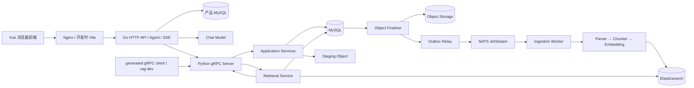

# RAG MVP

- 前置的中间件知识（过一遍了解概念）：[`docs/knowledge/middleware-guide.md`](docs/knowledge/middleware-guide.md)
- 环境搭建指南：
  - [Linux 从零搭建](docs/setup/setup-linux.md)
  - [Windows + WSL2 从零搭建](docs/setup/setup-windows.md)

一个由 **Vue 前端、Go 产品控制面和 Python RAG 计算服务**组成的个人知识库问答项目。Go 提供认证、知识库管理、模型设置、会话和问答；Python 通过版本化 gRPC 接收文档，异步完成解析、切块、向量化与索引，并返回可追溯的 evidence。

截至 **2026-09-11**，仓库已包含 Python 可靠性基线以及可运行的 Go/Vue 产品闭环，支持 Docker Compose 单机启动。当前实现面向个人使用和本地试运行；Kubernetes、多实例高可用、复杂多租户权限和通用 MCP 工具平台尚未交付。下述状态以当前代码为准，不表示本次已重新完成全部真实环境验收。

## 能做什么

- 通过 gRPC 创建 Dataset、流式上传文档、查询/重试/取消 Job、检索和删除文档。
- 解析 TXT、Markdown、代码、文本型 PDF、CHM 和 CHI；一个 CHM 是一个 Domain Document，每个 HTML Topic 是带标题层级、路径和锚点定位的逻辑子文档。
- 执行 `parse → normalize → chunk → embed → index`，以稳定 `chunk_id` 和索引版本保证重放幂等。
- 使用 Elasticsearch Dense KNN 与 BM25 双路召回，由纯算法层执行 RRF 融合、可选 Rerank 和上下文预算裁剪。
- 使用 MySQL 事务、Transactional Outbox、NATS ACK/NAK/redelivery、generation fence 和异步清理处理重复请求与进程崩溃。
- 返回带各阶段分数、来源定位和上下文预算结果的 evidence，由 Go Agent 生成 Prompt、回答与 Citation。
- 注册/登录、管理知识库、批量选择文件或文件夹上传、查看任务状态，以及恢复历史会话继续问答。
- 在设置页保存 Chat 与 Embedding 模型配置；Go Agent 调用只读 `rag_retrieve` 工具，并通过 SSE 返回检索事件和回答。
- 回答与展开的来源卡片支持 Markdown。回答中的有效引用呈现为圆形序号，悬停预览 chunk，点击展开大卡片并可复制原文。
- CHM 引用可读取完整 Topic，默认定位命中章节并单独展示引用片段，也可切换到完整 Topic；读取或定位失败时保留 evidence 片段。

职责边界保持不变：HTTP API、认证、所有权校验、会话、Chat Model、Agent Loop 和 SSE 位于 Go；Python 只提供 RAG 计算与私网 gRPC，不提供 HTTP/FastAPI 旁路。当前 Chat 调用按轮次收集模型响应，SSE 尚不是供应商逐 token 透传。

## 架构



**摄取不是“上传后直接发消息”**

1. 原始字节先进入 staging；
2. MySQL 在一个事务中创建 Document、Job、Task 和 `WAITING_OBJECT` Outbox；
3. Finalizer 提升正式对象后才允许 Relay 发布 `task_id`。
4. Worker 总是回读 MySQL 事实状态，成功更新 ES 并通过条件检查后才切换可见版本和 ACK。

检索时，服务生成查询向量并向 ES 分别请求 Dense 与 BM25 候选，再用 MySQL 复核文档删除状态和 active version，执行 RRF、上下文预算裁剪和来源规范化。Python 返回 evidence，不生成最终回答或 `[n]` Citation 编号。

**Rerank：** 设置页默认关闭并隐藏配置。点击“启用 Rerank”填写 HTTPS Base URL、模型名称、API Key、超时和 Top-N，再点击“保存并启用 Rerank”生效。支持第三方专用 `/rerank` 协议（`model/query/documents` → `results[index,relevance_score]`），Base URL 可填到 `/v1` 或完整 `/rerank` 地址；这不是 OpenAI 官方 Chat Completions 接口。最多重排 20 个融合候选，Top-N 为 1–20；关闭后保留配置，后续问答不再调用重排。超时、限流或服务暂不可用时退回 RRF；凭据等不可重试错误会使本次问答失败。

**当前限制：** ES 向量 mapping 固定为 1024 维。Embedding 配置按知识库保存快照，修改个人设置不会替换既有知识库的模型或密钥；更换模型需创建新知识库并重新上传。

## Docker 快速启动

### 一键启动产品开发环境

在仓库根目录执行 `make run`，统一转发到 `earthly --env-file-path .earthly.env +run`。Windows 推荐在 WSL2 中运行，与 Linux 使用相同命令；入口不再依赖 PowerShell 脚本。

前置条件：Docker Engine/Compose、GNU Make 和 Earthly v0.8.16。容器启动不要求宿主机安装 Node.js/npm、Go 或 uv；这些工具只在对应的本地开发流程中需要。

```bash
cp .env.example .env
make run
```

Earthfile 准备共享密钥卷、等待 RAG 服务就绪，再构建并后台启动产品 MySQL、Go API 和 Nginx 前端容器；命令完成后退出，容器继续运行。产品 Compose 的 `--wait` 对没有 healthcheck 的 API/web 只保证容器已运行，不代表业务探针验收。

浏览器打开 `http://127.0.0.1:5173/`，注册账号后在设置页配置 Chat 和 Embedding 模型，再创建知识库、上传资料并问答。Chat 需支持 OpenAI-compatible Chat Completions function calling。产品 Server/Worker 使用知识库配置快照，不读取 `.env` 中的 `EMBEDDING_MODEL_*`；这些变量保留给独立模式和显式真实模型测试。

前端经 Nginx 同源代理访问 Go API；API 的宿主机地址为 `http://127.0.0.1:8080/`。停止产品服务使用 `docker compose -f compose.product.yml down`，停止 RAG 使用 `make docker-down`，均保留持久卷。前端端口绑定所有网卡；使用局域网地址时，启动前将 `PRODUCT_ORIGIN` 设置为实际浏览器 origin（协议、主机与端口），以通过 Go 的来源校验。

前端代码改动后，执行 `make web-restart`，通过 Earthfile 重新构建镜像并重建前端 `web` 容器，使最新静态资源生效。该入口不启动或重启 Go API、MySQL、RAG 等依赖，也不删除数据卷；请先用 `make run` 启动完整环境。

### 仅启动 RAG 计算服务

`make docker-up` 不启动 Go 或前端。首次使用仍需准备 `.env` 与共享密钥卷；产品模式的摄取和检索还需要通过 Go 配置知识库 Embedding 快照。

```bash
docker volume create rag-product_product-keys
make docker-up
```

启动入口会校验 Compose、构建镜像、执行数据库迁移，并等待 MySQL、Elasticsearch、NATS、gRPC Server、Worker 与 Outbox 构建并进入healthy状态。

gRPC 开发端点为 `localhost:50051`。

使用完毕后安全停止服务：

```bash
make docker-down
```

该命令先扫描日志中的模型密钥，再停止容器并保留命名卷。不要随意执行 `docker compose down -v`，它会删除 MySQL、ES、NATS 和对象数据。

## gRPC 调试入口

本地调试与现有 Go 后端走同一条 gRPC 路径。安装开发依赖后，可用 generated client 封装的 `rag-dev` 创建 Dataset：

```bash
uv sync --frozen --group dev
uv run rag-dev --address localhost:50051 create-dataset \
  --request-id demo-create-1 \
  --idempotency-key demo-dataset-1 \
  --name demo \
  --embedding-model YOUR_MODEL_NAME \
  --embedding-dimension YOUR_MODEL_DIMENSION
```

模型名称和维度必须与目标知识库配置及 ES mapping 一致。以下是 RPC 命令示例：产品部署中，CLI 创建的 Dataset 不会自动归属于网页账号，也不会仅凭模型名获得 Embedding 凭据；完整产品体验优先使用网页创建和配置知识库。使用已有正确配置的 Dataset 时，可以上传和检索：

```bash
uv run rag-dev submit-document --request-id demo-upload-1 --idempotency-key demo-file-1 --dataset-id DATASET_ID --file ./your-document.md
uv run rag-dev get-job --request-id demo-job-1 --job-id JOB_ID
uv run rag-dev retrieve --request-id demo-query-1 --dataset-id DATASET_ID --query "文档讲了什么？"
```

CHM 文件使用相同的上传命令，只需将 `--file` 指向 `.chm`。Docker 镜像已经安装解包运行时；若直接在 Debian/Ubuntu 主机启动 `rag-worker`，需先安装 `libchm-bin`。CHM 按 Topic 硬边界、Topic 内 `h1`～`h6` 标题切分，超长标题段再按段落、句子和词法 token 边界递归切分。检索结果的 `metadata`/`locator.metadata` 会返回 `topic_path`、`topic_title`、`topic_order`、`heading_path` 和可选 `anchor`。

`.chi` 是 CHM 的关键词索引侧车。将与 CHM 同名的 `.chi` 作为第二个文档上传到同一个 Dataset（例如先上传
`ZRDDS_C_UserManual.chm`，再上传 `ZRDDS_C_UserManual.chi`），系统会按 `$WWKeywordLinks/BTree` 的二进制 listing block
读取关键词和 Topic index，再通过 `#TOPICS/#URLTBL/#URLSTR/#STRINGS` 恢复 Topic 标题、HTML 路径和锚点。CHI 作为
`logical_document_type=chm_index` 的辅助文档参与 Dense/BM25/RRF；命中后，检索服务还会在同一 Dataset 内按同名 CHM
和 `topic_path` 回查正文，并继续补充同 Topic 邻居。返回 evidence 可通过 `source_type=chi`、`chi_stream`、
`associated_chm_source_name`、`topic_url` 和 `retrieval_role=chi_topic_reference` 区分索引命中与关联正文。

完整命令面见 `uv run rag-dev --help`；protobuf 的唯一权威来源是 [`proto/rag/v1/rag_service.proto`](proto/rag/v1/rag_service.proto)。Server Reflection 只允许在开发环境启用。

## 本地开发

Makefile 封装 Earthfile，统一维护 Python 检查与 Docker 编排入口。`make ci` 聚合 Python 的 `lint` 和 `test`，无需模型 Secret；`make release-check` 在它之外再聚合 Go 与前端发布门禁（`go test`、前端 test/build），也是 GitHub Actions 与发布流程使用的门禁；两者都不运行真实基础设施或模型验收。

```bash
make proto  # 重新生成并校验 protobuf
make lint   # Ruff、format check、mypy、生成物一致性
make test   # 全部确定性离线测试与覆盖率门禁
make docker-test   # 全部容器启动的在线测试
make ci     # 聚合 Python 无 Secret 离线门禁
make run    # 后台启动完整产品容器栈
make web-restart # 重建并仅重启前端容器
make help   # 查看全部公共入口
```

Go 与前端检查已由 `make release-check` 聚合（Go 目前只运行 `go test`，尚未包含 `gofmt`/`go vet`），也可单独运行：

```bash
(cd backend/go-api && go test ./... && go vet ./...)
npm --prefix apps/web ci
npm --prefix apps/web run lint
npm --prefix apps/web test -- --run
npm --prefix apps/web run build  # 包含 TypeScript 类型检查
```

前端热更新开发使用 `npm --prefix apps/web run dev -- --port 5173 --strictPort`，通过 Vite 代理本机 8080 API。先用 `docker compose -f compose.product.yml stop web` 释放 5173 端口，保留后端服务。Node.js 版本需满足前端依赖要求；不要在 Windows 与 WSL 间复用 `node_modules`。

## 团队合入门禁

当前仓库包含 [Quality workflow](.github/workflows/quality.yml)，配置为在分支 `push`、目标为 `main` 的 PR 和手动触发时执行无密钥 `make release-check`（Python、Go 与前端发布门禁），检查名为 `release-quality`。工作流文件的存在不代表远端 Actions 已启用或最近一次运行通过；真实模型与真实基础设施验收不在其中。

管理员在流水线首次验证成功后，导入 [main 规则配置](.github/main-ruleset.json)，启用禁止删除和强推 `main`。仓库允许成员直接 push `main`，**不要求 PR 和人工审批**；`release-quality` 是 push 后的事后检查，红灯需立即修复或回滚。**JSON 文件不会自动启用 GitHub 服务端保护**，导入步骤与限制见 [测试指南第 7 节](docs/test/testing-guide.md#7-ci-与团队合入门禁)。

## 测试策略


| 层级                           | 验证重点                                             | 公共入口                                |
| -------------------------------- | ------------------------------------------------------ | ----------------------------------------- |
| Unit / Contract / Functional   | 领域规则、RPC/Port 契约、真实 gRPC + Fake ports 闭环 | `make test`                             |
| Fake Resilience / Offline Eval | 确定性故障编排与固定检索质量门槛                     | `make test`                             |
| Integration / E2E              | 真实 MySQL、ES、NATS、模型与四格式全链路             | `make docker-test SUITE=integration`    |
| Docker Resilience              | KILL、停启、重投递、并发栅栏与恢复                   | `make docker-test SUITE=resilience`     |
| Real Eval                      | 真实模型和 ES 上的固定 30 问                         | `make docker-test SUITE=eval`           |
| Go 产品层                      | 认证、所有权、Agent、RPC 客户端与 HTTP 行为          | 在`backend/go-api` 执行 `go test ./...` |
| Vue 前端                       | 页面、引用卡片、状态与 HTTP/SSE 传输                 | `npm --prefix apps/web test -- --run`   |

历史验收记录：2026-08-25 离线 195 passed、9 deselected、核心覆盖率 88.01%；Integration/E2E 27 passed；Docker Resilience 8 passed；Real Eval 1 passed，Recall@6、MRR@6、locator accuracy 均为 1.0。这些是当时版本的数据，不是当前分支的最新测试结果。后续 Go 产品联调记录见 [产品开发记录](docs/development/live-product-plane.md)。分层边界、费用、安全与失败定位见 [测试指南](docs/test/testing-guide.md)。

`make docker-test SUITE=eval EVAL_FIXTURE=original` 可选择原始评测数据集，省略 `EVAL_FIXTURE` 时默认使用 `rephrased`。Go 的真实产品集成测试在未配置 `PRODUCT_TEST_MYSQL_DSN` 时跳过，普通 `go test ./...` 不能替代该验收。真实基础设施测试须使用独立测试数据环境。

## 目录结构

```text
.
├─ proto/                 # Python/Go 共享的唯一 gRPC 契约
├─ apps/web/              # Vue 3、TypeScript、Vite；Nginx 容器与前端测试
├─ backend/go-api/        # Go HTTP API、认证、模型配置、Agent、会话和产品存储
├─ src/rag_mvp/
│  ├─ domain/             # 领域模型、状态机和纯规则
│  ├─ application/        # 用例编排，只依赖 ports
│  ├─ ports/              # 基础设施能力抽象
│  ├─ adapters/           # MySQL、ES、NATS、模型、存储和解析实现
│  ├─ rpc/                # gRPC transport 与 generated code
│  ├─ ingestion/          # Pipeline、checkpoint 与唯一 Worker consumer
│  ├─ outbox/             # Object Finalizer、Relay 与 staging sweeper
│  ├─ retrieval/          # RRF、Rerank、context 与 provenance 纯算法
│  └─ bootstrap/          # concrete adapter 的唯一装配点
├─ migrations/            # MySQL/Alembic schema
├─ tests/                 # Unit、Contract、Functional、Integration、E2E、Resilience、Eval
├─ docs/                  # 设计、实施记录、环境搭建与测试指南
├─ SPEC.md                # RAG 架构和可靠性规格
├─ PLAN.md                # 跨阶段历史路线图
├─ Earthfile              # 可复现的底层构建和测试编排
├─ Makefile               # 对外构建、检查和启动入口
├─ compose.product.yml    # Go API、产品 MySQL、前端容器
└─ docker-compose.yml     # Python RAG 与中间件服务拓扑
```

## 配置与安全

- 从 `.env.example` 创建本地 `.env`；`.env`、API Key、真实用户数据、`data/`、缓存和日志都不得提交。
- 在网页设置中保存 Chat/Embedding 配置，API Key 加密存储且不回传原文。知识库绑定 Embedding 快照，不能在同一 ES 向量字段中混用维度。
- 产品 MySQL 与 RAG MySQL 分离；`product-keys` 外部卷保存共享加密密钥与 Go 签名密钥，备份数据库时也需保存密钥。不要删除数据卷或密钥卷。
- 开发 Compose 使用本地对象卷；未来可通过 `ObjectStorage` port 替换为 MinIO 等实现，不改变应用用例。
- 当前 Compose 使用开发数据库密码和非 Secure Cookie。公网部署需配置 HTTPS、`PRODUCT_COOKIE_SECURE=true`、准确的 `PRODUCT_ORIGIN` 与外部密钥；Python gRPC 50051 不应直接暴露公网。

## 路线图与文档

- [`SPEC.md`](SPEC.md)：权威架构、RPC、状态机、存储与可靠性不变量。
- [`PLAN.md`](PLAN.md)：Milestone A～E 的跨阶段路线；其中 Go“未来实现”的表述属于早期规划，不代表当前完成状态。
- [`docs/development/live-product-plane.md`](docs/development/live-product-plane.md)：Go 产品配置、安全边界及历史联调记录；启动方式以本 README 和当前 Earthfile 为准。
- [`docs/test/testing-guide.md`](docs/test/testing-guide.md)：测试分层、真实 Docker 验收、质量指标与故障定位。
- [`docs/setup/setup-linux.md`](docs/setup/setup-linux.md)：Linux 主机从零安装 Docker、uv、Earthly 并运行项目。
- [`docs/setup/setup-windows.md`](docs/setup/setup-windows.md)：Windows 使用 Docker Desktop + Ubuntu WSL2 的完整安装与排障流程。
- [`tests/TEST.md`](tests/TEST.md)：每个测试文件与测试函数的职责清单。
- [`AGENTS.md`](AGENTS.md)：代码边界、协作规则和提交约定。

文档同步说明：`SPEC.md` 开头仍以纯 Python MVP 为范围，正文已包含部分产品联动契约；Go/Vue 的实际实现已超出该早期范围描述，但仍遵守 Go 控制面、Python RAG 计算面的职责划分。本次只更新 README，不改写 SPEC 或实施计划。

本项目采用 [Apache License 2.0](LICENSE)。设计借鉴 RAGFlow 等开源 RAG 系统的架构思想。
