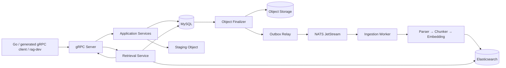

# RAG MVP

- 前置的中间件知识（过一遍了解概念）：[`docs/middleware-guide.md`](docs/middleware-guide.md)
- 环境搭建指南：
  - [Linux 从零搭建](docs/setup/setup-linux.md)
  - [Windows + WSL2 从零搭建](docs/setup/setup-windows.md)

一个可靠、可恢复的 Python RAG 计算服务：通过版本化 gRPC(待定) 接收文档，异步完成解析、切块、向量化与索引，并返回可追溯的 evidence。

当前仓库已完成 **Milestone D 可靠发布基线**：真实 MySQL、Elasticsearch、NATS JetStream 和 OpenAI格式 Embedding 已在 Docker 中完成集成、端到端、进程强杀恢复与 30 问检索评测。它适合单机容器生产试运行；Kubernetes、多实例高可用和 Go 产品控制面尚未实现。

## 能做什么

- 通过 gRPC 创建 Dataset、流式上传文档、查询/重试/取消 Job、检索和删除文档。
- 解析 TXT、Markdown、代码和文本型 PDF，保留文件名、页码、行号、代码符号等来源定位。
- 执行 `parse → normalize → chunk → embed → index`，以稳定 `chunk_id` 和索引版本保证重放幂等。
- 使用 Elasticsearch Dense KNN 与 BM25 双路召回，由纯算法层执行 RRF 融合、可选 Rerank 和上下文预算裁剪。
- 使用 MySQL 事务、Transactional Outbox、NATS ACK/NAK/redelivery、generation fence 和异步清理处理重复请求与进程崩溃。
- 返回带各阶段分数和 provenance 的 evidence，供未来 Go Agent 生成 Prompt 与 Citation。

**待定**：明确不属于 Python 服务的职责：公网 HTTP API、认证与租户入口、会话、Chat Model 回答、Agent Loop、Tool Calling、MCP 和 SSE。这些能力将在未来的 Go 控制面实现，Go 仍通过同一份 protobuf 调用 Python。

## 架构



**摄取不是“上传后直接发消息”**

1. 原始字节先进入 staging；
4. MySQL 在一个事务中创建 Document、Job、Task 和 `WAITING_OBJECT` Outbox；
5. Finalizer 提升正式对象后才允许 Relay 发布 `task_id`。
6. Worker 总是回读 MySQL 事实状态，成功更新ES并通过条件检查后才切换可见版本和 ACK。

检索时，服务生成查询向量并向 ES 分别请求向量化与BM25候选，再用 MySQL 复核文档删除状态和 active version，最后执行 RRF，而`Python 返回 evidence，不生成最终回答或 [n] Citation 编号。`

**摄取与检索方面待扩展 ：**

+ Rerank
  + 预留接口，但是未实现
+ token 预算处理
+ provenance 规范化
  + [`proto/rag/v1/rag_service.proto`](proto\\rag\\v1\\rag_service.proto)：message Evidence
  + 目前只针对文档进行处理，未针对代码进行设计


## Docker 快速启动

需要 Docker Engine、Docker Compose、GNU Make 和 Earthly v0.8.16。Windows 推荐在 WSL2 中执行以下命令。

```bash
cp .env.example .env
# 编辑 .env，填写 EMBEDDING_MODEL_URL、NAME、API_KEY、DIMENSION
make docker-up
```

启动入口会校验 Compose、构建镜像、执行数据库迁移，并等待 MySQL、Elasticsearch、NATS、gRPC Server、Worker 与 Outbox 构建并进入healthy状态。

gRPC 开发端点为 `localhost:50051`。

使用完毕后安全停止服务：

```bash
make docker-down
```

该命令先扫描日志中的模型密钥，再停止容器并保留命名卷。不要随意执行 `docker compose down -v`，它会删除 MySQL、ES、NATS 和对象数据。

## 最小 gRPC 调用 (待定，不一定用RPC）

本地调试与未来 Go 后端走同一条 gRPC 路径，不提供 HTTP/FastAPI 旁路。安装开发依赖后，可用 generated client 封装的 `rag-dev` 创建 Dataset：

```bash
uv sync --frozen --group dev
uv run rag-dev --address localhost:50051 create-dataset \
  --request-id demo-create-1 \
  --idempotency-key demo-dataset-1 \
  --name demo \
  --embedding-model YOUR_MODEL_NAME \
  --embedding-dimension YOUR_MODEL_DIMENSION
```

模型名称和维度必须与 `.env` 一致。记下返回的 `dataset_id` 后，可以继续上传和检索：

```bash
uv run rag-dev submit-document --request-id demo-upload-1 --idempotency-key demo-file-1 --dataset-id DATASET_ID --file ./your-document.md
uv run rag-dev get-job --request-id demo-job-1 --job-id JOB_ID
uv run rag-dev retrieve --request-id demo-query-1 --dataset-id DATASET_ID --query "文档讲了什么？"
```

完整命令面见 `uv run rag-dev --help`；protobuf 的唯一权威来源是 [`proto/rag/v1/rag_service.proto`](proto/rag/v1/rag_service.proto)。Server Reflection 只允许在开发环境启用。

## 本地开发

 Makefile封装Earthfile，Earthfile编排容器并指定唯一运行环境

```bash
make proto  # 重新生成并校验 protobuf
make lint   # Ruff、format check、mypy、生成物一致性
make test   # 全部确定性离线测试与覆盖率门禁
make docker-test   # 全部容器启动的在线测试
make ci     # 聚合完整无 Secret 提交门禁
make help   # 查看全部公共入口
```

## 测试策略

| 层级                           | 验证重点                                             | 公共入口                               |
| ------------------------------ | ---------------------------------------------------- | -------------------------------------- |
| Unit / Contract / Functional   | 领域规则、RPC/Port 契约、真实 gRPC + Fake ports 闭环 | `make test`                          |
| Fake Resilience / Offline Eval | 确定性故障编排与固定检索质量门槛                     | `make test`                          |
| Integration / E2E              | 真实 MySQL、ES、NATS、模型与四格式全链路             | `make docker-test SUITE=integration` |
| Docker Resilience              | KILL、停启、重投递、并发栅栏与恢复                   | `make docker-test SUITE=resilience`  |
| Real Eval                      | 真实模型和 ES 上的固定 30 问                         | `make docker-test SUITE=eval`        |

2026-08-25 的统一入口验收结果：离线 195 passed、9 deselected、核心覆盖率 88.01%；Integration/E2E 27 passed；Docker Resilience 8 passed；Real Eval 1 passed，Recall@6、MRR@6、locator accuracy 均为 1.0。分层边界、费用、安全与失败定位见 [`docs/test/testing-guide.md`](docs/test/testing-guide.md)。

## 目录结构

```text
.
├─ proto/                 # Python/Go 共享的唯一 gRPC 契约
├─ src/rag_mvp/
│  ├─ domain/             # 领域模型、状态机和纯规则
│  ├─ application/        # 用例编排，只依赖 ports
│  ├─ ports/              # 基础设施能力抽象
│  ├─ adapters/           # MySQL、ES、NATS、模型、存储和解析实现
│  ├─ rpc/                # gRPC transport 与 generated code
│  ├─ ingestion/          # Pipeline、checkpoint 与唯一 Worker consumer
│  ├─ outbox/             # Object Finalizer、Relay 与 staging sweeper
│  ├─ retrieval/          # RRF、Rerank、context 与 provenance 纯算法
│  └─ bootstrap/          # concrete adapter 的唯一装配点
├─ migrations/            # MySQL/Alembic schema
├─ tests/                 # Unit、Contract、Functional、Integration、E2E、Resilience、Eval
├─ docs/                  # SPEC、路线图、实施计划与测试指南
├─ Earthfile              # 可复现的底层构建和测试编排
├─ Makefile               # 八个稳定公共入口
└─ docker-compose.yml     # 单机完整服务拓扑
```

## 配置与安全

- 从 `.env.example` 创建本地 `.env`；`.env`、API Key、真实用户数据、`data/`、缓存和日志都不得提交。
- Dataset 的 Embedding 模型和维度必须与当前部署一致；首个 READY Document 后冻结，不能在同一 ES 向量字段中混用维度。
- 开发 Compose 使用本地对象卷；未来可通过 `ObjectStorage` port 替换为 MinIO 等实现，不改变应用用例。
- 当前是单机拓扑，不宣称 Kubernetes、多实例调度、跨节点共享本地对象文件或公网安全加固已经完成。

## 路线图与文档

- [`SPEC.md`](SPEC.md)：权威架构、RPC、状态机、存储与可靠性不变量。
- [`PLAN.md`](PLAN.md)：Milestone A～E 的交付路线；下一阶段是 Go 产品控制面。
- [`docs/test/testing-guide.md`](docs/test/testing-guide.md)：测试分层、真实 Docker 验收、质量指标与故障定位。
- [`docs/setup/setup-linux.md`](docs/setup/setup-linux.md)：Linux 主机从零安装 Docker、uv、Earthly 并运行项目。
- [`docs/setup/setup-windows.md`](docs/setup/setup-windows.md)：Windows 使用 Docker Desktop + Ubuntu WSL2 的完整安装与排障流程。
- [`tests/TEST.md`](tests/TEST.md)：每个测试文件与测试函数的职责清单。
- [`AGENTS.md`](AGENTS.md)：代码边界、协作规则和提交约定。

本项目采用 [Apache License 2.0](LICENSE)。设计借鉴 RAGFlow 等开源 RAG 系统的架构思想。
