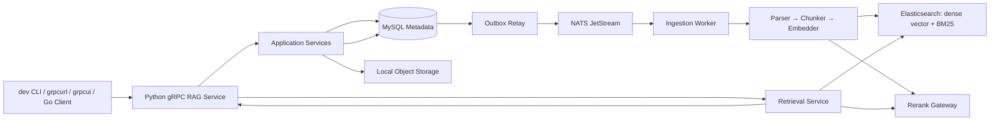
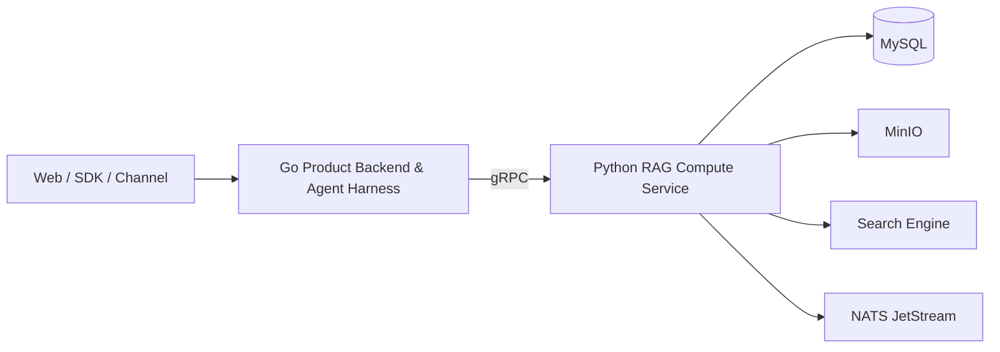
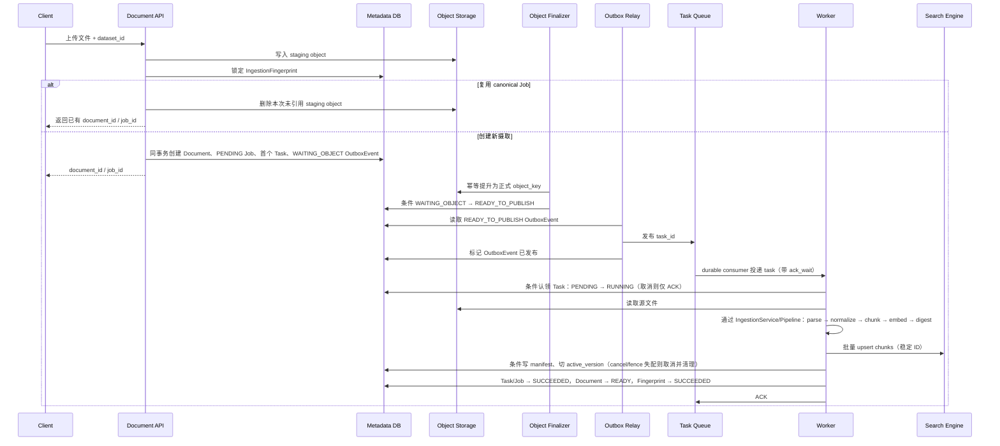
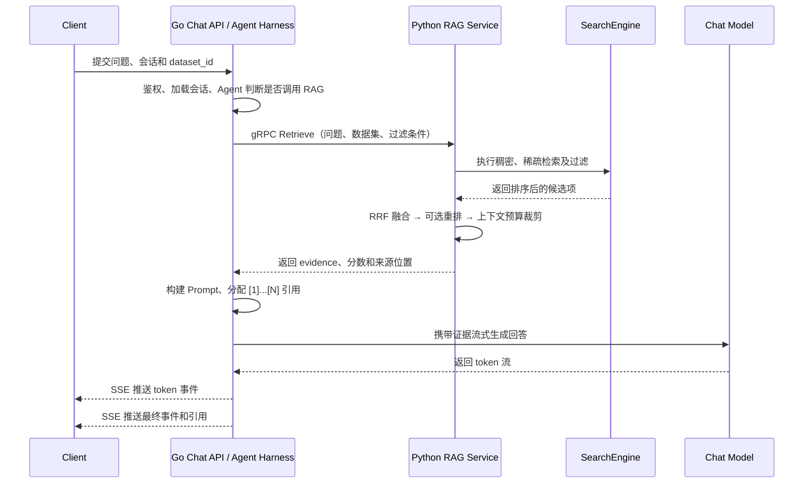

# Python RAG 最小 MVP 规格说明（SPEC）

> 版本：0.1.0  
> 状态：设计基线  
> 范围：单租户、单机优先的纯 RAG 计算 MVP；不包含 Answer 生成、Agent Harness、MCP、复杂权限、工作流画布或多集群部署。  
> 演进约束：未来由 Go 承担唯一的对外产品 API、鉴权、会话、Agent Harness 与网络协议；Python 保持为 RAG 计算服务与 Worker。

---

## 目录

- 1. 项目概述
- 2. 核心特点与范围
- 3. 技术选型
- 4. 测试方案
- 5. 系统架构与模块设计
- 6. 项目排期
- 7. 可扩展性与未来展望
- 附录 A：验收清单
- 附录 B：参考来源

---

## 1. 项目概述

本项目基于 Python 实现一个可运行、可测试、可恢复的最小 RAG 计算服务：用户上传 PDF、Markdown、TXT、代码文本、CHM 或 CHI；系统异步解析、切块、向量化并建立全文/向量索引；调用方提问时，系统执行混合检索、可选重排和上下文预算建议，返回可追溯 evidence。最终答案生成、会话和 SSE 由后续 Go 产品后端负责。

### 设计理念

> **核心定位：先把“有依据的知识问答”做成可靠的闭环，再扩展为 Go 主导的 Agent 产品平台。**

#### 1️⃣ 以知识资产生命周期为中心

不把 RAG 视为 `similarity_search()` 加一次 LLM 调用，而是显式管理：`Dataset → Document → Job → Task → Chunk → RetrievalEvidence`。这是借鉴 RAGFlow 最值得保留的设计：文件、元数据、索引、任务状态和引用血缘是一级领域对象。

#### 2️⃣ 存储职责分离，状态以元数据库为准

原文件属于对象存储；业务事实和任务状态属于关系数据库；全文/向量召回属于检索引擎。三者不假设存在跨库总事务，因此用稳定 ID、幂等 upsert、版本化索引和可重试任务实现最终一致。

#### 3️⃣ 默认简单，但接口不封死

第一版只交付一条成熟路径：本地文件存储 + MySQL + ES + OpenAI 兼容模型接口。Parser、Chunker、SearchEngine、ModelGateway、TaskQueue 都以端口（Protocol）隔离；替换实现不应修改应用层用例。

#### 4️⃣ 先保证正确性，再优化召回质量与吞吐

优先级依次为：任务不丢失/不重复计数、引用可回溯、检索可解释、答案可评测。混合检索、Rerank、GPU 批处理、更多格式和多租户均在稳定基线之后增加。

#### 5️⃣ 为 Go 接管产品层预留边界

Python MVP 的唯一入口是 gRPC；本地调试也调用同一 gRPC 服务。Python 是 RAG 执行域（Document、Job、Task、索引版本）的唯一写入方；未来 Go 通过 RPC 提交命令、查询 Job，不直接写这些表或绕过 Python 修改摄取状态。Go 是用户、权限、会话和 Agent 主系统。

### MVP 明确不做的事情

- 不实现 Agent Loop、Tool Calling、MCP Server、Canvas/DSL、代码执行沙箱。
- 不实现 OCR、复杂 PDF 版面/表格理解、图像理解、GraphRAG、RAPTOR 或知识编译。
- 不支持多租户 RBAC、计费、第三方 SaaS 同步器、浏览器前端或集群调度。
- 不同时支持多个向量数·据库/搜索引擎；接口可替换，但默认发行只有一个实现。

---

## 2. 核心特点与范围

### 2.1 端到端 RAG 闭环

```text
上传文件
  → 保存原文件 + 创建 Document / Job
  → 异步 Worker 解析、规范化、切块
  → 去重、Embedding、批量写入搜索引擎
  → 将 Task / Job / Document 切换到成功终态
  → 用户提问
  → Query 规范化 → 混合检索 → 可选 Rerank
  → 返回带来源、分数和上下文预算建议的 evidence
```

必须支持的输入格式：`.md`、`.txt`、`.py/.go/.js/.ts/.java`、文本型 PDF、`.chm` 与 `.chi`。扫描 PDF 和复杂表格 PDF 在 MVP 中仅仅返回文字部分。

一个上传的 CHM 对应一个既有 `Document`，不为 Topic 新建数据库 Document。CHM 内每个 HTML Topic 是逻辑子文档和不可跨越的切块硬边界；Topic 内先按 `h1`～`h6` 标题层级形成段落，超长标题段再依次优先选择段落、句子和词法 token 边界，单个不可分 token 才允许按字符硬截断。Topic 顺序优先采用 `.hhc` 目录，未列入目录的 HTML 按规范化路径稳定追加。每个 CHM Chunk 的 `content_with_weight` 必须在正文前稳定加入 `topic_title`、`heading_path` 与 locator `symbol` 上下文，使同一 Topic 的所有分块均可按页面标题、标题路径和接口符号检索；正文切分上限不包含该检索权重前缀。权重文本参与 Embedding、内容摘要和 `chunk_id` 计算，因此修改前缀规则必须提升 parser/chunker 配置版本并重建索引。Chunk 与 Evidence 必须同时保留原 CHM `source_name`，并在 metadata/locator metadata 中返回 `topic_path`、`topic_title`、`topic_order`、`heading_path` 和可选 `anchor`；行号仍表示 Topic 规范化正文中的行范围，不计算检索权重前缀。

CHM 只解析本地解包后的 HTML 文本，不执行脚本、样式、ActiveX 或外部资源。生产 Worker 使用 `extract_chmLib`，并对签名、路径、符号链接、解包超时、文件数、Topic 数和展开总字节执行 fail-closed 限制；缺少运行时返回 `CHM_EXTRACTOR_UNAVAILABLE`，损坏、越界或无可读 Topic 返回不可重试 `INVALID_CHM`。

CHM HTML 清洗必须忽略 `script/style/template` 以及语义化 `nav/aside/footer`，并按常见 Doxygen/产品手册的 `navrow`、`navpath`、`breadcrumb`、`menu`、`sidebar`、`toolbar`、`search` 等容器标识过滤导航噪声；页面提供 `main/article/role=main` 或明确正文容器时，优先只采用该正文区域。该规则改变规范化正文、Embedding、内容摘要和 `chunk_id`，因此自 `source-router-v6` 起旧 CHM 必须重建。Evidence 额外返回不含 `topic_title/heading_path/symbol` 检索权重前缀的 `display_content` 供引用预览使用，但模型检索上下文仍使用 `content_with_weight`。

完整来源查看采用独立只读路径，不把整个 Topic 塞入检索上下文：调用方以 Evidence 的 `document_id`、`index_version`、`metadata.topic_path` 和可选 `anchor` 调用 `GetSourceTopic`。服务端必须复核 Document 为 `READY`、请求版本等于 `active_version`、对象已提升且源格式为 CHM，再从原始对象按同一清洗规则恢复完整 Topic 并返回安全 Markdown；路径穿越、已删除文档、旧版本引用和非 CHM 来源均 fail closed。Go 产品层在转发前还必须校验当前用户拥有该 Document。前端首次展开时必须根据 Evidence 的 `heading_path`/`symbol` 定位并突出显示命中章节，单独标示本次回答实际引用的 Evidence 片段，并只展示该标题至下一个同级或更高层级标题之间的连续上下文；用户可显式切换到完整 Topic，也可返回命中章节。定位失败时退回 Evidence 原文，不得让无法定位的整篇长 Topic 冒充命中位置。

`.chi` 是可选的 CHM 关键词索引侧车，作为同一 Dataset 中单独上传的辅助文档参与检索，不创建或替代 CHM 的 Domain Document。生产 Worker 使用同一 `extract_chmLib` 解包，按 `$WWKeywordLinks/BTree` 的 listing-block 结构读取 UTF-16LE 关键词及其 `#TOPICS` 索引，再通过 `#TOPICS → #URLTBL → #URLSTR` 恢复目标 HTML Topic 路径/锚点，并用 `#STRINGS` 恢复 Topic 标题；禁止把 BTree 控制字节误判成关键词。关键词按目标 Topic 形成有界分段，每个分段的检索权重前缀稳定加入索引关键词、Topic 标题、Topic 路径/URL 和关联 CHM 名称；metadata 必须包含 `source_type=chi`、`logical_document_type=chm_index`、`chi_stream=$WWKeywordLinks/BTree`、`associated_chm_source_name`、`chi_topic_index`、`topic_path`、`topic_title`、`topic_url` 和可选 `anchor`。缺少任一必需映射流、无可读 Topic 链接、偏移/块链越界或解包失败返回不可重试 `INVALID_CHI`；CHI 不执行脚本、HTML 或外部资源。调用方应把同名 CHM 与 CHI 上传到同一 Dataset，检索会在同一 Dense/BM25/RRF 流程中同时考虑两者。

### 2.2 可恢复的异步摄取

摄取是后台任务，不阻塞上传请求。任务状态机：

```text
PENDING → RUNNING → SUCCEEDED
    │          ├→ FAILED
    │          └→ CANCELLED
    └→ CANCELLED
```

`Job` 保存输入文件 SHA-256、解析/切块/模型配置摘要（digest）、聚合进度、错误、输出索引版本和 chunk 计数；`Task` 保存一次可调度的执行单元及其 attempt/checkpoint。队列消息只包含 `task_id`；Worker 每次从数据库读取 Task/Job 事实，避免消息体成为过期状态副本。创建 Task 时，必须在**同一个 MySQL 事务**中创建 `OutboxEvent(task_id)`；依赖 staging object 的首个摄取 Task 初始为 `WAITING_OBJECT`，已有正式对象的重试 Task、删除和清理 Task 可直接为 `READY_TO_PUBLISH`。Outbox Relay 再以可重试方式发布 READY 事件到 NATS。这消除“数据库已提交、NATS 发布失败，Task 永远 PENDING”的双写丢失窗口。

该设计继承 RAGFlow 对 at-least-once 消息投递的经验：可能重复执行，但不能重复产生可见数据或统计。Chunk 使用稳定 ID；索引使用 upsert；完成前崩溃的任务允许重新执行。

### 2.3 可解释的检索与引用

检索结果必须包含：`chunk_id`、`document_id`、`score`、`source_name`、页码/行号、文本片段与检索阶段信息，形成 Python 的 `Evidence`。Go 在生成 Prompt 时为 evidence 分配编号，并将模型引用 `[1]` 映射回真实来源，形成最终 `Citation`。

第一版的默认检索策略：

1. Dense：问题和 chunk embedding 的余弦近邻召回；
2. Sparse：BM25/关键词召回；
3. Fusion：RRF 融合两个候选排名；
4. 可选 Rerank：只重排 Top-20，输出 Top-6；
5. ContextBuilder：在模型上下文预算内选取证据，超限时按得分截断，不截断句中间。

### 2.4 全链路可插拔，但只实现一套默认适配器

| 层 | 抽象端口 | MVP 默认实现 | 后续可替换实现 |
|---|---|---|---|
| 原文件 | `ObjectStorage` | 本地目录 | MinIO |
| 元数据/任务 | `MetadataRepository` | MySQL | 无 |
| 任务队列 | `TaskQueue` | NATS JetStream | 无 |
| 检索引擎 | `SearchEngine` | Elasticsearch | 无 |
| Embedding / Rerank | `ModelGateway` | OpenAI-compatible 的 API 调用 | 本地 Ollama |
| 文档解析 | `Parser` | Text / Markdown / Code / 文本 PDF / CHM HTML Topic / CHI keyword-index parser | DeepDoc、OCR |
| 切块 | `Chunker` | Recursive Markdown/Text Chunker | 语义、父子、代码 AST Chunker |

> 直接使用 Elasticsearch 负责MVP的向量语义索引和关键词索引。

### 2.5 面向未来 Go Agent 的服务契约

Python RAG 从 MVP 第一版起就是**私网 gRPC 服务**，而非面向浏览器的公网后端。契约以 `proto/rag/v1/rag_service.proto` 为唯一事实来源，Python 用 `grpcio` 实现服务端，未来 Go 通过生成的 gRPC Client 调用。这样，控制平面迁移到 Go 时不需要重写摄取、检索和证据生成逻辑。

```proto
syntax = "proto3";
package rag.v1;

service RagService {
  rpc CreateDataset(CreateDatasetRequest) returns (CreateDatasetResponse);
  rpc BindEmbeddingProfile(BindEmbeddingProfileRequest) returns (CreateDatasetResponse);
  rpc DeleteDataset(DeleteDatasetRequest) returns (DeleteDatasetResponse);
  rpc SubmitDocument(stream UploadDocumentRequest) returns (SubmitDocumentResponse);
  rpc GetJob(GetJobRequest) returns (GetJobResponse);
  rpc RetryJob(RetryJobRequest) returns (RetryJobResponse);
  rpc CancelJob(CancelJobRequest) returns (CancelJobResponse);
  rpc Retrieve(RetrieveRequest) returns (RetrieveResponse);
  rpc GetSourceTopic(GetSourceTopicRequest) returns (GetSourceTopicResponse);
  rpc DeleteDocument(DeleteDocumentRequest) returns (DeleteDocumentResponse);
}
```

| RPC | 调用类型 | 语义 | 未来 Go 调用方 |
|---|---|---|---|
| `CreateDataset` | Unary | 创建知识库并固定初始 `embedding_model`、维度和检索配置；创建后不可原地更换向量模型。 | Go Dataset 服务 / dev CLI |
| `DeleteDataset` | Unary | 不可恢复地删除整个知识库：事务内将 Dataset 置为 `DELETING`、立即阻断提交和检索，并创建 dataset 作用域的清理 Job/Task；Worker 经 Outbox 异步删除 ES、对象和全部 MySQL 聚合数据。 | Go Dataset 服务 / dev CLI / 测试 teardown |
| `SubmitDocument` | 客户端流式 | 接收文件、创建 Document、投递异步摄取任务；立即返回 `document_id` 和 `job_id`，不等待解析/向量化完成。 | Document API / TaskService |
| `GetJob` | Unary | 查询任务状态、进度、失败原因和是否可重试。 | Go 状态查询 API |
| `RetryJob` | Unary | 仅对 `FAILED` 且 `retryable=true` 的 Job 创建同类型的 retry Job、待执行 Task 和 OutboxEvent；旧 Job 保持终态，不修改已成功的索引版本。 | Go Dataset/Document 服务 |
| `CancelJob` | Unary | 取消尚未开始的摄取，或向运行中摄取写入 `cancel_requested_at`；Worker 在 checkpoint 收敛到 `CANCELLED`。删除 Job 不可取消。 | Go Dataset/Document 服务 |
| `Retrieve` | Unary | 仅检索，返回带分数、位置、元数据的 evidence chunks，不生成回答。 | Go Agent 的 RAG Tool |
| `GetSourceTopic` | Unary | 按当前激活版本和 Topic 路径从原始 CHM 恢复完整、已清洗的 Topic Markdown；仅用于用户查看引用原文，不参与检索上下文。 | Go 引用来源 API |
| `DeleteDocument` | Unary | 在 MySQL 标记 Document 删除并使其立刻不可检索；创建 `DELETE_DOCUMENT` Job 和清理 Task，经 Outbox 异步删除 ES 记录和对象文件。 | Go Dataset/Document 服务 |

`UploadDocumentRequest` 的第一帧必须是 header（`dataset_id`、`source_name`、`idempotency_key`、可选 `expected_sha256`、可选 `target_document_id`），后续帧只能携带字节；服务端限制最大字节数并在结束帧校验 SHA-256。文件先写入由 `idempotency_key` 派生的 staging object。新文档模式在同一 MySQL 事务内对唯一 `(dataset_id, file_sha256, config_digest)` 的 `IngestionFingerprint` 行 `SELECT ... FOR UPDATE`：已有 `PENDING/RUNNING/SUCCEEDED` fingerprint 时返回其 canonical Document/Job，不创建新 Task，并立即删除本次未引用 staging object；`FAILED_RETRYABLE` fingerprint 也返回其 canonical Job，由调用方使用 `RetryJob`；只有 `RELEASED`（无正式对象的不可恢复失败或已删除 Document）才创建新的 Document/Job/Task、重新占用 fingerprint，并创建 `WAITING_OBJECT` OutboxEvent。这样并发上传相同文件也只产生一个摄取。

Object Finalizer 将 staging object 幂等提升为正式 `object_key` 后，必须在同一条件更新中验证 `OutboxEvent.status=WAITING_OBJECT AND Document.status!=DELETED AND Document.lifecycle_generation=Job.document_generation`，才置为 `READY_TO_PUBLISH`。条件失败时 Finalizer 立即删除刚提升的正式对象，并保持/标记 Outbox 为 `CANCELLED`；Relay **只能**发布 READY 事件，因此 Worker 不会在正式对象可读前、或 Document 已删除后收到任务。中断或事务失败且未被 MySQL 引用的 staging object 由 TTL sweeper 清理；`WAITING_OBJECT` 所引用的 staging object 只由 Finalizer 重试或终态补偿任务处理，不能被 TTL 误删。

Outbox Relay 必须同时支持两种触发方式：一是按固定间隔轮询 MySQL 中的 `READY_TO_PUBLISH` 事件，作为进程重启、唤醒丢失和临时故障后的最终兜底；二是由 Finalizer 成功、RetryJob/Delete/Cleanup Task 创建或运维调试发起一次手动/即时唤醒，降低正常路径延迟。两种触发都只能唤醒同一个 Relay 扫描逻辑，随后仍须查询 MySQL 决定发布哪些 `task_id`，禁止应用服务因手动触发而直接发布 NATS。手动唤醒是 best-effort，丢失时由下一轮定时轮询补偿；并发扫描允许产生重复发布，但必须由条件状态更新和 Worker 幂等收敛。

未给 `target_document_id` 是新文档模式：按前述 `IngestionFingerprint` 状态复用 canonical Job 或在 RELEASED 后创建新 Document。给出 `target_document_id` 是重建模式：必须属于该 Dataset，系统在 `SELECT ... FOR UPDATE` 的 Document 行锁内分配唯一的新 `index_version`，并创建对应 Job；新版本完整后才切换 `active_version`。多个重建乱序完成时，`active_version` 只能单调前进；低版本迟到成功不得覆盖已激活的高版本，其 IndexBuild 必须置为 `ABANDONED` 并创建 `CLEANUP_INDEX_VERSION` Task。相同 `idempotency_key` 的完整提交必须返回第一次的 `document_id/job_id`，不得新建 Document、Job 或 Task。`CreateDataset`、`DeleteDocument`、`RetryJob` 与 `CancelJob` 也必须携带 `idempotency_key`；`request_id` 用于日志与 trace，不承担去重语义。Worker 的内部状态迁移记录 `operation_id`，不伪装为客户端请求。

`Job.status` 与 `Task.status` 统一为 `PENDING → RUNNING → SUCCEEDED | FAILED | CANCELLED`。Job 是用户可查询的聚合状态：首个 Task 投递后仍为 `PENDING`，任一必要 Task 运行时为 `RUNNING`，全部必要 Task 成功后才为 `SUCCEEDED`。`FAILED` 必须返回稳定的业务错误码、可读错误信息和 `retryable`；`RetryJob` 是唯一的 Job 重试命令，且总是生成新 Job，重复上传不会产生未定义的 `SKIPPED` 状态。摄取、文档删除和索引版本清理 Job 必须关联 Document；`DELETE_DATASET` Job 必须关联 Dataset 且 `document_id` 为空。MVP 的 `tenant_id` 固定为服务端注入的 `default_tenant`，不接受客户端任意指定。

`CancelJob` 对 `PENDING` 摄取 Job 在同一事务内把 Job/Task 置为 `CANCELLED`、撤销未发布 OutboxEvent；对 `RUNNING` 摄取 Job 只写 `cancel_requested_at`，由 Worker 的下一 checkpoint 原子转为 `CANCELLED`，并不得切换 `active_version`。已终态 Job 返回已有终态。`DELETE_DOCUMENT` Job 不可取消，因为逻辑删除已经对检索可见；调用返回 `JOB_NOT_CANCELLABLE`。每个 Job 保存 `retry_count`，超过 `max_user_retries` 后 `retryable=false`，默认值为 3。

`DeleteDataset` 是不可恢复的级联物理删除命令，必须携带 `RequestContext` 和 `dataset_id`。Dataset 新增生命周期 `ACTIVE → DELETING` 与单调递增的 `lifecycle_generation`；创建后为 `ACTIVE`。在 Dataset 行锁内把它置为 `DELETING` 并递增 generation 后，`GetDataset`（若未来提供）、`SubmitDocument`、`Retrieve`、Document 重建和 `DeleteDocument` 都必须拒绝该 Dataset；`visible_document_versions` 只返回 `ACTIVE` Dataset 下 `READY` Document，因此已经在 ES 中存在的向量也立刻不可见。该事务必须将所有 Document 标为 `DELETED` 并递增其 generation，释放 fingerprint，取消未终态摄取/文档清理 Task 与未发布 Outbox，随后创建 `DELETE_DATASET` Job、`CLEANUP_DATASET` Task 和 `READY_TO_PUBLISH` OutboxEvent。已发布的旧 delivery 只能因 Dataset/Document generation fence 失败后 ACK，不能复活数据。

Go 产品后端必须通过鉴权后的 `DELETE /datasets/:id` 暴露该能力：先用产品资源索引校验 Dataset 归属，再把 `Idempotency-Key` 加用户前缀转发给 gRPC `DeleteDataset`。RPC 接受删除任务后，Go 立即把该 Dataset 及其 Document/Job 引用从当前用户的可见资源索引隐藏并返回 `202` 与清理 `job_id`；Dataset 所有权索引保留不可见的 `deleting_dataset` 墓碑和 `job_id`，使响应丢失后的重复请求仍返回同一结果。ES、对象和 Python MySQL 聚合仍由既有 `CLEANUP_DATASET` Worker 异步物理删除。前端必须使用明确的不可恢复二次确认，不得因单次误触直接发起删除。

`CLEANUP_DATASET` 由 Worker 通过既有 Outbox/JetStream 路径执行，而不是由 RPC 直接删除基础设施数据：它先以 dataset_id 幂等删除 Elasticsearch 中该 Dataset 的全部 chunk，再按元数据快照逐个幂等删除 Document 正式对象和 Outbox 记录的 staging 对象；两者都成功后，MetadataRepository 在同一 MySQL 事务中验证 Dataset 仍为 `DELETING` 且 generation 相符，并删除该 Dataset 的 Outbox、Task、Job、Chunk manifest、IndexBuild、IngestionFingerprint、Document、操作幂等记录以及 Dataset 行本身。删除前后可能到达的 NATS 消息因查不到 Task 而只 ACK。清理失败保持 Dataset 为 `DELETING`，Worker 以 `DATASET_CLEANUP_RETRYABLE` 持续 NAK 且不写失败终态；不可通过 `RetryJob` 重新激活 Dataset。相同幂等键在 Dataset 仍存在时复用同一清理 Job；不同键在删除进行中返回 `DATASET_DELETION_IN_PROGRESS`；物理删除完成后再次请求返回 `DATASET_NOT_FOUND`。因此该 API 不保留墓碑、审计记录或可轮询的完成 Job，调用方若需确认最终清空，应轮询已返回的 Job，并将其后出现的 `JOB_NOT_FOUND` 视为清理完成。

真实 30 问和本地 PDF 50 问 eval 只能通过 generated gRPC client 创建与删除自己的随机 Dataset。Dataset 创建成功后，测试必须立即进入 `try/finally`：主体先完成日志写入和指标断言，finally 调用 `DeleteDataset` 并持续轮询删除 Job；观察到 `FAILED/CANCELLED` 必须失败，观察到 `JOB_NOT_FOUND` 才表示 MySQL、ES 与对象数据已完成最终 purge。连续运行 eval 不得依赖删除 Docker volume，也不得积累上一次运行的数据。

Object Finalizer 对 `WAITING_OBJECT` 指数退避重试；达到 `max_finalize_attempts` 后，在 MySQL 事务中将关联 Task/Job 标记为 `FAILED(OBJECT_FINALIZATION_FAILED)`、把 OutboxEvent 标记为 `CANCELLED`，并将关联 IngestionFingerprint 置为 `RELEASED`，使 `GetJob` 不会无限显示 PENDING。该失败没有正式 `object_key`，不可 `RetryJob`；客户端应使用新的 `idempotency_key` 重新上传。失败记录关联的 staging object 在保留期结束后才可由 sweeper 清理。

所有并发状态写入必须是条件更新，不能“读出后无条件覆盖”：Worker 仅能以 `Task.status=PENDING AND Job.cancel_requested_at IS NULL` 认领为 `RUNNING`；收到已取消或不可认领的 delivery 时只 ACK。Worker 完成时必须同时验证 `Task.status=RUNNING`、`Job.cancel_requested_at IS NULL`、`Document.status!=DELETED` 和 `Document.lifecycle_generation=Job.document_generation`，才可切换 active version/标记成功。`DeleteDocument` 在 Document 行锁中先将状态设为 `DELETED` 并递增 `lifecycle_generation`，同时将该 Document 的 IngestionFingerprint 置为 `RELEASED`、取消所有未终态 `INGEST_DOCUMENT` Task、把其未发布 OutboxEvent 标为 `CANCELLED`，并创建 `CLEANUP_DOCUMENT` Job/Task。已发布消息不能撤回，但 Worker 会因条件认领失败而仅 ACK。任何旧 Worker 的最终事务因条件不满足而转为 `CANCELLED(DOCUMENT_DELETED_DURING_INGEST)`，并创建不可见版本清理 Job，绝不可把 Document 写回 `READY`。

`RetryJob` 在原 FAILED Job 的行锁中检查 `retryable`、`retry_count < max_user_retries` 及“没有 PENDING/RUNNING retry 子 Job”，随后递增计数并创建唯一的活跃子 Job；并以 `(retry_of_job_id, active_retry_marker)` 唯一约束兜底。这样并发 Retry 请求只会有一个创建成功，其余返回该子 Job。

`RetrieveResponse` 的命中项至少包含 `chunk_id`、`document_id`、`content_with_weight`、dense/sparse/fusion/rerank 分数、页码或代码行号、metadata；Go 据此构造 prompt、citation 和 Agent Tool 返回值。

每个 RPC 均需设定 deadline；检索为秒级，摄取由客户端流上传后异步执行。每个正常响应都使用 `oneof { result, BusinessError error }`（`BusinessError` 至少有 `code`、`message`、`retryable`、`request_id`）；不支持格式、重复删除、不可重试 Job 等可预期领域结果返回该结构。gRPC status code 仅用于 RPC 本身不能完成的情况，如 `INVALID_ARGUMENT`（畸形流或超限）、`DEADLINE_EXCEEDED`、`UNAVAILABLE` 和服务端未处理异常；调用方不得解析 Python 异常字符串。

正式 `.proto` 至少定义以下字段级契约：`RequestContext(request_id, idempotency_key)`；`UploadDocumentRequest` 使用 `oneof { UploadHeader header; bytes data }`，且 header 只能是首帧；`UploadHeader` 包含 `RequestContext`、`dataset_id`、`source_name`、`expected_sha256`、`target_document_id`。`CreateDatasetRequest` 包含 Context、name、embedding_model、embedding_dimension、检索配置；`DeleteDatasetRequest`、`RetryJobRequest`、`CancelJobRequest`、`DeleteDocumentRequest` 包含 Context 与目标 ID；`DeleteDatasetResult` 返回 `dataset_id` 和 `job_id`，不承诺 Job 历史永久保留；`GetJobRequest` 包含 request_id/job_id；`RetrieveRequest` 包含 request_id、dataset_id、query、受限 filters 和 top_k。`JobResult` 新增 `dataset_id`，而 `document_id` 对 dataset 作用域 Job 为空字符串。每个 `*Response` 都是 `oneof { <Result> result; BusinessError error }`，`CancelJobResponse.result` 返回实际 Job/Task 状态，避免调用方猜测取消是否已收敛。

`Dataset.embedding_model` 与 `embedding_dimension` 在 Dataset 首次出现 `READY` Document 后冻结。MVP 不支持只重建一个 Document 就更换 embedding 模型或维度；该需求必须新建 Dataset（或在后续版本以整个 Dataset 的 `search_schema_version` 迁移实现），从而避免同一 ES dense field 混入不兼容向量。

本地调试直接调用 gRPC：单元测试直接调用 application service；集成测试启动临时 gRPC Server 并通过生成的 Python client 调用；手工调试使用开发环境启用的 Server Reflection 配合 `grpcurl`、`grpcui` 或仓库内 dev CLI。不得为调试维护 HTTP adapter 或重复一套业务接口；Server Reflection 仅在开发环境启用。

未来 Go 接入后，Go 是唯一公网入口和 Agent 决策者：它负责身份、租户、会话、限流、Chat Model 调用和 SSE；Python 的稳定职责是 `ingest`、`retrieve`、`embed`、`rerank` 与 evidence 输出。Go Agent 自行决定何时调用 `Retrieve`、调用哪些其他 Tool、如何向用户生成最终回答。

---

## 3. 技术选型

### 3.1 运行时与开发工具

| 类别 | 选型 | 理由 |
|---|---|---|
| 语言 | Python 3.12+ | AI SDK、解析库和模型生态成熟；避免绑定 RAGFlow 当前较重的 Python 3.13 全量依赖树。 |
| 内部服务接口 | gRPC + Protocol Buffers | Python/Go 共享的版本化契约；支持上传客户端流与检索 Unary 调用。 |
| 本地调试 | generated gRPC client + `grpcurl`/`grpcui` + dev CLI | 与 Go 调用完全相同的协议路径；Server Reflection 仅在开发环境启用。 |
| 依赖管理 | `uv` + `pyproject.toml` | 锁定依赖并快速创建可复现环境。 |
| 构建入口 | Earthly 0.8.16 + GNU Make | Earthfile 保存完整命令与执行环境；Makefile 只暴露稳定高层入口。Git Hook、CI 和 README 不复制底层命令。 |
| 代码质量 | Ruff + mypy | Ruff 统一 lint/format；mypy 对端口和 DTO 做静态校验。 |
| 测试 | pytest + pytest-asyncio + pytest-cov | 支持同步/异步单测、覆盖率与 fixture。 |
| 容器编排 | Docker Compose | 多阶段 `runtime/test` 镜像；Migration 成功后启动 gRPC Server、Worker、Outbox、MySQL、Elasticsearch、NATS；本地 MVP 不引入 Kubernetes。 |
| Chunk ID | `xxhash` | 使用 RAGFlow 同款 xxHash64(`content_with_weight + document_id`) 生成可重放的索引主键。 |

### 3.2 数据与基础设施

| 数据类型 | MVP 实现 | 负责内容 | 设计约束 |
|---|---|---|---|
| 关系数据 | MySQL 8.0+（InnoDB） | Tenant、带生命周期 generation 的 Dataset、Document、IngestionFingerprint、Job、Task、Chunk manifest、IndexBuild、OutboxEvent | 事务维护业务状态、去重锁、Outbox、索引版本与引用完整性；`DeleteDataset` 成功清理后物理删除该 Dataset 的全部聚合行；不把向量正文存到此处，也不保存 Go 的 Conversation/Message。 |
| 原文件 | 本地 `data/objects/` | 上传的二进制、可下载源文件 | Key 由 document ID 派生，不用原始文件名作唯一键。 |
| 检索索引 | Elasticsearch 8.19.19 + Search Guard FLX 4.1.2 | HTTPS、HTTP Basic、`dense_vector` KNN、BM25 全文、chunk payload 与 metadata filter | Search Guard 插件必须与 ES 精确版本匹配；`chunk_id` 是逻辑引用 ID；ES 物理 `_id` 为 `{document_id}:{index_version}:{chunk_id}`，同一版本 upsert 必须幂等。 |
| 队列 | NATS JetStream | 持久化 Task 消息、durable consumer、ACK/NAK、延迟重投 | 使用显式 ACK 与 `ack_wait`/`max_deliver`，不以数据库行 claim 作为消费协调机制。 |

### 3.3 模型与 RAG 算法

| 能力 | MVP 策略 | 默认参数（可配置） |
|---|---|---|
| Embedding | OpenAI-compatible `/embeddings` | `batch_size=32`；多输入批次收到 HTTP 400 时按输入顺序二分并重试，单条仍被拒绝则返回 `EMBEDDING_REQUEST_REJECTED`；维度由模型返回后校验并固定 Elasticsearch index mapping。 |
| Chunking | 多格式递归切分 | `chunk_size=800` 字符，`overlap=120`；代码按函数/类优先；CHM 固定 Topic/标题硬边界，超长标题段按段落→句子→词法 token 递归切分。 |
| Dense 召回 | Cosine KNN | `dense_top_k=20` |
| Sparse 召回 | Elasticsearch `match` / `multi_match` BM25 | `sparse_top_k=20` |
| 融合 | Reciprocal Rank Fusion | `rrf_k=60` |
| Rerank | 默认关闭、可选开启 | `rerank_top_n=6`，输入最多 20 个候选。 |
| 上下文预算 | Evidence 截断器 | `max_context_tokens=4_000`，预留模型回答 token。 |

原始独立 Python MVP 模式的一个运行实例只配置一个 Embedding 模型、一个声明维度和一套 ES vector mapping。产品模式（§5.6）改为每 Dataset 固定模型快照，同一 ES 索引仍统一 1024 维；下面的实例模型一致性检查仅适用于独立旧模式。`CreateDataset` 仍保存 `embedding_model` 与 `embedding_dimension`，但二者必须与当前运行实例的 ModelGateway 配置一致；不一致时返回稳定 `EMBEDDING_CONFIG_MISMATCH`，不得创建 Dataset。真实 API 返回的每个向量都必须与声明维度一致。若需要使用不同模型或维度，应启动使用独立 ES index/schema 的另一部署；同一 index 不得混写不同维度。

### 3.4 Elasticsearch 安全边界

Elasticsearch 是 RAG 的私有基础设施，不是对外 API。默认 Compose、CI 与生产部署均不得发布 `9200` 到宿主机全网卡；`elasticsearch.yml` 必须以 `http.host: 0.0.0.0` 监听 Docker 私有网络，RAG Server、Worker、Outbox 和测试容器只能经该网络访问 `https://elasticsearch:9200`。仅本地排障 override 可绑定 `127.0.0.1:9200`，不得用于 CI 或生产。MySQL、NATS client/monitoring 端口同样不得因本地便利而默认对外发布。

检索服务固定采用 Elasticsearch `8.19.19` 与 Search Guard FLX `4.1.2`，插件工件必须校验 SHA-256。首次引入 Search Guard 必须按全量重启迁移执行，启用 transport TLS、HTTP TLS，并以管理员客户端证书初始化。由于 Search Guard 与随 Elastic 发行版捆绑的 X-Pack Security 不能同时注册 transport 安全层，`elasticsearch.yml` 必须设置 `xpack.security.enabled: false`；此设置只停用 X-Pack Security，TLS、HTTP Basic、RBAC 与 fail-closed 行为仍必须由 Search Guard 实现。禁止使用 demo 证书、demo 用户或匿名访问。用户认证使用 Search Guard `basic/internal_users_db`；其内部库只保存 BCrypt 哈希。

运行时由 `RAG_ELASTICSEARCH_URL`、`RAG_ELASTICSEARCH_USERNAME`、`RAG_ELASTICSEARCH_CA_CERT` 和二选一的 `RAG_ELASTICSEARCH_PASSWORD`/`RAG_ELASTICSEARCH_PASSWORD_FILE` 配置 HTTPS Basic 客户端。`Settings` 仅在装配 Elasticsearch client 时读取密码文件，且将密码建模为 secret 类型；URL 不是完整 HTTPS endpoint、CA path 为空、密码为空或同时配置两种密码来源时必须拒绝启动。应用身份 `rag_mvp` 仅可操作 `rag-chunks-v1*`：完成 index mapping/创建、bulk 写入、检索、delete-by-query、index 版本清理和必要 cluster health/复合操作；不得拥有 `SGS_ALL_ACCESS`、访问 Search Guard 系统索引、其他业务索引、节点管理或用户/角色管理权限。密码、私钥、管理员证书与 `Authorization` 值只能通过 Secret 注入，绝不写入 Git、镜像、日志、trace、测试 artifact 或生成的 Compose 配置。

所有 TLS/认证/证书错误 fail closed：ES healthcheck 必须用 CA、`rag_mvp` 和 `/_searchguard/health` 验证 `status=UP`；安全 bootstrap 成功前 `rag-migrate`、Server、Worker 与 Outbox 不得启动。禁止 `verify_certs=false`、`curl -k`、明文 HTTP 回退或为排障关闭 Search Guard。真实 Docker suite 必须验证无凭据拒绝、错误凭据/CA 拒绝、最小权限隔离、受保护 ES 的完整摄取/检索/删除闭环和无公网 9200 listener。

development/test 的 Compose 最终服务顺序固定为 `rag-security-materials → elasticsearch → rag-search-guard-bootstrap → rag-migrate → rag-server/rag-worker/rag-outbox`。材料服务向 `search-guard-node-secrets` 写入 node/admin 所需的 `ca.pem`、`node.pem`、`node-key.pem`、`admin.pem`、`admin-key.pem` 与 ES healthcheck 使用的 password 副本；向 `search-guard-client-secrets` 写入运行时所需的 `ca.pem`、`rag_mvp_password`。前者分别挂到 `/node-secrets`（bootstrap）和 ES 的 `/usr/share/elasticsearch/config/search-guard`，后者只读挂到应用/测试容器的 `/run/secrets/ca.pem`、`/run/secrets/rag_mvp_password`。首次启动采用两阶段健康策略：bootstrap 只等待 `elasticsearch: service_started` 并以管理员客户端证书初始化；普通 healthcheck 必须在 bootstrap 成功后才用 `rag_mvp` 请求 `/_searchguard/health`。对应静态/真实安全证据位于 `tests/contract/test_search_guard_assets.py`、`tests/contract/test_container_artifacts.py` 和 `tests/integration/test_search_guard_security.py`。

生产使用根目录 `compose.production.yml` 与 `deploy/production/` 的单机 Compose 编排；它不是 development/test Compose 的 override，且只能只读挂载外部 CA/node/admin/client Secret，禁止定义或启动 `rag-security-materials`。生产主机的公开手工启动入口是 `make production-run`，Makefile 只能将执行委托给 Earthfile；该 target 必须先校验 `PUBLIC_MODE`、生产 env 和 Compose 配置，再从当前源码构建无状态 `production-material-check` 并以禁止拉取的本地镜像校验外部材料，校验成功后才可构建、启动 production manifest 的有状态与业务服务，且不得调用 development/product Compose。`production-material-check` 必须以 `--environment production` 验证材料；任何材料缺失、权限不正确或证书主体不匹配都必须阻断 ES、bootstrap 与下游服务启动。该入口默认 `PUBLIC_MODE=ip`，启动 Caddy 的 HTTP 入口并通过 `http://49.235.110.118` 访问；域名模式使用 `PUBLIC_MODE=domain`，要求真实域名 Origin、站点地址和 Secure Cookie 配置后由 Caddy 自动申请 HTTPS。生产 `edge` 网桥固定为 `172.19.0.0/16`，供公网回程策略路由保持走主路由；若与主机其他网络冲突，必须在启动前调整网段及配套策略。生产启动必须移除同 Compose 项目的孤儿容器，但不得删除持久卷。该 manifest 只发布 Caddy 的 80/443，将 MySQL、NATS、Elasticsearch、Python gRPC、Go API 与 web 放在 Compose 私网；Caddy 是唯一公网入口，并负责 34 MiB 请求上限与 SSE 立即转发。只有裸公网 IP 时不得宣称浏览器认可的 HTTPS 已验收。它是单机部署基线，不等同 Kubernetes/多节点高可用，也不得从 development/test Compose 推断其安全性。

生产升级是维护窗口中的全量重启 runbook：先通过 `PRODUCTION_BACKUP_DIR` 挂载的宿主机持久化 repository 创建并验证 snapshot、禁用 shard allocation、停止全部节点并备份 data volume；再校验精确 ES/插件镜像与 checksum，预置外部 CA/node/admin/client 密钥并完成上述生产材料校验；只在其成功后由 production 编排启动 ES 和 bootstrap。bootstrap/health 通过后、恢复 allocation/业务前，必须创建新的受保护目标数据卷/集群，执行并验证已确认 snapshot restore，核对预期索引、文档计数/完整性与一次 RAG 可检索性；restore 或核验失败必须保持停止。只有这些恢复验证及 `rag_mvp` 索引边界通过后才启动下游服务并恢复 allocation。证书、密码或 bootstrap 失败立即停止；回滚仅使用已验证 snapshot 与旧镜像，始终保留私网端口策略。若怀疑历史 9200 暴露，必须轮换密码/证书、审查操作日志并重建可信索引。完整操作步骤见生产部署手册及 Linux/Windows 安装手册。

### 3.4.1 main 分支应用镜像自动发布

GitHub Actions `deploy.yml` 仅响应 `DIO-12312/RAG` 的 main push；以 `make release-check`
经 Earthfile 执行 Python/Go/前端门禁后，`make release-publish` 发布 linux/amd64 的 RAG、
Go API、Web、Search Guard bootstrap、Elasticsearch 镜像至 GHCR。每个版本以完整 commit SHA
标记，`release.json` 记录实际 registry digest，生产应用只接受批准仓库的 digest 引用，拉取后
验证镜像 revision 与事件 SHA 一致。镜像发布使用 GITHUB_TOKEN 的 packages:write；部署登录使用
已有 `MIRROR` 私钥与 `HOST` known_hosts，服务器拉取使用 `GHCR_USERNAME`/`GHCR_TOKEN`。

自动发布是单机短暂停服切换，不保证 SSE 连接不中断。部署服务端由 systemd 托管，GitHub
并发组不取消执行中的发布，主机 flock 互斥，成功版本序号防止旧任务覆盖新版本。代码通过
git archive 放入 `/data/RAG/.releases/` 独立版本目录，不覆盖开发工作区。
首次启用前由 `make production-baseline RELEASE_SHA=<已部署源码SHA>` 记录实际运行镜像及已解析
生产 Compose 到 `/var/lib/rag-deploy`（0700/0600，仅主机）。应用镜像用本地 rollback tag 保留；
后续 `make production-deploy` 沿用该配置、拉取镜像成功后才停止应用，通过 --no-deps/--no-build/
--pull never 仅替换 Server/Worker/Outbox/API/Web，并复核容器、API readiness、Web 页面与 Caddy 路由。
不自动执行 Python migration，不替换 MySQL/ES/NATS/Caddy 或 Search Guard 配置。

迁移目录、Go storage/启动代码、领域数据、RPC、ES/元数据 adapter、生产 Compose/Caddy 和
Search Guard 资产的兼容性摘要发生变化时，在停服前拒绝发布，需按维护部署流程升级并重新
建立基线。此门禁是保守变化检测，不是任意代码的数据向后兼容证明；业务变更仍须审查旧版
可读取新版写入数据。失败回退仅恢复应用镜像，不自动回滚数据库或用户数据。
切换前写持久化 pending journal；失败恢复上一版本，恢复失败保留 journal 并报错，下一次部署
或 `make production-recover` 优先恢复。主机断电后 journal 不自动执行，需要该恢复命令或下次部署。
当前范围不含镜像签名、漏洞扫描平台、异机备份自动化；不得把离线模拟通过视为 GHCR/SSH 实际部署通过。

### 3.5 不直接复制 RAGFlow 的部分

RAGFlow 需要复杂文档理解、多个检索引擎、对象存储、模型提供商、双语言后端、Agent Canvas 和大量连接器，因此使用了更复杂的 Quart/Peewee、Redis、MinIO、ES/Infinity、深度解析及多层任务体系。本项目借鉴其领域边界、幂等摄取、混合检索和引用血缘，不复制其产品规模和双实现负担。

---

## 4. 测试方案

### 4.1 测试原则

1. **按依赖分层**：默认单测不得要求网络、模型、MySQL、Elasticsearch、NATS 或真实文件系统以外的服务。
2. **围绕领域不变量**：不只验证“函数被调用”，还验证重复消息、崩溃恢复、删除重建、Evidence 来源定位等真实 RAG 风险。
3. **确定性优先**：模型输出和 embedding 在 unit 层由 FakeModelGateway 固定；真实模型只在 opt-in 的评测/集成层运行。
4. **适配器统一契约**：每个 SearchEngine、ObjectStorage、TaskQueue 实现必须跑同一组 contract tests。
5. **质量与正确性分开**：代码测试验证行为；离线评测集验证 Recall@K、MRR、evidence/来源定位准确率，不将 LLM 自由文本做脆弱的逐字 snapshot。最终 Citation 编号准确率属于未来 Go 层测试。
6. **无容器开发通道**：本机无法运行 Docker 时，允许通过测试专用 Fake/Mock ports 完成真实 gRPC、application、Worker、Outbox、pipeline 与 retrieval 的 Functional 闭环。Fake 只能位于 `tests/fakes/`，不得进入生产 container、不得伪装成 MySQL/Elasticsearch/NATS integration，也不得据此声明发布验收通过。

### 4.2 测试目录

```text
tests/
├─ fakes/                       # 测试专用 ports 实现；禁止由生产 bootstrap 导入
├─ unit/
│  ├─ domain/                 # 状态机、digest、稳定 ID、领域校验
│  ├─ ingestion/              # parser、chunker、dedup、pipeline
│  ├─ retrieval/              # 查询理解、RRF、过滤、排序、context budget、evidence provenance
│  └─ application/            # 用例与 fake ports
├─ contract/
│  ├─ test_search_engine_contract.py
│  ├─ test_object_storage_contract.py
│  └─ test_task_queue_contract.py
├─ functional/
│  └─ test_mock_upload_ingest_retrieve.py  # 真实进程边界 + Fake ports 的无容器闭环
├─ integration/
│  ├─ test_mysql_submission.py
│  ├─ test_mysql_lifecycle.py
│  ├─ test_mysql_concurrency.py
│  ├─ test_mysql_outbox_worker.py
│  ├─ test_mysql_migrations.py
│  ├─ test_elasticsearch_adapter.py
│  ├─ test_nats_jetstream_adapter.py
│  └─ test_real_embedding_model.py
├─ e2e/
│  └─ test_real_upload_ingest_retrieve.py
├─ resilience/
│  ├─ docker/                 # 真实容器 KILL/NATS 停启/并发栅栏
│  └─ test_redelivery_idempotency.py
├─ eval/
│  ├─ fixtures/retrieval_quality.json
│  ├─ test_retrieval_quality.py
│  └─ test_real_retrieval_quality.py
└─ fixtures/
   ├─ documents/
   └─ golden_chunks/
```

### 4.3 测试矩阵

| 类型 | 命令/Marker | 依赖 | 重点 | CI 频率 |
|---|---|---|---|---|
| Unit | `pytest tests/unit` | 无外部服务 | 核心领域与纯函数 | 每次提交 |
| Contract | `pytest tests/contract` | in-memory / 临时目录 | 各端口的语义一致性 | 每次提交 |
| Functional | `pytest tests/functional` | 测试专用 Fake ports、临时目录、进程内 gRPC | 无 Docker 的 upload → outbox → worker → retrieve 功能闭环；不计作真实 E2E | 每次提交 |
| Integration | `pytest -m integration` | MySQL、Elasticsearch、NATS、Compose | 真实 adapter、mapping 与 stream 配置 | main push/手动/发布前 |
| E2E | `pytest -m e2e tests/e2e` | 完整 Compose、真实 OpenAI-compatible Embedding API | 四格式 gRPC upload → async ingest → hybrid retrieve；禁止 Fake ports | main push/手动/发布前 |
| Mock Resilience | `pytest -m resilience tests/resilience` | 可控 Fake queue/DB | 快速验证 crash/redelivery、幂等、取消和状态栅栏 | PR |
| Eval | `pytest -m eval` | 固定 embedding 或受控模型 | Recall@K、MRR、evidence/来源定位准确率 | 夜间/发布前 |
| Model Integration | `pytest -m model_integration` | Docker 网络、真实 OpenAI-compatible Embedding API 与 Secret | 鉴权、单条/批量、顺序、维度、有限数值、相对语义和密钥脱敏 | main push/手动/发布前 |
| Docker Resilience | `pytest -m docker_resilience` | 完整 Compose、可控 failpoint 与容器 KILL 权限 | Worker/Relay 强杀、NATS 暂停恢复、并发与最终一致性 | 夜间/发布前 |

### 4.4 必测领域不变量

**真实验收状态（2026-08-25）：** T1～T25 均已同时具备 Mock 证据和按需的真实 MySQL/Elasticsearch/NATS/Docker 证据；权威测试节点映射见 `tests/fixtures/reliability_matrix.json`。Docker 强杀、重复投递、NATS 停启与并发栅栏共 8 个真实场景全部通过。

| 编号 | 不变量 | 测试方式 |
|---|---|---|
| T1 | 相同 `idempotency_key` 的提交不重复创建；相同文件和配置的不同提交不重复解析或索引。 | 前者断言返回同一 Document/Job；后者断言按 IngestionFingerprint 复用进行中、成功或可重试失败的 canonical Job，不引入 `SKIPPED` 状态。 |
| T2 | 同一 job 被至少一次重复投递，chunk、文档统计和索引不重复。 | 第一次写入后不标记成功，模拟 redelivery，再次执行。 |
| T3 | 已写索引、未 `SUCCEEDED` 时 Worker 被强杀，重启后可收敛。 | 故障注入 `after_index_write_before_complete`。 |
| T4 | 已 `SUCCEEDED`、但 ACK 丢失时，重投仅 ACK/跳过，不再调用 parser、embedder。 | 按 Task 状态作真实来源。 |
| T5 | `DeleteDocument` 成功返回后文档立即无法检索；清理 Task 成功后，其 Elasticsearch chunk 文档和对象文件均不可见。 | 删除后立即检索断言为空；等待清理 Task 终态后做全存储查询。 |
| T5a | `DeleteDataset` 成功返回后 Dataset 立即不可提交、不可检索；清理完成后 MySQL、ES、对象存储均不残留该 Dataset 数据。 | 删除与摄取并发、已发布 delivery 重投、外部清理失败重试、不同幂等键并发删除和物理清空后重复请求。 |
| T6 | 过滤条件不会跨 Dataset 返回 chunk。 | 两 dataset 同词查询，断言 `dataset_id` filter。 |
| T7 | Context 超预算时优先保留高分完整 chunk，且每个保留 Evidence 的 locator 与 chunk 血缘正确。 | 固定候选 + token budget + locator golden test；`[n]` 编号由 Go 测试。 |
| T8 | ES 中新版本写完、切换 `Document.active_version` 前，检索仍只返回旧 active version。 | 在版本切换前后分别检索，并由 MySQL active-version 过滤断言。 |
| T9 | 原文件、Chunk 正文、模型或切块配置变化会分别改变 `file_sha256`、`content_sha256` 或 `config_digest`。 | 参数化 hash 测试，禁止使用未定义的“content digest”术语。 |
| T10 | 任务取消不能将状态覆盖为成功。 | 在 pipeline checkpoint 之间发 cancel。 |
| T11 | Chunk ID 与 RAGFlow 规则一致。 | 固定 `content_with_weight` 与 `document_id`，断言 xxh64 十六进制结果；同文档相同文本应得到同 ID。 |
| T12 | Task 与 OutboxEvent 原子创建；Relay 发布失败不丢 Task。 | 注入 NATS 发布失败，断言同一事务中 Task/Outbox 存在；定时轮询或手动唤醒后 Relay 最终发布，重复投递仍由 Worker 幂等收敛。 |
| T13 | 删除 Job 的逻辑删除先于清理；重试 Job 不覆盖旧 active version。 | Delete 返回后立即检索为空；失败重试期间旧成功版本仍可见（未删除场景）。 |
| T14 | 未完成上传或 MySQL 提交失败不产生可见 Document，staging object 最终被清理。 | 中断客户端流与注入事务失败；断言无 Document/Job/Task，并在 TTL sweeper 后断言 staging key 消失。 |
| T15 | Outbox 只能在正式对象可读后发布。 | Finalizer 前运行 Relay，断言无 NATS 消息；Finalizer 成功后才允许投递；模拟 Finalizer 崩溃后可恢复。 |
| T16 | `CancelJob` 不会让摄取 Job 切换 active version。 | 分别在 PENDING、RUNNING checkpoint、SUCCEEDED 下取消；断言 Outbox 撤销/取消标记、终态和旧版本可见性。 |
| T17 | 同一 Document 并发重建获得不同 index_version；失败构建或迟到旧版本最终清理，active version 不回退。 | 并发提交 target_document_id，断言唯一约束；让高版本先完成再完成低版本，断言 active version 单调、迟到 IndexBuild=ABANDONED 并由清理 Task 删除不可见版本。 |
| T18 | Finalizer 持续失败不会让 Job 永久 PENDING。 | 超过 `max_finalize_attempts`，断言 Task/Job=`FAILED`、Outbox=`CANCELLED`、错误码稳定，staging object 在保留期后清理。 |
| T19 | Delete 与运行中 ingest 并发时 Document 不会被重新激活。 | 在 ES upsert 后、active-version 事务前调用 Delete；断言 Document 保持 `DELETED`、旧 Worker 为 `CANCELLED(DOCUMENT_DELETED_DURING_INGEST)`、所有版本进入清理。 |
| T20 | Cancel 与已发布 delivery 竞态不会执行摄取或覆盖取消。 | Outbox=PUBLISHED 后、Worker 认领前取消，断言 Worker 仅 ACK；在最终事务前取消，断言不切 active version。 |
| T21 | 并发 RetryJob 只产生一个活跃子 Job。 | 对同一 FAILED Job 并发调用 RetryJob，断言一个创建、其余返回同一子 Job，retry_count 只加一。 |
| T22 | Delete 与 Object Finalizer 并发不留下正式对象或 READY Outbox。 | Finalizer 提升对象后、条件更新前调用 Delete；断言正式对象被补偿删除、Outbox=CANCELLED、无摄取消息发布。 |
| T23 | Delete 取消未启动摄取，已发布消息只 ACK。 | 分别构造 WAITING、READY、PUBLISHED 未认领 Task 后删除；断言前两者不发布/不执行，后者 Worker 仅 ACK。 |
| T24 | 并发相同文件上传只复用一个 canonical Job。 | 两个不同幂等键同时提交相同 dataset/file/config，断言唯一 fingerprint、同一 Document/Job、第二个 staging object 被清理。 |
| T25 | Fingerprint 在失败重试和删除后遵守复用/释放语义。 | 正式对象存在的失败上传再次 Submit 返回 FAILED_RETRYABLE canonical Job；无正式对象失败和已删除 Document 的 fingerprint=RELEASED，下一次上传可创建新 Document。 |
| T26 | DDS 查询理解与改写保持确定、受限且可追踪。 | 固定中英文术语、DP/DW/DR、API、结构体、枚举和错误码输入，断言归一化实体与意图；明确问题只生成一个归一化查询，模糊问题只生成 2～3 个去重子查询，并让每个子查询同时经过 Dense/BM25 召回。 |

### 4.5 如何测试“断电重启”

RAGFlow 的 Go 摄取测试将“已持久化结果但还没 `MarkCompleted`，随后消息重投”作为关键窗口，并断言计数只应用一次。Python MVP 复用这个思想：不把 `panic/recover` 当断电，而在真正的持久化边界放置 test-only failpoint。

```text
after_parse
after_index_write
after_complete_before_ack
after_relay_publish_before_mark
```

在 unit/resilience 测试中，failpoint 让执行停在边界并直接结束 Worker（不执行完成逻辑）；重新创建 Worker，重新投递同一 `task_id`。断言 T2/T3/T4。Docker 集成演练中，`FileBarrierFailpoint` 只允许在 `environment=test` 且同时配置专用根目录和显式 checkpoint 时装配；它先在共享卷写 `.reached`，再等待测试创建 `.release`。等待 Worker/Relay 写入 barrier 后用 `docker kill -s KILL <container>` 强杀，再启动精确容器；持久 `.reached` 让重启进程不会再次卡在相同的一次性断点。基础 Compose 和生产环境不得挂载 barrier 或 Docker socket，也不得用 `docker compose down -v`，否则把持久化数据删掉，测不到恢复语义。

### 4.6 覆盖率与质量门禁

- `make lint` 只执行 Ruff lint/format check、mypy 与 protobuf 生成物一致性检查；不运行测试。
- `make test` 执行全部确定性离线测试、离线评测和核心模块覆盖率门禁；不访问真实模型或 Docker 基础设施。
- `make ci` 是 `make lint` 与 `make test` 的完整无 Secret 门禁，也是 Git Hook 和快速 GitHub Actions 的唯一公共入口。真实基础设施验收必须另行使用 `make docker-test SUITE=integration|resilience|eval|all`。
- `domain/`、`application/`、`ingestion/`、`retrieval/` 的 line coverage 不低于 85%；新增代码不低于 90%。
- `ports/` 所有抽象方法必须至少有一个 contract 测试覆盖。
- 发布前 E2E 必须覆盖 `.md`、`.txt`、代码文件和文本 PDF 各一例；CHM/CHI 使用本地提供且被 Git 忽略的真实手册进行验收，不得把真实手册提交到仓库，也不得把注入 extractor 的 Functional 测试表述为真实解包验收。
- 离线评测集初始至少 30 个问题，每题提供 `relevant_chunk_ids`；真实评测还必须把固定语料经 gRPC 摄取到真实 ES，并使用真实模型执行 30 问。两者发布门槛均为 `Recall@6 ≥ 0.85`、`MRR@6 ≥ 0.70`、locator accuracy `= 1.0`；不得通过修改向量 snapshot、自由文本 snapshot 或降低阈值消除失败。

### 4.7 本地提交质量门禁（Git Hook，规划）

当前仓库尚未交付 `.githooks/pre-commit`；以下为后续 Hook 约束，不代表已启用。本次团队门禁通过 §4.8 的服务端检查与分支规则实现，开发者可先手动执行 `make ci`。

仓库将版本控制 `.githooks/pre-commit`，使质量检查与源码一同演进；不得把唯一 hook 实现放在未提交的 `.git/hooks/`。每位开发者 clone 后执行一次：

```powershell
git config core.hooksPath .githooks
```

此配置仅改变当前 clone 的 Git 配置，不会提交到仓库；`.githooks/pre-commit` 本身必须使用 Git for Windows 可执行的 POSIX `sh`。每次 `git commit` 在创建提交对象前执行该脚本：所有检查成功才允许提交；任一命令以非零状态退出则 Git 终止提交、保留工作区和暂存区，开发者修复后重新暂存并提交。禁止依赖 `--no-verify` 绕过质量门禁。

当前 Python MVP 的 hook 只调用稳定公共入口：

```sh
make ci
```

`make ci` 通过 Earthly 固定 Python、uv、依赖与完整底层命令，并使用独立空白 env 文件，不能读取运行时 `.env`。hook 只做检查，不运行会改写工作区的 `ruff format` 或 `gofmt -w`；否则格式化后的内容不会自动进入本次暂存区，检查对象与提交对象可能不一致。开发者应先显式执行格式化命令并重新 `git add`。hook 中的 resilience 与 eval 分别只运行 Fake 和离线集合；真实 Integration、Model Integration、E2E、Docker Resilience 与 Real Eval 依赖容器、Secret、耗时或模型资源，不进入每次提交 hook。`.github/workflows/docker-quality.yml` 尚未交付，当前仍通过 `make docker-test SUITE=integration|resilience|eval|all` 显式验收；后续自动化与 PR 必需检查分离。

未来引入 Go 产品控制面后，应在 Earthfile 中增加 Go 的 format check、vet 与 test target，再由现有 `make ci` 聚合；不得把底层 Go 命令复制到 Hook、CI 或 README。预期检查仍包括：

```sh
test -z "$(gofmt -l ./...)"
go vet ./...
go test ./...
```

`gofmt -l` 的任何输出都必须使 hook 失败；`go vet` 和 `go test` 分别阻止明显的静态问题和失败的 Go 测试进入提交。Python/Go 的完整检查命令必须同时由 CI 执行，CI 是不可绕过的最终门禁：本地 hook 提供快速反馈，CI 防止 `git commit --no-verify`、未配置 hook 或不同开发环境导致的漏检。

### 4.8 Push/PR 流水线与团队合入规则

`.github/workflows/quality.yml` 在所有分支 push、目标为 `main` 的 PR 以及手动触发时执行 `make ci`。固定 check 名为 `python-quality`，使用托管临时 Linux runner、固定 Earthly 0.8.16 与下载校验、只读仓库权限；不注入业务 Secret、不部署、不吞检查失败。并发取消仅限同一事件和同一分支/PR，避免 push 取消 PR 的合并结果检查。必需检查不采用路径过滤或 job 条件跳过。

`.github/main-ruleset.json` 是管理员导入 GitHub Rulesets 的分支规则模板：仅保护 `main` 不被删除和强推覆盖，不要求 PR 或必需检查，成员可以直接 push `main`。由于 GitHub 的 `required_status_checks` 会拒绝尚未通过检查的直接推送，与本仓库约定冲突，因此不启用；相应地 `python-quality` 是 push 后的事后检查，不构成合入拦截，真正的推送前拦截依赖本地 Git Hook 或团队约定。默认 bypass 列表为空。配置文件不自动修改远端规则，必须先验证真实 Actions 成功，再由管理员保存启用；不能仅凭本地测试宣称远端门禁已生效。

本次门禁仅接入已有 Python 离线集合与 85% 聚合覆盖率；Go/前端质量检查、Go 生成物一致性、新增代码覆盖率独立门槛以及真实模型套件的自动化尚未纳入。它们是明确的后续工作，不能将 Python 绿灯当作全产品或真实基础设施验收。真实套件继续独立显式运行，不作为本次 PR required check。启用顺序、运行边界和门禁故障处置见 `docs/test/testing-guide.md` §7。

---

## 5. 系统架构与模块设计

### 5.1 总体架构



未来演进后的边界：



Go 是唯一公网入口和 Agent 决策者；Python 是私网 RAG 服务。Go 通过 RPC 调用 Python，并维护用户侧资源映射；Python 始终是 RAG Document/Job/Task/索引状态的唯一写入方。

Web 文件选择器与 Go 上传入口必须共同放行 Python RAG 已支持的 `.pdf`、`.md`、`.txt`、`.py`、`.go`、`.js`、`.ts`、`.java`、`.chm` 和 `.chi`，避免产品入口与计算服务能力不一致。反向代理的请求体上限必须略高于 Python 的 `RAG_MAX_UPLOAD_BYTES`，为 multipart framing 预留开销；文件大小的权威业务上限仍由产品前端与 Python RAG 服务共同执行。

### 5.2 建议目录树

```text
python-rag-mvp/
├─ Earthfile                           # 完整、可复现的构建与测试执行环境
├─ Makefile                            # 八个稳定公共入口；只转发 Earthly target
├─ README.md                           # GitHub、Python package 与容器共用的项目入口
├─ pyproject.toml
├─ AGENTS.md
├─ LICENSE
├─ docs/
│  ├─ SPEC.md
│  ├─ PLAN.md
│  ├─ testing-guide.md
│  └─ plans/
├─ .githooks/
│  └─ pre-commit                        # 本地提交门禁：lint、类型检查和快速测试
├─ .env.example
├─ docker-compose.yml
├─ proto/
│  └─ rag/v1/rag_service.proto         # Python/Go 共享的唯一 RPC 契约
├─ src/rag_mvp/
│  ├─ main.py                         # gRPC server entry / lifespan
│  ├─ config.py                       # Pydantic Settings，集中读取环境变量
│  ├─ rpc/
│  │  ├─ server.py                     # 从 bootstrap 取得依赖，注册 servicer 并启动 gRPC Server
│  │  ├─ rag_service.py                # protobuf DTO ↔ application DTO；只转发 RPC，不直接调用 adapter
│  │  ├─ interceptors.py               # request_id、deadline、default_tenant、错误映射
│  │  └─ generated/                    # protoc 生成的 pb2/pb2_grpc；禁止手改
│  ├─ dev/
│  │  └─ cli.py                        # 仅作为 generated gRPC client：submit/job/retrieve/delete
│  ├─ domain/
│  │  ├─ models.py                     # Dataset/Document/Job/Task/Chunk/RetrievalHit/Evidence
│  │  ├─ enums.py                      # DocumentStatus/JobStatus/TaskStatus
│  │  ├─ ids.py                        # stable ID 与 digest
│  │  └─ policies.py                   # 状态转换、去重与删除规则
│  ├─ application/
│  │  ├─ document_service.py           # 上传、逻辑删除、创建 Job/Task/OutboxEvent；不直接发布 NATS
│  │  ├─ ingestion_service.py          # 执行一个 Task、状态转换、checkpoint、失败分类；不 consume/ACK
│  │  ├─ retrieval_service.py          # 调用 Dense/Sparse 端口、active-version 复核、调用 retrieval 算法
│  │  └─ dto.py                        # application 输入/输出 DTO；不复用 protobuf DTO
│  ├─ outbox/
│  │  ├─ main.py                       # Object Finalizer + Relay + staging Sweeper 独立进程入口
│  │  ├─ finalizer.py                  # 提升 staging object；仅在成功后将 OutboxEvent 置为 READY_TO_PUBLISH
│  │  ├─ relay.py                      # 只轮询 READY_TO_PUBLISH 事件，至少一次发布 task_id 到 JetStream
│  │  └─ sweeper.py                    # TTL 清理未被 WAITING Outbox 引用的中断 staging object
│  ├─ ports/
│  │  ├─ metadata.py                   # MetadataRepository + 事务内 Task/Outbox 写入与 active-version 复核
│  │  ├─ storage.py
│  │  ├─ message_queue.py
│  │  ├─ search_engine.py
│  │  ├─ model.py
│  │  ├─ parser.py
│  │  └─ chunker.py
│  ├─ adapters/
│  │  ├─ metadata/
│  │  │  └─ mysql.py                   # MetadataRepository 的 MySQL 实现
│  │  ├─ storage/
│  │  │  └─ local.py                   # ObjectStorage 的本地文件实现
│  │  ├─ message_queue/
│  │  │  └─ nats_jetstream.py          # TaskQueue 的 JetStream 实现
│  │  ├─ search_engine/
│  │  │  └─ elasticsearch.py            # SearchEngine 的 ES KNN/BM25 实现
│  │  ├─ model/
│  │  │  └─ openai_compatible.py        # ModelGateway 的 OpenAI-compatible 实现
│  │  ├─ parsers/
│  │  │  ├─ text.py
│  │  │  ├─ markdown.py
│  │  │  ├─ code.py
│  │  │  └─ pdf.py
│  │  └─ chunkers/recursive.py
│  ├─ ingestion/
│  │  ├─ pipeline.py                   # 由 IngestionService 调用：parse → normalize → chunk → embed → index
│  │  ├─ checkpoints.py                 # 阶段进度和故障注入点
│  │  ├─ failpoints.py                  # TEST-only 跨进程文件 barrier；生产配置拒绝启用
│  │  └─ worker.py                     # 唯一的 JetStream consumer：consume → IngestionService → ACK/NAK
│  ├─ retrieval/                       # 纯检索算法；不依赖 gRPC、MySQL、NATS 或 ES SDK
│  │  ├─ query_analysis.py              # 确定性 DDS 术语归一化、实体提取、意图分类与受限多查询改写
│  │  ├─ hybrid.py                      # 合并 Dense KNN 与 BM25 候选，按 RRF 融合、去重、保留各阶段分数
│  │  ├─ rerank.py                      # 纯函数：按 application 提供的 rerank 分数稳定重排；模型不可用时按融合排序降级
│  │  ├─ context_builder.py             # 按 token 预算选取完整 evidence，返回 ContextPlan（evidence + token 估算）；不生成 Prompt
│  │  └─ provenance.py                  # 规范化 evidence 的 document/file/page/line/position；不分配最终 [n] 引用
│  └─ bootstrap/
│     └─ container.py                   # 唯一装配点：构建 adapters、services、pipeline、worker 和 gRPC server
├─ tests/
│  └─ contract/
│     └─ test_build_entrypoints.py     # Make/Earthly/Hook/CI、Secret 隔离与卷保护契约
└─ data/                                # 本地运行数据；默认不提交 Git
```

目录对应的调用方向固定如下：

```text
dev/cli.py 或 Go gRPC Client
  → rpc/rag_service.py
    → application/document_service.py | retrieval_service.py
      → ports/*
        → adapters/*

NATS JetStream
  → ingestion/worker.py
    → application/ingestion_service.py
      → ingestion/pipeline.py
        → ports/* → adapters/*

MySQL OutboxEvent
  → outbox/finalizer.py
    → ports/storage.py（staging → 正式对象）
    → ports/metadata.py（WAITING_OBJECT → READY_TO_PUBLISH）
  → outbox/relay.py
    → ports/message_queue.py（仅发布 task_id）

application/retrieval_service.py
  → retrieval/query_analysis.py（术语归一化、实体/意图识别、最多 3 个子查询）
  → ModelGateway.embed(subqueries) + ports/search_engine.py（各子查询的 dense/sparse candidates）
  → ports/metadata_repository.py（active-version / 删除状态复核）
  → retrieval/hybrid.py（同路子查询合并后，再做 Dense/BM25 RRF）
  → ModelGateway.rerank(original query, ...) → rerank.py → context_builder.py → provenance.py
  → 返回 Evidence DTO
```

`main.py` 只启动 `rpc/server.py`；`outbox/main.py` 只启动 Object Finalizer、Relay 与 staging Sweeper；`bootstrap/container.py` 是唯一创建 concrete adapter 的位置。Compose 将 gRPC Server、Worker 和 Outbox 进程作为独立进程启动。Server 只装配 Metadata、Storage、Search、Model 和 RPC application services；Worker 额外装配 Queue、Pipeline、Ingestion/Cleanup services，但不装配 RagService；Outbox 只装配 Metadata、Storage 与 Queue，禁止拿到 Search 或 Model/API Key。容器构建失败时关闭已创建资源，正常关闭按创建顺序逆序执行且幂等。任何 `rpc/`、`dev/`、`domain/`、`retrieval/` 文件都不得越级导入 `adapters/`。`outbox/finalizer.py` 只依赖 MetadataRepository 与 ObjectStorage；`outbox/relay.py` 只依赖 MetadataRepository 与 TaskQueue；`outbox/sweeper.py` 只依赖 MetadataRepository 与 ObjectStorage。三者都不得消费、ACK/NAK 或执行 Task。

### 5.3 领域模型

| 实体 | 关键字段 | 职责 |
|---|---|---|
| `Dataset` | `id, name, embedding_model, embedding_dimension, search_schema_version, created_at` | 一组可检索文档的逻辑边界；由 `CreateDataset` 创建；`search_schema_version` 仅表示 ES mapping/schema，不表示文档内容版本。 |
| `Document` | `id, dataset_id, source_name, object_key, file_sha256, status, active_version, next_index_version, lifecycle_generation` | 原文件及其当前可见索引版本；一个 CHM 仍只对应一个 Document，HTML Topic 仅作为 Chunk metadata 中的逻辑子文档；`next_index_version` 在行锁内递增分配；删除递增 `lifecycle_generation` 形成 tombstone fence；状态为 `PENDING/READY/FAILED/DELETED`。 |
| `IngestionFingerprint` | `dataset_id, file_sha256, config_digest, document_id, job_id, state` | 以唯一键串行化同内容/配置的新文档上传；`PENDING/RUNNING/SUCCEEDED/FAILED_RETRYABLE` 指向 canonical Job；无正式对象的不可恢复失败或已删除 Document 为 `RELEASED`，可被下一次上传重新占用。 |
| `Job` | `id, type, document_id, config_digest, index_version, document_generation, status, progress, error, retryable, retry_count, cancel_requested_at, retry_of_job_id, is_system` | 用户可查询的一次摄取或删除聚合；`document_generation` 是提交时的 fence 快照；系统清理 Job 标记 `is_system=true`，不保存 NATS delivery lease。 |
| `Task` | `id, job_id, type, status, attempt, last_delivery_sequence, checkpoint, error` | Worker 最小调度单元；`last_delivery_sequence` 用于条件认领与 attempt 去重；NATS 消息只携带 `task_id`。MVP 类型为 `INGEST_DOCUMENT`、`CLEANUP_DOCUMENT` 或 `CLEANUP_INDEX_VERSION`。 |
| `OutboxEvent` | `id, task_id, status, published_at, attempt` | 与 Task 同事务创建；状态为 `WAITING_OBJECT/READY_TO_PUBLISH/PUBLISHED/CANCELLED`。Relay 至少一次发布 READY 事件的 NATS `task_id`，重复消息由 Worker 幂等处理。 |
| `IndexBuild` | `document_id, index_version, job_id, status, created_at` | 版本构建 manifest；状态为 `BUILDING/ACTIVE/ABANDONED`，用于可见性切换与不可见 ES 版本清理。 |
| `Chunk` | `id, document_id, version, ordinal, text, metadata, content_sha256` | 可独立检索和引用的最小证据单元；ES 使用版本化物理 `_id`，manifest 保存其可见版本。 |
| `RetrievalHit` | `chunk, dense_rank, sparse_rank, fused_score, rerank_score` | 一次检索的候选及各阶段分数。 |
| `Evidence` | `chunk_id, document_id, source_name, locator, excerpt, scores` | Python 返回的可追溯证据；Go 在最终回答中分配 `[n]` Citation 编号。 |

稳定标识规则：

```text
document_id = UUIDv7
config_digest = SHA256(canonical_json({parser_version, chunker_config, embedding_model}))
chunk_id = xxh64((content_with_weight + str(document_id)).encode("utf-8", "surrogatepass")).hexdigest()
es_record_id = f"{document_id}:{index_version}:{chunk_id}"
```

`canonical_json` 指字段名排序、无多余空白、UTF-8 编码的 JSON 序列化，避免直接字符串拼接产生边界歧义。`file_sha256` 是原始上传字节的 SHA-256，用于文件去重；`content_sha256` 是单个 Chunk 的 `content_with_weight` UTF-8 字节的 SHA-256，用于变更审计；`config_digest` 是 parser/chunker/embedding 配置的 SHA-256。`content_with_weight` 是完成解析、规范化、切块和必要元数据增强后的最终可检索正文；它与 `document_id` 拼接时不插入分隔符，按 UTF-8 编码后计算 64 位 xxHash，输出 `chunk_id` 的 16 位十六进制字符串。这与 RAGFlow 当前 Python Task Executor 的普通 Chunk 规则一致：`xxhash.xxh64((content_with_weight + str(doc_id)).encode("utf-8", "surrogatepass")).hexdigest()`。[RAGFlow Chunk ID 生成（task_executor.py:407）](vscode://file/D:/AI/github/ragflow/rag/svr/task_executor.py:407:1)

该规则的语义是：同一 `document_id` 内，最终文本完全相同的 Chunk 会得到相同 ID；文本或所属 Document 任一变化，ID 都会变化。它天然支持至少一次任务重投后的幂等 upsert，但也意味着**同一文档中内容完全相同的重复 Chunk 会折叠为同一索引记录**。Pipeline 必须在调用 Embedding 前按最终 `chunk_id` 稳定去重并保留首次出现的正文、ordinal 和来源定位，使向量、ES 记录与 MySQL manifest 保持一一对应。MVP 必须在切块测试中明确接受该语义；若业务要求保留相同文本的两个不同位置，应有意偏离 RAGFlow，改为把 `ordinal` 或位置范围纳入 hash 输入。

`index_version` 仍用于控制“哪一轮索引对用户可见”，但不参与 `chunk_id` 计算：文件内容或解析/切块配置变化时新建版本；`target_document_id` 的重建在 Document 行锁内递增 `next_index_version` 并创建 `IndexBuild(BUILDING)`，数据库以 `(document_id, index_version)` 唯一约束兜底。ES 以 `es_record_id` 保留新旧版本，避免相同 Chunk 覆盖。全部新版本 Chunk 写入后，Worker 只在 Document generation fence 仍匹配时于 MySQL 事务内写 Chunk manifest、将 IndexBuild 置为 `ACTIVE` 并更新 `Document.active_version`。检索先从 ES 过量召回候选，再批量读取 MySQL 的 `Document.active_version` 并剔除不匹配版本；因此切换前只见旧版本，切换后只见完整新版本，旧 ES 记录由清理 Task 异步删除。若 Job 终态失败或被删除 fence 拦截，IndexBuild 置为 `ABANDONED`，并创建 `is_system=true` 的 `CLEANUP_INDEX_VERSION` Job/Task 删除该不可见 ES 版本；重投同一摄取 Task 仍可对同一 `BUILDING` 版本做幂等 upsert。

### 5.4 关键端口

```python
class SearchEngine(Protocol):
    async def upsert_chunks(self, chunks: list[IndexedChunk]) -> None: ...
    async def delete_document_version(self, document_id: str, version: int) -> None: ...
    async def delete_document(self, document_id: str) -> None: ...
    async def dense_search(self, request: SearchRequest) -> list[SearchCandidate]: ...
    async def sparse_search(self, request: SearchRequest) -> list[SearchCandidate]: ...

class TaskQueue(Protocol):
    async def publish(self, task_id: str) -> None: ...
    async def consume(self, worker_id: str, timeout_seconds: int) -> Delivery | None: ...
    async def ack(self, delivery: Delivery) -> None: ...
    async def nak(self, delivery: Delivery, delay_seconds: int, error: RetryableError) -> None: ...

class ModelGateway(Protocol):
    async def embed(self, texts: list[str]) -> list[list[float]]: ...
    async def rerank(self, query: str, passages: list[str]) -> list[float]: ...
```

`SearchRequest` 必须包含 `dataset_id`、受限的 metadata filters、召回数量和 query（稀疏）或 query vector（稠密）；`SearchCandidate` 必须至少返回 `chunk_id`、`document_id`、`index_version`、`dataset_id`、原始分数、文本和来源定位。`RetrievalService` 负责先对查询做确定性分析，再调用 `ModelGateway.embed(subqueries)` 和 `dense_search`；不能让 ES adapter 自行选择 Embedding 模型。这样 `dataset_id` 过滤在 ES 侧先收窄，Document/version 的最终可见性仍由 MySQL 复核。

`SearchEngine` 不能只暴露 `similarity_search`。它必须从接口层支持 metadata filter、全文/稠密多路匹配与删除；`retrieval/hybrid.py` 是 Dense/BM25 候选的唯一 RRF 融合和稳定排序位置，避免适配器和算法层重复融合。这是从 RAGFlow `DocStoreConnection` 的成熟检索抽象中借鉴的关键点。

查询分析必须由纯规则模块 `retrieval/query_analysis.py` 完成，不调用 LLM、数据库或搜索 SDK。模块以 NFKC 和空白规范化保留原问题，执行中英文 DDS 术语归一化，扩展 `DP`、`DW`、`DR`，提取 API 名、结构体、枚举和错误码，将常见自然语言操作映射到 DDS 接口名，并把查询归入安装、配置、接口使用、QoS、错误排查、性能调优或通用意图。含明确 API/错误码的问题只产生一个归一化查询；“怎么用、怎么配、报错了、很慢”等模糊问题产生 2～3 个稳定去重的检索子查询。每个子查询必须同时执行 Dense 与 BM25 召回；同一种召回路线内先按跨子查询排名合并并去重，再由 `retrieval/hybrid.py` 执行既有 Dense/BM25 RRF。Rerank 仍使用用户原问题，且无论改写数量如何，最终仍受原 filters、MySQL active-version 复核、Top-K 和 context budget 约束。

`RetrievalService` 必须向 ES 请求大于最终 Top-K 的候选，再经 `MetadataRepository` 批量读取候选 Document 的 `active_version` 与删除状态，剔除版本不匹配或已删除的候选后才执行 RRF。若启用重排，由 `RetrievalService` 调用 `ModelGateway.rerank`，把返回分数交给纯函数 `retrieval/rerank.py` 稳定排序；模型不可用且错误可降级时只返回 RRF 排序。查询中出现 C API/枚举形式的显式标识符时，应用层可在不修改各路原始分数的前提下，对大小写不敏感的完整标识符命中执行稳定优先级调整。

最终 Top-K 中的 CHI 锚点若包含 `associated_chm_source_name` 和 `topic_path`，`RetrievalService` 必须通过 `SearchEngine.topic_references` 在同一 Dataset 中定位关联 CHM 的对应 Topic；查询必须同时约束原 filters、CHM `source_name`、`source_type=chm` 和 `topic_path`，并优先使用 CHI `anchor` 与原查询选择最相关 Chunk。返回结果仍须经 MySQL active-version 复核；若关联正文不在直接检索结果中，新增的 Evidence 标记 `retrieval_role=chi_topic_reference`、`anchor_chunk_id` 和 `chi_topic_url`，且不伪造 Dense/BM25/RRF/Rerank 分数；若同一 CHM Chunk 已由普通混合检索直接命中，则保留其原始位置和真实分数，仅增加 `chi_reference_anchor_chunk_id` 与 `chi_topic_url`，不得复制同一正文。找不到同名 CHM 时保留 CHI Evidence 并正常降级。

对最终 Top-K 中的 CHM 直接检索锚点及 CHI 定位出的 CHM Topic 锚点，`RetrievalService` 必须通过 `SearchEngine.topic_neighbors` 批量补充 ordinal 前后各一个 Chunk，并同时约束 `dataset_id`、原 filters、`document_id`、`index_version` 和 `topic_path`，不得跨 Document、版本或 Topic。直接锚点必须优先进入预算；邻接 Evidence 在 metadata 中标记 `retrieval_role=topic_neighbor`、`anchor_chunk_id` 和 `neighbor_distance`，且不伪造 Dense/BM25/RRF/Rerank 分数。这里的 Top-K 是直接检索锚点数量，CHI Topic 关联和邻接扩展后响应 Evidence 可以多于 Top-K，但最终仍由 `ContextBuilder` 按 `max_context_tokens` 选择完整 Evidence 并输出 `ContextPlan(selected_evidence, estimated_tokens, omitted_chunk_ids)`，而不是 Prompt 字符串。关联和邻接查询不可替代 MySQL active-version 复核；这个复核步骤是索引版本切换的可见性保障，不能下沉到 ES adapter。

### 5.5 摄取执行流程



失败语义：可重试异常发送 `NAK(delay)` 或不 ACK 等待 JetStream 的 `ack_wait` 到期重投；Worker 以 `last_delivery_sequence` 条件更新 Task attempt，避免同一 delivery 的并发处理重复计数。Worker 从 delivery metadata 读取投递次数；在最后一次允许投递中，必须先将 Task/Job 标记 `FAILED` 并记录错误，再 ACK，不能依赖 `max_deliver` 自动回写 MySQL。此时若 Document 有正式 `object_key` 且 Job 可重试，关联 IngestionFingerprint 置为 `FAILED_RETRYABLE`；没有正式对象的失败由 Finalizer 置为 `RELEASED`。另订阅 JetStream `MAX_DELIVERIES` advisory，由补偿器扫描并修复遗漏终态。取消在每个阶段 checkpoint 检查；收到已取消任务、或完成事务发现 cancellation/document fence 失配时，Worker 不再写成功而是创建系统版本清理 Job 后 ACK。不支持的文件类型直接 `FAILED` 并写清错误码。Worker 只有确认 MySQL 终态持久化、Elasticsearch 写入完成后才 ACK。

`RetryJob` 不把失败 Task 或 Job 从 `FAILED` 改回 `PENDING`：它创建带 `retry_of_job_id`、与原 Job 相同 `type` 的新 Job、对应 Task 与 OutboxEvent；旧 Job 永远保持原终态。重试摄取只能复用已存在的正式 `object_key`，因此其 OutboxEvent 直接为 `READY_TO_PUBLISH`；没有正式对象的初始上传失败不可通过 RetryJob 恢复，调用方必须重新上传。删除清理失败重建 `CLEANUP_DOCUMENT` Task，也直接 READY。若失败的是一次已有 `READY` Document 的重建，旧 `active_version` 在新版本完整写入并切换前持续可见；若没有旧成功版本，Document 状态为 `FAILED`。`DeleteDocument` 先在事务内将 Document 标记为 `DELETED`、创建 `DELETE_DOCUMENT` Job/`CLEANUP_DOCUMENT` Task/`READY_TO_PUBLISH` OutboxEvent，因而即使 Relay 或 Worker 暂停，检索也会立即被 MySQL 复核挡住。`DeleteDataset` 使用同一可靠路径，但因成功的最终状态是物理删除整个聚合，不能复用 `RetryJob`，也不能依赖保留的成功 Job 作为完成标记。

### 5.6 目标态：Go 后端 / Agent Harness 的问答执行流程

2026-09-06 后续迭代：Embedding URL/模型/API Key/超时/Top-K 由个人设置写入 Go MySQL，API Key 加密存储，不再要求运行环境提供模型凭据。创建 Dataset 时 Go 将配置加密快照经 gRPC 传给 Python，Python MySQL 随 Dataset 持久化，Worker 与 Retrieve 使用同一快照。仅基础设施加密密钥通过只读 secret 提供给 Python，不将 API Key 放入 NATS/日志或返回前端。已有 Dataset 的模型与维度不变；空快照可经 BindEmbeddingProfile 在行锁下首次绑定匹配配置，已绑定快照不可被该 RPC 覆盖。当前 ES 索引为 1024 维，前端清楚标明并校验维度。修改个人配置影响之后创建的知识库，避免不同模型的向量混用。批量上传按单文件调用已有上传 RPC、每文件独立幂等键；目录仅展开文件，不改变 Python Task/Outbox 语义。Go 历史会话返回创建/最近消息时间并稳定倒序；前端右侧模态抽屉展示。回答 Markdown 禁止原始 HTML并清洗输出，引用证据保留原文。

2026-09-06 产品控制面迭代开始实施：`backend/go-api` 使用独立 MySQL 保存个人用户、模型配置、资源所有权索引和会话，单用户拥有多个 Dataset，无租户角色。网络 API 使用根路径与 24 小时 JWT cookie。Go Agent 通过现有 `Retrieve` RPC 执行只读工具调用，绑定已鉴权 Dataset，限制轮数/时间并支持取消。知识库创建、文档管理和知识库删除均经 Python RPC；Go 不读写 Python 表。Embedding 已改为用户配置及 Dataset 加密快照。实施与验收记录见 `docs/development/live-product-plane.md`。

2026-09-11 用户级 Rerank：复用产品 `agent_settings.rerank_enabled` 持久化开关，默认关闭，前端关闭时隐藏配置并保留已保存凭据。保存完整配置后才允许启用。Go 对已授权 Dataset 的每次问答读取当前用户的 Rerank 配置，以共享 AES-GCM 密钥封装 Base URL、模型名、API Key 和超时；AAD 为 `rag/rerank-profile/v1/<dataset_id>`。密文仅经 `RetrieveRequest.encrypted_rerank_profile`（新增字段 8）传递，不落入 Python 数据库、日志或 evidence；关闭时不传配置、不调用模型。Python 通过 ModelGateway 的请求级工厂接收配置，在 adapter 内解密并调用 HTTPS 专用 `/rerank` 接口，继续执行公网 DNS/IP 校验及禁用重定向。模型返回的 `results[index,relevance_score]` 必须完整、索引唯一且分数有限，先恢复输入顺序，再交给纯排序函数。最多重排 20 个 RRF 候选；启用时 Top-N（1–20）作为最终直接命中数量，仍受上下文预算及来源扩展规则约束。超时、429、5xx 和无效分数响应可降级至 RRF；无效密文、认证失败及其他不可重试请求错误必须明确失败。已有无配置的 RPC 调用保持兼容，用户配置不修改 Dataset Embedding 快照，不在共享客户端上存储请求级状态。

本节描述最终产品路径，不是 Python RAG Worker 的职责。Python 只经 gRPC 执行 `Retrieve` 并返回 evidence；Go 负责会话、Agent 决策、Prompt、Chat Model 调用和向浏览器发送 SSE。



SSE 是 **Go 公网 Chat API 的事件契约**，事件格式：

```json
{"event":"retrieval","data":{"hits":[{"chunk_id":"...","score":0.82}]}}
{"event":"token","data":{"text":"根据文档..."}}
{"event":"final","data":{"answer":"... [1]","citations":[{"ordinal":1,"source_name":"guide.md","locator":"L42-L58"}]}}
{"event":"error","data":{"code":"MODEL_UNAVAILABLE","message":"..."}}
```

### 5.7 配置与可观测性

`Settings` 只从环境变量/`.env` 读取：MySQL DSN、Alembic migration root、对象目录、Elasticsearch URL/索引名/用户名/密码/CA 证书路径、NATS URL/stream/consumer、模型 URL/名称/API Key/声明维度、parser 版本、chunk 大小/重叠、上传上限、`ack_wait`、`max_deliver`、Worker 空闲等待、Outbox 轮询/批量/Finalizer 尝试上限、staging sweep 间隔/TTL、重试退避和日志级别。容器镜像必须复制 Alembic 配置与版本脚本，并由 `rag-migrate` 显式设置 migration root 后执行 `upgrade head`；Search Guard 安全 bootstrap 必须先于 migration 成功，应用角色只能在二者成功后启动。RPC 上传计算 `config_digest` 与 Worker Pipeline 必须使用同一份 parser/chunk/model Settings，禁止入口使用硬编码配置造成去重摘要与真实执行参数不一致。所有循环在超时轮询期间仍必须能被 stop event 立即唤醒。生产容器要求 `EMBEDDING_MODEL_URL`、`EMBEDDING_MODEL_NAME`、`EMBEDDING_MODEL_API_KEY` 与 `EMBEDDING_MODEL_DIMENSION`；维度不得在代码中按供应商写死。API Key、Elasticsearch 密码、证书私钥和管理员客户端证书只存在环境变量、受保护挂载或密钥管理系统，禁止写入 Dataset、Job、日志、trace、镜像或测试 artifact。

真实模型 integration 和 Docker E2E 被显式选择时，缺少模型配置必须使门禁失败，不得静默 skip 或回退 Fake。Unit、快速 Contract 与 pre-commit 继续使用确定性 Fake，避免将外部网络抖动和费用引入每次提交；Fake 结果仍不能替代真实发布验收。

每个 Job 与检索请求写结构化日志：`request_id/job_id/document_id/dataset_id/stage/duration_ms/model/index_version/error_code`。MVP 先输出 JSON 日志和 DB 简单审计记录；未来 Go 层接入 OpenTelemetry/Langfuse 时，Python 通过 trace context 继续传播。

---

## 6. 项目排期

### Phase 0：工程基线（状态：✅ 已验收）

| ID | 任务 | 验收 | 依赖 |
|---|---|---|---|
| P0-1 | 创建 `pyproject.toml`、Ruff、mypy、pytest 配置 | `make lint`、`make test` 可运行 | - |
| P0-2 | 创建 Application Container 和 Settings | 测试可注入 fake ports，无 import-time 网络/连接 | P0-1 |
| P0-3 | 配置 Compose：gRPC Server、Worker、Outbox Relay、MySQL、Elasticsearch、NATS JetStream | 一条命令启动，全部依赖 healthcheck 可用 | P0-1 |

### Phase 1：领域模型与可靠摄取（状态：✅ 已验收）

| ID | 任务 | 验收 | 依赖 |
|---|---|---|---|
| P1-1 | MySQL schema：Tenant/Dataset/Document/IngestionFingerprint/Job/Task/Chunk manifest/IndexBuild/OutboxEvent | migration/初始化幂等；Task/Outbox 同事务、fingerprint、delivery sequence、删除 generation fence、版本/活跃重试唯一约束与状态机单测通过 | P0-2 |
| P1-2 | Local ObjectStorage、staging sweeper/Finalizer、文件 SHA-256 与去重 | 重复上传不重复执行；中断上传不留下永久 staging object；Finalizer 前不得发布 Task；删除与 Finalizer 并发无孤儿对象 | P1-1 |
| P1-3 | Text/Markdown/Code parser + Recursive Chunker | golden chunk fixtures 与 `content_sha256` 通过 | P1-1 |
| P1-4 | Outbox Relay + NATS JetStream publish/consume/ACK/NAK/retry/cancel | Relay 仅发布 READY 事件且可恢复；durable consumer 下同一 delivery 不会被两个 Worker 同时成功处理；ACK 丢失会 redelivery | P1-1 |
| P1-5 | Pipeline 与 failpoints | redelivery/断电恢复测试通过 | P1-2~P1-4 |

### Phase 2：索引与检索（状态：✅ 已验收）

| ID | 任务 | 验收 | 依赖 |
|---|---|---|---|
| P2-1 | OpenAI-compatible Embedding Gateway | fake 与真实 adapter contract 通过 | P1-5 |
| P2-2 | Elasticsearch dense KNN + BM25 upsert/search | `chunk_id` `_id` 幂等、删除一致；mapping 和 metadata filter 通过集成测试 | P2-1 |
| P2-3 | Hybrid/RRF/metadata filter | 固定 fixture 的预期排序通过 | P2-2 |
| P2-4 | 可选 Rerank + ContextBuilder | token 预算、Evidence locator 与 ContextPlan 通过 | P2-3 |

### Phase 3：Python gRPC 服务与验收（状态：✅ 已验收）

| ID | 任务 | 验收 | 依赖 |
|---|---|---|---|
| P3-1 | 实现 `CreateDataset`、`DeleteDataset`、`SubmitDocument`、`GetJob`、`RetryJob`、`CancelJob`、`DeleteDocument` gRPC | protobuf contract test、业务错误 oneof 与 Python client 集成测试通过 | P1-5 |
| P3-2 | 实现 `Retrieve` gRPC | 能返回各阶段分数与可追溯 evidence hits | P2-4 |
| P3-3 | gRPC 本地调试工具 | dev 环境 Reflection、`grpcurl`/`grpcui` 调用说明与 dev CLI 可用；不新增 HTTP adapter | P3-1~P3-2 |
| P3-4 | 端到端测试与评测基线 | 四类文件 upload→retrieve；指标达到附录门槛 | P3-1~P3-2 |

### Phase 4：Go 建立产品控制面（状态：⬜，不属于 Python MVP 发布阻塞项）

| ID | 任务 | 验收 | 依赖 |
|---|---|---|---|
| P4-1 | 固化 Python protobuf/gRPC 契约与版本策略 | Go client contract test 通过 | P3-4 |
| P4-2 | Go 建立公网 API、身份、租户、会话、SSE | Python 仅暴露私网 gRPC | P4-1 |
| P4-3 | Go Agent Harness 将 `Retrieve` 作为 Tool | Agent 可获得 evidence/citation，但 Python 不决定 Agent loop | P4-2 |
| P4-4 | MySQL、NATS JetStream、Elasticsearch 的多实例运行与高可用配置 | 多实例 worker 的 ACK/redelivery、幂等、恢复测试通过 | P4-2 |

---

## 7. 可扩展性与未来展望

### 7.1 明确的扩展点

| 扩展点 | 新增方式 | 不应触碰的层 |
|---|---|---|
| 文档格式 | 实现 `Parser.supports/parse`，新增 golden fixtures | Application/Retrieval |
| 切块策略 | 实现 `Chunker.split`，保持 Chunk metadata 契约 | SearchEngine |
| 模型供应商 | 实现 `ModelGateway`，通过配置选择 | Evidence DTO 与检索算法 |
| 搜索引擎 | 实现 `SearchEngine` contract suite | API 与领域模型 |
| 存储/数据库 | 实现 ObjectStorage/Repository | 任务状态机 |
| 队列 | 仅在未来明确需要时实现 TaskQueue 的 publish/consume/ACK/NAK/retry 语义 | Pipeline 业务逻辑与 Outbox 语义 |
| Go Agent | 使用 gRPC `Retrieve` | Python 摄取与检索内部实现 |

### 7.2 从单机到集群的升级路径

```text
MVP
  MySQL + local files + NATS JetStream + Elasticsearch
      ↓
可靠单服务
  MySQL 高可用 + MinIO + NATS JetStream 集群 + Elasticsearch 集群
      ↓
产品平台
  Go API/Agent + Python RAG workers + Kubernetes + observability
```

升级前必须满足：Repository、ObjectStorage、TaskQueue、SearchEngine 的 contract suite 无依赖具体实现；所有 API 以 stable ID 和版本化 schema 交互；任务在至少一次投递下保持幂等。

### 7.3 Agent 接入后的职责红线

Python RAG 可以返回“问题、命中证据、分数、建议上下文、引用定位”，但不拥有：用户权限、会话记忆策略、工具选择、循环停止条件、跨工具计划、SSE 对外协议。这些属于 Go Agent Harness。

```text
Go Agent: 该不该检索？检索哪个 Dataset？是否调用 SQL/Web/业务 Tool？如何继续推理？
Python RAG: 给定合法 Dataset 和 Query，返回可靠、可解释、可引用的知识证据。
```

### 7.4 后续功能优先级

1. **短期**：PDF 页码定位、metadata filter、rerank、评测集、MinIO。
2. **中期**：NATS 多 Worker、文档版本对比、用户反馈闭环、OpenTelemetry、Go Gateway。
3. **长期**：Go Agent Harness、MCP、复杂文档/OCR、GraphRAG、跨语言 Golden parity、Kubernetes 自动伸缩。

---

## 附录 A：MVP 发布验收清单

- [x] 支持 Markdown、TXT、代码文件、文本 PDF、CHM 和 CHI 上传与解析；CHM 以 Topic/标题为硬边界并返回路径/锚点来源，CHI 关键词索引可作为同 Dataset 的辅助检索文档；不支持的类型返回确定错误。
- [x] 上传立即返回 `document_id`/`job_id`；摄取在后台执行并能查询进度。
- [x] 相同 `idempotency_key` 的提交返回同一 Job；相同内容和配置的不同提交不产生重复索引；配置/内容变化产生新版本。
- [x] Task 与 OutboxEvent 在一个 MySQL 事务中创建；NATS 短暂不可用后，Relay 能补发且不丢摄取任务。
- [x] Worker 强杀后，未 ACK 任务可被重新领取；最终索引、统计、chunk 数均不重复。
- [x] 用户只能在指定 Dataset 中检索；返回的每个 hit 都有来源定位。
- [x] 默认混合检索可运行；RRF 排名、metadata filter、删除行为有自动化测试。
- [x] `Retrieve` 返回的每个 hit 都含稳定 `chunk_id`、分数及来源定位；Go 可据此构造 Citation，Python 不分配 `[n]`。
- [x] Unit/contract/resilience/integration/E2E 测试均通过；核心覆盖率达到本规范门槛。
- [x] `docker compose up` 可启动完整本地演示；密钥不被提交或记录在日志。
- [ ] Elasticsearch 使用 Search Guard FLX 4.1.2 与 HTTPS Basic Auth；无认证、错误凭据或错误 CA 均被拒绝，`rag_mvp` 仅能访问 `rag-chunks-v1*`。
- [ ] 默认部署没有公网或宿主全网卡的 `9200` listener；安全 bootstrap、受保护 healthcheck 和所有真实 Docker suites 均通过。

**发布验收记录（2026-08-25）：** 使用 `qwen3.7-text-embedding`、1024 维向量完成验收；运行环境为 Docker Engine 29.4.0、Docker Compose 5.1.1、MySQL 8.4.6、Elasticsearch 8.19.3、NATS 2.11.8。离线门禁 190 项通过、核心覆盖率 88.01%；真实 adapter/model 与四格式 E2E 合计 27 项通过；Docker Resilience 8 项通过；真实 30 问评测 1 项通过且达到上述指标门槛。该记录早于 Search Guard 安全加固，不能作为受保护 Elasticsearch 的验收证据。API Key、模型 URL 和向量值不写入文档或测试 artifact。

## 附录 B：参考来源

### RAGFlow 源码与设计

- [RAGFlow 项目说明](vscode://file/D:/AI/github/ragflow/README_zh.md:1:1)
- [RAGFlow 开发与测试约束](vscode://file/D:/AI/github/ragflow/AGENTS.md:1:1)
- [Python 服务入口](vscode://file/D:/AI/github/ragflow/api/ragflow_server.py:1:1)
- [Python 任务执行器](vscode://file/D:/AI/github/ragflow/rag/svr/task_executor_refactor/task_manager.py:1:1)
- [Python 检索实现](vscode://file/D:/AI/github/ragflow/rag/nlp/search.py:1:1)
- [检索引擎抽象](vscode://file/D:/AI/github/ragflow/common/doc_store/doc_store_base.py:1:1)
- [Go ACK / heartbeat 任务测试](vscode://file/D:/AI/github/ragflow/internal/ingestion/service/execute_task_ack_test.go:1:1)
- [Go 重投幂等测试](vscode://file/D:/AI/github/ragflow/internal/ingestion/service/redelivery_counter_test.go:1:1)
- [Go Worker 生命周期测试](vscode://file/D:/AI/github/ragflow/internal/ingestion/service/ingestor_lifecycle_test.go:1:1)

### 用户指定的参考规格

- [MODULAR-RAG-MCP-SERVER DEV_SPEC](vscode://file/D:/AI/github/MODULAR-RAG-MCP-SERVER-main/MODULAR-RAG-MCP-SERVER-main/DEV_SPEC.md:1:1)
- [MODULAR-RAG-MCP-SERVER README](vscode://file/D:/AI/github/MODULAR-RAG-MCP-SERVER-main/MODULAR-RAG-MCP-SERVER-main/README.md:1:1)

### Elasticsearch 安全

- [Search Guard HTTP Basic Authorization](https://docs.search-guard.com/latest/http-basic-authorization)
- [Search Guard 版本矩阵](https://docs.search-guard.com/latest/search-guard-versions)
- [Search Guard 安装、TLS 与初始化](https://docs.search-guard.com/latest/search-guard-installation)
- [Search Guard 内部用户数据库](https://docs.search-guard.com/latest/internal-users-database)
- [Search Guard 角色权限](https://docs.search-guard.com/latest/roles-permissions)

本 SPEC 借鉴前者的七章规格结构和模块化 RAG 思路；借鉴 RAGFlow 的任务状态机、检索端口、深文档到引用的数据血缘、消息重投幂等与测试分层。它有意不复制二者的 Agent/MCP/多供应商规模，以保持 Python MVP 可在小团队内完成和验证。
