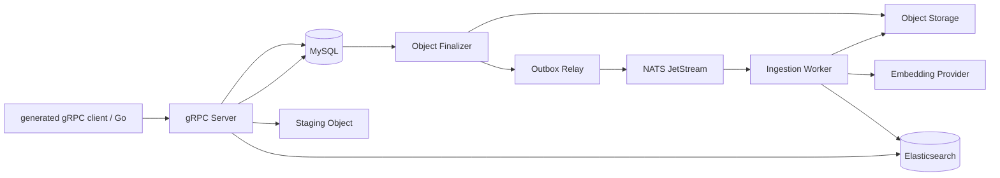

# RAG MVP 中间件知识地图

这份文档只解释本仓库实际使用、运行时必须理解的基础设施。学习顺序建议是：先理解一次文档摄取如何跨越 MySQL、对象存储、NATS、Worker 和 Elasticsearch；再分别深入每个中间件。

## 1. 整体协作关系

一次上传不会直接把完整任务消息发送给 Worker：文件先进入 staging object；MySQL 事务记录 Document、Job、Task 与 OutboxEvent；Finalizer 把文件提升为正式对象后，Relay 才向 NATS 发布 `task_id`。Worker 回读 MySQL 的权威状态，完成解析、切块、向量化和 ES 写入。检索则由 gRPC Server 同时查询 ES 与 MySQL，避免已删除或过期索引版本重新可见。

## 2. MySQL / InnoDB：业务事实与一致性

### 它在项目中负责什么

MySQL 保存 Tenant、Dataset、Document、IngestionFingerprint、Job、Task、OutboxEvent、索引版本与幂等记录。它是业务状态的唯一权威来源；ES 和 NATS 都不能代替它保存最终事实。

### 必须掌握的概念

| 概念 | 含义 | 本项目中的用途 |
| --- | --- | --- |
| InnoDB 事务 | 多个 SQL 写入要么全部提交，要么全部回滚 | 同一事务创建 Document、Job、Task 和 OutboxEvent，避免“数据库写成功但消息丢失” |
| 行锁 | 并发请求对同一行串行协调 | 删除 Document、RetryJob、同内容上传去重时防止竞态 |
| 唯一约束 | 数据库强制一个业务键只能出现一次 | `(dataset_id, file_sha256, config_digest)` 只保留一个 canonical 摄取任务 |
| 幂等键 | 重复请求返回第一次结果，而不是重复执行 | 网络重试不会创建第二个 Job 或覆盖 staging object |
| 状态机 | 状态只能按允许的边迁移 | Job/Task 使用 `PENDING → RUNNING → SUCCEEDED/FAILED/CANCELLED` |
| Transactional Outbox | 业务状态与“待发送事件”同事务落库 | Relay 可在 NATS 短暂不可用后补发 `task_id` |

关键理解：MySQL 不负责全文或向量搜索；它负责回答“这个文档现在是否存在、哪个索引版本可见、这个任务是否仍可执行”。

## 3. Elasticsearch：全文与向量检索引擎

### 它在项目中负责什么

Elasticsearch 保存可检索 Chunk 的正文、metadata、来源定位与向量。它同时完成关键词检索和语义检索，但不拥有 Document 的生命周期状态。

### 必须掌握的概念

| 概念 | 含义 | 本项目中的用途 |
| --- | --- | --- |
| 倒排索引 | 从词项快速找到包含该词的文档 | BM25 关键词/全文召回 |
| BM25 | 基于词频、文档长度等计算的相关性分数 | 对专有名词、精确术语和代码符号有效 |
| `dense_vector` | 固定维度的浮点向量字段 | 保存 Embedding，支持语义 KNN |
| KNN | 从向量空间找最近邻 | Dense 召回语义相近的 Chunk |
| Bulk upsert | 一次批量写入或覆盖多条记录 | Worker 为一个文档版本写入多个 Chunk，支持重放 |
| 物理 `_id` | ES 文档唯一键 | `{document_id}:{index_version}:{chunk_id}`，防止新旧版本互相覆盖 |
| RRF | 基于名次而非原始分数融合多路结果 | Python `retrieval/hybrid.py` 合并 Dense 与 BM25 候选 |

关键理解：ES 返回的是“候选”。`RetrievalService` 还要回查 MySQL 的删除状态和 `active_version`，才能把候选变成真正可见的 evidence。

## 4. NATS JetStream：可靠的异步任务投递

### 它在项目中负责什么

JetStream 承载 Task 的异步通知。消息体只包含 `task_id`，不能携带或决定 Task 的真实状态；Worker 收到消息后必须回读 MySQL。

### 必须掌握的概念

| 概念 | 含义 | 本项目中的用途 |
| --- | --- | --- |
| Stream | 持久化消息日志 | 保存 `rag.tasks` 上的摄取任务通知 |
| Subject | NATS 的消息主题 | 生产者和 consumer 通过约定主题通信 |
| Durable consumer | consumer 的持久身份与投递进度 | Worker 重启后仍从正确位置恢复 |
| ACK | Worker 明确确认已处理 delivery | 只有 Task 成功收敛或确认无需执行时才 ACK |
| NAK | Worker 告知当前 delivery 未完成 | 失败可按策略重投 |
| `ack_wait` | 未 ACK 后等待多久重投 | 处理进程强杀、网络中断或卡死 |
| redelivery | 同一消息再次投递 | 至少一次语义的正常结果，不等于重复写入 |

关键理解：JetStream 提供的是至少一次投递，而不是“恰好一次执行”。本项目用 `Task.last_delivery_sequence`、MySQL 条件认领、幂等 ES `_id` 和状态机，把重复投递收敛为一次可见结果。

## 5. 对象存储：原始文件的可靠落点

### 它在项目中负责什么

对象存储保存上传的原始二进制。MVP 使用本地 `data/objects/`；未来可以通过 `ObjectStorage` port 换成 MinIO 等云对象存储，而不改变 application 层。

### 必须掌握的概念

| 概念 | 含义 | 本项目中的用途 |
| --- | --- | --- |
| staging object | 上传过程中尚未正式可用的对象 | 名称由 `idempotency_key` 派生，避免中断上传污染正式目录 |
| Finalizer | 将 staging 提升为正式对象的后台角色 | 对象就绪后才让 Outbox 进入可发布状态 |
| 正式 object | Worker 可安全读取的原文件 | 对应 Document 的 object key |
| TTL sweeper | 定期清理长期无人引用的临时对象 | 回收上传中断或失败遗留物 |
| 逻辑删除与异步清理 | 先让业务不可见，再慢慢删除物理文件 | 删除请求不会被慢速对象 I/O 阻塞 |

关键理解：对象存储与 MySQL 没有跨库事务。staging → Finalizer → Outbox 的设计，就是为了在“文件成功、数据库失败”或反向故障时仍能恢复。

## 6. Embedding Provider：外部模型依赖

Embedding Provider 通常是兼容 OpenAI `/embeddings` 的 HTTP 服务。

| 概念 | 含义 | 本项目中的用途 |
| --- | --- | --- |
| Embedding | 将文本变成固定维度向量 | Chunk 入库与查询语义检索 |
| 向量维度 | 每个向量的元素数量 | 必须和 ES `dense_vector` mapping 一致 |
| batch size | 单个 HTTP 请求携带的输入条数上限 | 默认最多 32；供应商拒绝多输入 HTTP 400 时按顺序二分请求 |
| 限流/瞬时故障 | 429、5xx、网络超时等暂时不可用 | 有边界的指数退避，最终映射 `EMBEDDING_UNAVAILABLE` |
| 非重试错误 | 鉴权错误、单条非法输入或维度不匹配 | 返回稳定错误码，不能静默使用 Fake 向量 |

不同供应商会限制最大输入条数、总 token 或请求体大小。因此“配置 batch size”是吞吐与兼容性的平衡：大批量减少网络往返，小批量更容易满足服务限制。

## 7. gRPC / protobuf：Python 与调用方的服务边界

### 它在项目中负责什么

gRPC 是 Python RAG 服务的唯一接口。当前可由 `rag-dev` 或 generated client 调用；未来 Go 控制面通过同一份 protobuf 调用 Python。

### 必须掌握的概念

| 概念 | 含义 | 本项目中的用途 |
| --- | --- | --- |
| `.proto` | RPC 服务、请求和响应的唯一契约 | Python/Go 同步生成客户端与服务端代码 |
| unary RPC | 一次请求对应一次响应 | CreateDataset、GetJob、Retrieve 等 |
| client streaming | 客户端连续发送多帧数据 | SubmitDocument 分帧上传大文件 |
| deadline | 调用方设置的超时时间 | 防止网络或服务端无限等待 |
| generated client | 从 protobuf 自动生成的调用代码 | 测试和 `dev/cli.py` 不绕过 RPC 直调 application |

关键理解：gRPC 是边界协议；业务状态依旧在 MySQL，耗时摄取依旧经 NATS，全文/向量命中依旧由 ES。

## 8. Docker Compose 与 Earthly：单机运行和可重复门禁

### Docker Compose

`docker-compose.yml` 定义单机拓扑：MySQL、Elasticsearch、NATS、迁移容器、gRPC Server、Worker、Outbox 和测试容器。你需要掌握：

- `depends_on` 和 healthcheck：应用只在数据库迁移和依赖健康后启动；
- named volume：保存 MySQL、ES、NATS 与对象文件数据；正常停止不能使用 `down -v`；
- profile：`rag-test` 仅在 test profile 下运行；
- environment：模型 URL、名称、密钥、维度只通过环境变量注入。

### Earthly 与 Make

Earthfile 将 Python、uv、依赖和测试命令固定下来；Makefile 只暴露稳定的公共入口，例如 `make lint`、`make test`、`make ci` 和 `make docker-test SUITE=integration`。因此日常不应复制长 Docker 命令到 Hook 或 CI，而应调用 Make target。

关键理解：Compose 解决“哪些服务一起运行”，Earthly 解决“用什么一致环境构建和验证”，Make 解决“开发者如何稳定地调用它们”。

## 9. WSL2：Windows 上的 Linux 开发运行层

Windows 上推荐在 Ubuntu WSL2 中运行 Make、Earthly 和 Docker CLI，而 Docker Engine 仍由 Docker Desktop 提供。它的角色不是再安装一个 Docker Engine，而是让 Linux 工具链通过 Docker Desktop Integration 使用同一个 Engine。

需要掌握：

| 概念 | 含义 | 本项目中的影响 |
| --- | --- | --- |
| WSL2 distribution | Windows 内运行的真实 Linux 环境，例如 Ubuntu | 运行 GNU Make、Linux Earthly、uv 与 shell 工具 |
| Docker Desktop Integration | Docker Desktop 向指定 WSL 发行版注入 Docker CLI/socket 访问 | Ubuntu 内的 `docker version` 应能看到同一 Docker Engine |
| Linux 路径 | 如 `/mnt/c/Users/.../RAG` | 从 WSL 进入 Windows 工作区后执行 Make |
| 文件系统边界 | Windows NTFS 与 WSL ext4 的性能/权限差异 | 小项目可直接在 `/mnt/c`；高频 I/O 场景可迁到 WSL 文件系统 |
| 默认发行版 | WSL 启动时默认进入的 Linux 发行版 | Docker Desktop 可选择集成默认发行版或指定 Ubuntu |

推荐验证顺序：在 Docker Desktop 设置中启用 **Use the WSL 2 based engine** 和 Ubuntu 的 **WSL Integration**；然后在 Ubuntu 中执行 `docker version`，再进入 `/mnt/c/Users/wcz/Documents/ChatGPT/RAG` 执行 `make docker-up`。如果 Ubuntu 内没有 `docker` 命令，不要在 Ubuntu 再安装独立 Docker Engine，先检查 Docker Desktop 的 WSL Integration。

## 10. 一条完整链路的复习方式

以“上传一个 PDF 并提问”为例：

1. gRPC client 流式发送上传帧，Server 写 staging object。
2. MySQL 在一个事务内写 Document、Job、Task、OutboxEvent 和幂等记录。
3. Finalizer 提升对象，Relay 从 MySQL 读取 READY OutboxEvent 并将 `task_id` 发布到 JetStream。
4. Worker 接到 delivery，回查 MySQL，解析 PDF、切块、调用 Embedding Provider，并 Bulk upsert 到 ES。
5. Worker 条件完成 Task/Job，切换 Document 的 active index version，然后 ACK NATS delivery。
6. 调用方执行 Retrieve；服务生成 query vector，向 ES 请求 Dense 和 BM25 候选，回查 MySQL 可见性，RRF 融合后返回 evidence 与定位信息。

