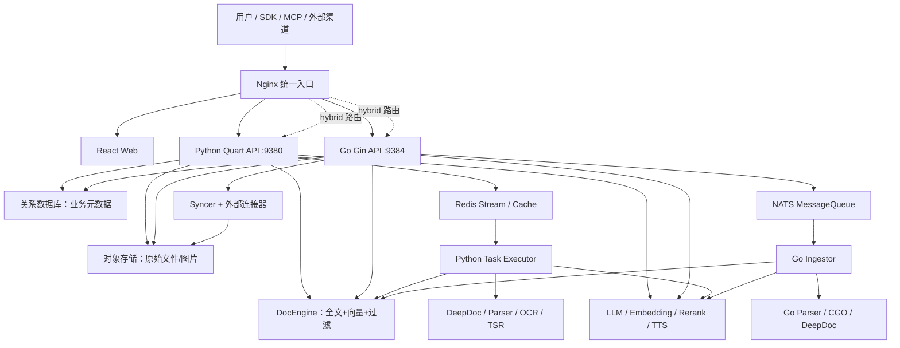
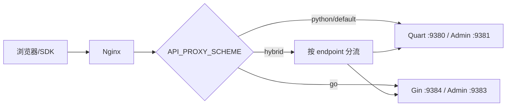
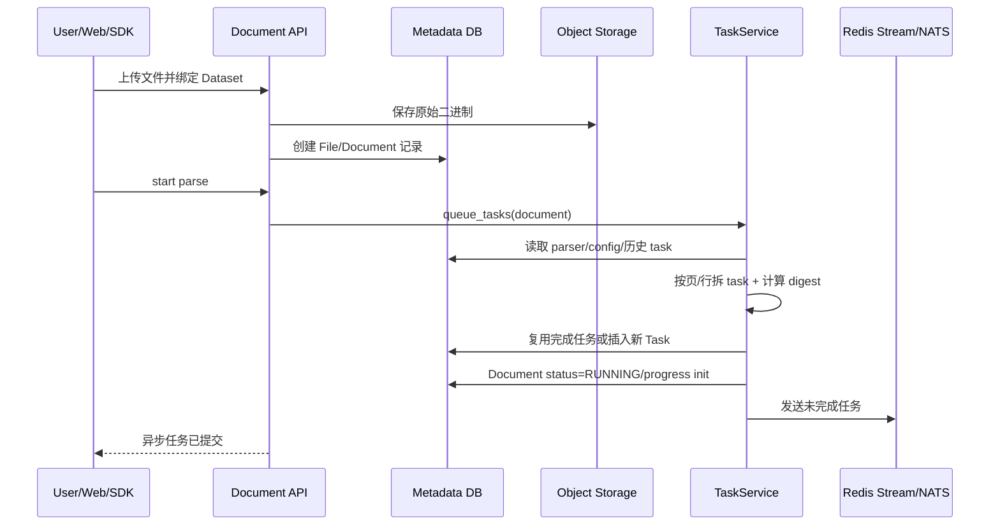
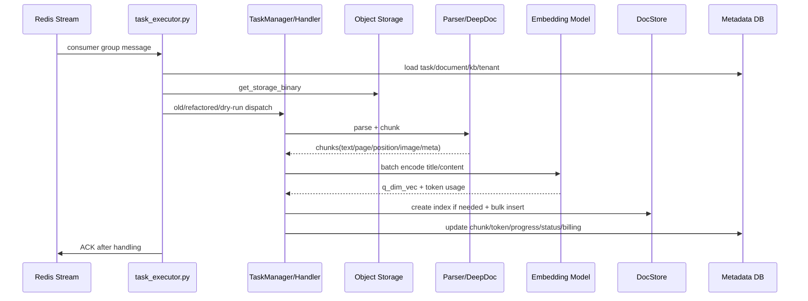
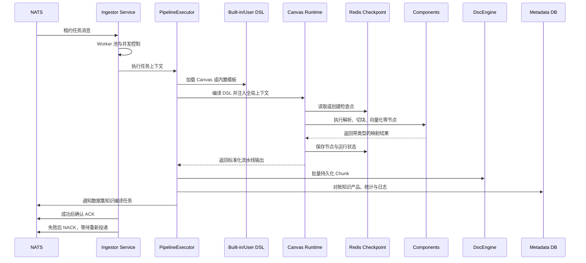
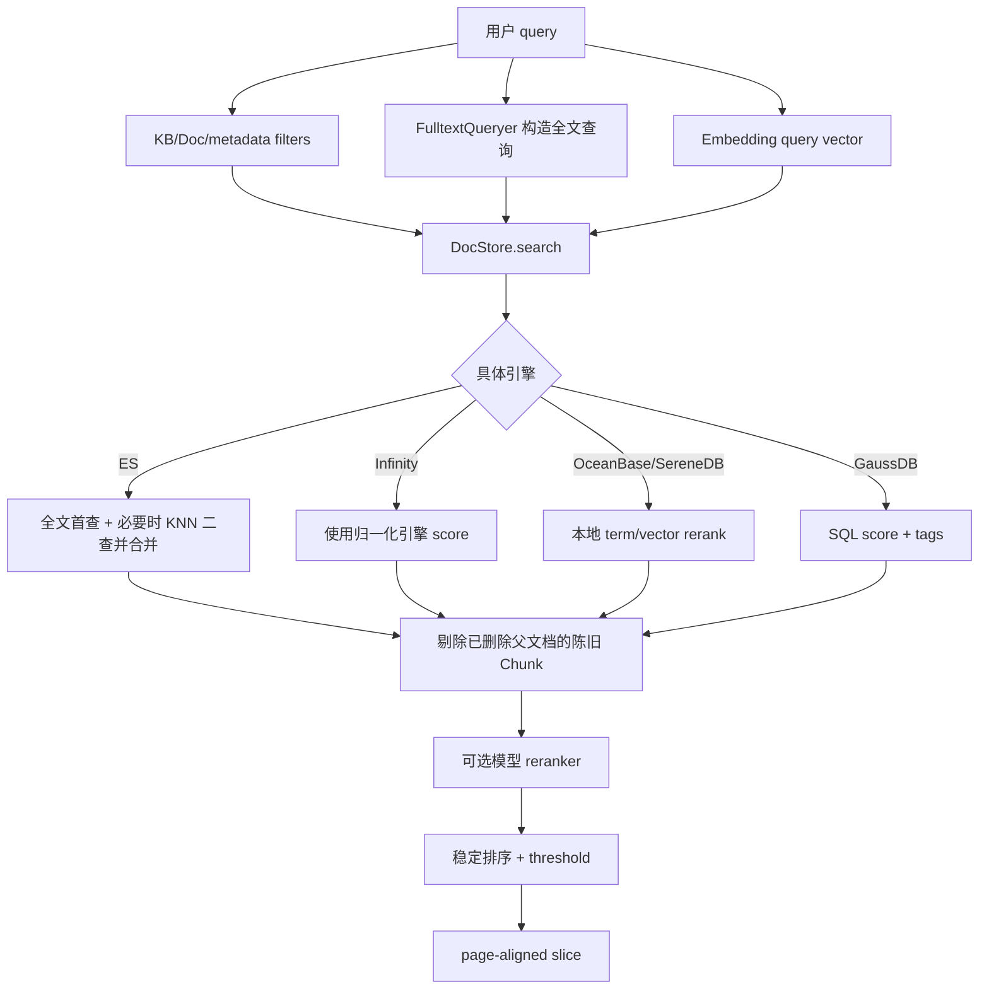
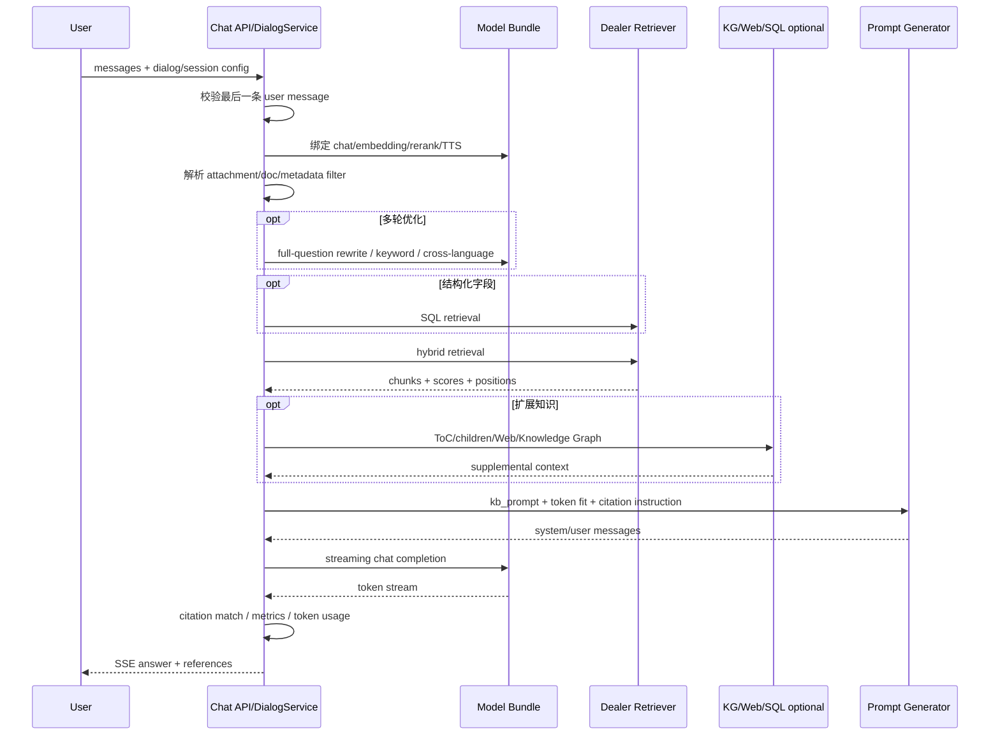
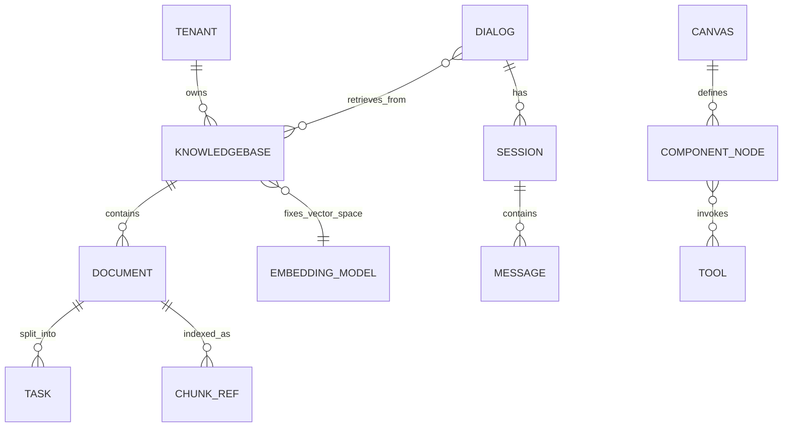

# RAGFlow v0.27.0 / main（同时带 nightly tag）源码级架构分析

> 分析对象：`D:\AI\github\ragflow`  
> 源码基线：分支 `main`，提交 `f796721ff25f0f86e4499c166f0c49228d5f6ad7`；该提交同时带 `nightly` tag  
> 项目版本：`pyproject.toml = 0.27.0`  
> 分析日期：2026-08-22  
> 证据优先级：固定提交源码 > 同版本官方文档 > 本文架构推断

## 0. 阅读说明与结论边界

这不是把 README 改写成“前端—后端—数据库”的概览，而是沿真实调用链读取了启动脚本、Python/Go 组合根、API、任务队列、摄取流水线、解析器、检索器、对话编排、Agent、存储适配器、前端运行时分流以及测试代码后得到的源码级模型。

当前仓库约有 7000 个文件，其中还包含 1736 个前端源码/资源文件、897 个 Go 测试文件、数百个 fixture、SVG、模型配置和第三方绑定。逐字列出所有资源文件既不能解释架构，也会掩盖关键边界。因此本文采用三层“文件级”粒度：

1. 根目录文件逐一说明；
2. 所有一级目录、核心二级包逐一说明；
3. 生产调用链上的关键源码文件逐一说明，并给出同类文件的命名/职责规则。测试则按测试目录、执行入口、测试层级和代表性用例拆解。

最重要的判断是：**RAGFlow 不是一个 `loader → splitter → vector store → LLM` 的轻量 RAG 链，而是一套围绕知识资产生命周期构建的数据与 AI 平台。** 它把原始文件、业务元数据、检索索引和异步任务分别交给对象存储、关系数据库、文档引擎和消息队列；摄取与问答是两条独立但以 Chunk 为契约连接的流水线。

第二个关键判断是：**当前代码处在 Python 向 Go 渐进迁移，而不是清晰的“Python 负责 AI、Go 负责基础设施”二分。** Python 和 Go 都有 API、业务服务、摄取、解析、检索/Agent 相关实现；Docker 通过 `API_PROXY_SCHEME=python|go|hybrid` 选择后端，前端也会探测 `/api/v1/language` 再选择差异实现。Go 代码已经很大，但 Python 仍是格式支持最完整、官方运行手册最主要的生产路径。

---

## 1. 仓库规模与技术构成

### 1.1 文件规模

| 类型 | 约计文件数 | 主要用途 |
|---|---:|---|
| Go `.go` | 2014 | 新 API、领域服务、DAO、摄取、Agent Harness、解析、引擎、对象存储、同步器及大量测试 |
| Python `.py` | 1189 | 成熟 API、任务执行器、DeepDoc、检索/生成、模型适配、Agent Canvas、SDK、MCP 和测试 |
| React `.tsx` | 839 | 页面、组件、Agent/数据流画布、管理端和文档交互 |
| TypeScript `.ts` | 532 | 服务调用、状态、Hooks、类型、工具、测试 |
| C/C++ `.c/.cc/.cpp/.h` | 129 | 分词、PDF/Office 解析等原生绑定及性能敏感能力 |
| Shell/YAML | 55+ | 构建、容器入口、Compose、Helm、CI/CD |
| Markdown/MDX | 217+ | 官方文档、开发说明、测试说明 |

一级目录文件数能反映重心：`internal/` 约 2265，`web/` 约 1759，`test/` 约 517，`rag/` 约 252，`api/` 约 162，`agent/` 约 150，`docs/` 约 143。Go 已不是一个边缘工具，而是仓库最大的后端实现区。

### 1.2 主要技术栈

| 层 | 技术 |
|---|---|
| Python Web | Quart、Quart-CORS、Quart-Schema、Quart-Auth；Peewee 元数据模型 |
| Go Web | Gin；GORM；Viper；Zap |
| Web | React 18、TypeScript、Vite、React Router、React Query、Zustand、Ant Design、X6/XYFlow |
| 元数据 | MySQL 为默认；Python 配置还支持 PostgreSQL/OceanBase/GaussDB 等路径 |
| 原始文件 | MinIO 默认，另有 S3/OSS/GCS/Azure/OpenDAL 等适配 |
| 文档引擎 | Elasticsearch、Infinity，并在当前源码中扩展 OceanBase/SeekDB/GaussDB/SereneDB 等实现 |
| 队列/缓存 | Python 路径主要使用 Redis Streams；Go 路径的 `MessageQueue` 当前工厂选择 NATS；Redis 仍用于缓存、会话、checkpoint 等 |
| 可观测性 | 日志、任务心跳、Langfuse、OpenTelemetry、Jaeger，可选 ClickHouse 分析 |
| 原生能力 | CGO、PDFium、pdf-oxide、office-oxide、C++ tokenizer binding |

源码入口证据：[Python 项目依赖](D:/AI/github/ragflow/pyproject.toml)、[Go 模块](D:/AI/github/ragflow/go.mod)、[前端依赖](D:/AI/github/ragflow/web/package.json)。

---

## 2. 整体文件架构树

```text
ragflow/
├─ .agents/                    Agent/开发辅助配置
├─ .github/
│  ├─ workflows/              CI、分层测试、镜像构建、发布
│  └─ ISSUE_TEMPLATE/...      协作与问题模板
├─ admin/                      独立管理端：Python 服务 + 客户端
│  ├─ client/
│  └─ server/
├─ agent/                      Python Agent Canvas、组件、工具、沙箱
│  ├─ component/              LLM、Retrieval、Message、Switch 等节点
│  ├─ plugin/                 Agent 插件机制
│  ├─ sandbox/                代码执行沙箱与多供应商执行器
│  ├─ templates/              Agent 模板
│  ├─ test/                   Python Agent 局部测试
│  └─ tools/                  搜索、浏览器、SQL、邮件等工具
├─ api/                        成熟 Python 控制面/API 与元数据服务
│  ├─ apps/
│  │  ├─ restful_apis/        Dataset/Document/Chunk/Chat/Agent/Search 等 REST API
│  │  ├─ services/            HTTP 辅助服务
│  │  └─ auth/                登录、鉴权、OAuth
│  ├─ channels/               飞书/钉钉/Discord/Slack/Teams/WhatsApp 等渠道
│  ├─ db/
│  │  ├─ db_models.py         Peewee 业务模型
│  │  ├─ services/            业务服务与事务/队列编排
│  │  └─ init_data/           初始化模型、模板、迁移数据
│  ├─ utils/                  API 层通用工具
│  └─ ragflow_server.py       Python API 进程入口
├─ bin/                        构建产物目录
├─ cmd/                        Go 进程入口
│  └─ ragflow_server.go       API/Admin/Ingestor/Syncer 多模式入口
├─ common/                     Python 跨域基础设施与配置
│  ├─ data_source/            外部数据源连接器
│  ├─ doc_store/              文档引擎抽象及 ES/Infinity/... 适配
│  ├─ storage/                对象存储适配
│  ├─ redis_conn.py           Redis 缓存/队列封装
│  └─ settings.py             Python 组合根与全局依赖装配
├─ conf/
│  ├─ models/                 模型供应商/模型目录配置
│  ├─ llm_factories.json      LLM 工厂元数据
│  ├─ mapping.json            索引字段映射
│  └─ service_conf.yaml       本地服务配置
├─ deepdoc/                    Python 深度文档理解
│  ├─ parser/                 PDF/DOCX/Excel/PPT/HTML/Markdown/... 解析
│  ├─ vision/                 OCR、版面分析、表格结构识别
│  └─ server/                 可独立部署的 DeepDoc 推理服务
├─ docker/
│  ├─ docker-compose.yml      应用服务组合
│  ├─ docker-compose-base.yml 基础设施组合
│  ├─ .env                    部署变量
│  ├─ service_conf.yaml.template
│  ├─ entrypoint.sh           总容器入口与 Python/Go/Hybrid 路由
│  ├─ launch_backend_service.sh
│  └─ nginx/                  三种后端代理配置
├─ docs/                       Quickstart、配置、指南、参考、FAQ 源文件
├─ example/                    SDK/API/应用示例
├─ helm/                       Kubernetes Helm Chart
├─ internal/                   Go 后端主体（仅 Go 包内可见）
│  ├─ admin/                  Go 管理端
│  ├─ agent/
│  │  ├─ canvas/              Go Canvas 图执行
│  │  ├─ component/           Agent 节点
│  │  ├─ runtime/             节点注册/运行协议
│  │  ├─ sandbox/             Go 沙箱适配
│  │  └─ tool/                Agent 工具
│  ├─ binding/                C/C++/Rust 风格原生库绑定
│  ├─ channels/               Go 消息渠道
│  ├─ cli/                    Go CLI 实现
│  ├─ common/                 Go 通用常量/ID/上下文
│  ├─ dao/                    GORM DAO 与数据库初始化
│  ├─ deepdoc/                Go PDF/DOCX 深度解析
│  ├─ engine/                 DocEngine 与 MessageQueue 端口/适配器
│  ├─ entity/                 领域实体、数据库模型、JSON 类型
│  ├─ handler/                Gin HTTP handler
│  ├─ harness/                通用图引擎 + Agent ADK + AgentLoop
│  ├─ ingestion/
│  │  ├─ component/           Parser/Chunker/Tokenizer 等节点
│  │  ├─ pipeline/            DSL 编译、checkpoint、resume
│  │  ├─ task/                单任务执行/持久化
│  │  ├─ service/             NATS 消费、worker pool、心跳
│  │  ├─ compilation/         Dataset/Document 知识编译
│  │  └─ knowledge_compile/   Wiki/Graph/Tree 等知识产品
│  ├─ parser/                 通用文件解析器与 CGO/非 CGO 分支
│  ├─ router/                 Go API 路由表
│  ├─ server/                 配置与服务生命周期
│  ├─ service/                Go 业务用例层
│  ├─ storage/                Go 对象存储端口/适配器
│  ├─ syncer/                 外部数据同步调度/连接器
│  └─ tokenizer/              Go 分词器
├─ mcp/                        MCP Server/Client，封装 RAGFlow HTTP API
├─ memory/                     对话记忆抽取、存储和混合检索
├─ rag/                        Python RAG 核心
│  ├─ app/                    各分块模板/文件类型处理策略
│  ├─ flow/                   Python Ingestion Pipeline DSL
│  ├─ graphrag/               图谱构建与检索
│  ├─ llm/                    模型 Bundle/供应商统一调用
│  ├─ nlp/                    分词、全文查询、混合召回、排序
│  ├─ prompts/                Prompt 模板、引用、压缩和查询改写
│  └─ svr/                    Task Executor 与重构版摄取服务
├─ ragflow_deps/               特殊依赖/构建辅助
├─ sdk/                        Python Client SDK
├─ test/
│  ├─ unit_test/              Python 单元/组件测试
│  ├─ testcases/              SDK、REST、Web/Admin 业务测试
│  ├─ integration/            跨组件集成测试
│  ├─ playwright/             浏览器 E2E
│  ├─ benchmark/              端到端性能基准
│  └─ fixtures/               共享样本
├─ tools/                      迁移、检查、运维和开发脚本
├─ web/                        React/Vite 前端
│  ├─ src/pages/              页面级业务域
│  ├─ src/components/         通用与领域组件
│  ├─ src/services/           HTTP/SSE API 客户端
│  ├─ src/hooks/              React hooks
│  ├─ src/interfaces/         TypeScript DTO/领域类型
│  ├─ src/utils/              请求、运行时分流和通用工具
│  └─ src/main.tsx            前端入口
├─ build.sh                    Go/C++ 构建和 Go 分层测试入口
├─ run_tests.py               Python unit_test 便捷执行器
├─ run_go_tests.sh            Go 测试包装
├─ Dockerfile*                CPU/GPU/CI/DeepDoc/TEI 镜像
├─ go.mod / go.sum            Go 依赖锁定
├─ pyproject.toml / uv.lock   Python 项目、测试配置与依赖锁定
└─ README*.md                 多语言项目说明
```

---

## 3. 逻辑架构：控制面、数据面与执行面



### 3.1 四类持久状态

| 状态 | 系统记录什么 | 为什么不能混为一个库 |
|---|---|---|
| 关系数据库 | User/Tenant、Dataset、Document、Task、Dialog、Canvas、模型配置、权限、计数 | 强事务、关系查询、业务一致性 |
| 对象存储 | 上传原文件、解析图片、派生二进制 | 大对象吞吐与生命周期，不适合关系表 |
| 文档引擎 | Chunk 文本、稀疏字段、稠密向量、标签、页码、位置、元数据 | 全文+向量+过滤+排序的在线召回 |
| Redis/NATS | 异步任务、consumer group、缓存、会话、checkpoint、心跳 | 解耦慢任务、并发消费、失败重试与恢复 |

这种分离是 RAGFlow 最值得借鉴的底层设计：**Chunk 是检索数据契约，但 Document/Task 才是业务事实；索引可以重建，原文件和元数据不能丢。**

### 3.2 Python 与 Go 的真实职责

| 领域 | Python | Go | 当前判断 |
|---|---|---|---|
| API | Quart REST API、认证、渠道、开放 API | Gin REST API、Admin/API 模式 | 两套重叠实现，受代理方案控制 |
| 元数据 | Peewee service/model | GORM DAO/entity/service | 正在形成 Go 分层架构 |
| 摄取 | 最完整 Task Executor，格式覆盖广 | DSL Pipeline、NATS worker、checkpoint/resume | Go 结构更清晰，格式仍在迁移 |
| 解析 | DeepDoc OCR/DLA/TSR，格式最全 | PDF/DOCX/TXT 主路径、CGO/原生绑定 | Python 仍是能力基准 |
| 检索/问答 | `Dealer` 混合召回、完整 chat orchestration | Go service/engine/handler 逐步覆盖 | Python 源码仍最能解释产品行为 |
| Agent | Python Canvas 与大量组件/工具 | Canvas + 新 Harness/ADK/AgentLoop | 新旧并存，Go Harness 更偏目标架构 |
| 数据同步 | Python data_source 适配 | Go Syncer/connector 体系 | Go 已形成独立运行模式 |
| CLI/运维 | 各种脚本和 Python SDK | Go CLI 与单二进制多模式启动 | Go 更适合部署与并发 worker |

运行时证据：[Docker 入口](D:/AI/github/ragflow/docker/entrypoint.sh)、[后端启动脚本](D:/AI/github/ragflow/docker/launch_backend_service.sh)、[Go 多模式入口](D:/AI/github/ragflow/cmd/ragflow_server.go)、[前端语言探测](D:/AI/github/ragflow/web/src/utils/backend-runtime.ts)、[前端差异分发唯一入口](D:/AI/github/ragflow/web/src/utils/backend-variant.tsx)。

---

## 4. 根目录文件逐一职责

| 文件 | 职责 |
|---|---|
| `AGENTS.md` | 面向开发代理/贡献者的仓库结构、测试层级、编码约束说明；尤其明确 Go build tag 分层 |
| `build.sh` | 构建 Go/C++/原生依赖，并提供 unit/integration/e2e/manual/all 测试入口 |
| `run_go_tests.sh` | Go 测试便捷包装，设置必要环境 |
| `run_tests.py` | 只面向 `test/unit_test` 的 Python 测试执行器，支持 coverage、xdist、marker、keyword、target |
| `test.py` | 仓库级测试/开发辅助入口，不能替代分层 CI |
| `go.mod`, `go.sum` | Go 1.26.4 模块与依赖锁；暴露 Gin/GORM/NATS/Redis/ES/Infinity/云存储/CGO 生态 |
| `pyproject.toml` | Python 3.13 项目元数据、完整依赖、pytest/coverage/ruff 配置 |
| `uv.lock` | Python 可重复依赖解析 |
| `web/package.json` | 前端 build/lint/type-check/Jest/Storybook 脚本与依赖 |
| `Dockerfile` | 主 RAGFlow 镜像 |
| `Dockerfile_base` | 大型系统库、模型/解析依赖的基础镜像，降低主镜像重复构建成本 |
| `Dockerfile_ci` | CI 专用构建上下文 |
| `Dockerfile_deepdoc_oss` | DeepDoc 独立服务镜像 |
| `Dockerfile_tei` | Text Embeddings Inference 镜像 |
| `Dockerfile.scratch.oc9` | 特定基础系统/极简发布构建辅助 |
| `codecov.yml` | 覆盖率平台配置 |
| `lefthook.yml` | 本地 Git hooks/质量检查编排 |
| `show_env.sh` | 诊断运行环境、依赖和系统信息 |
| `README.md`, `README_*.md` | 多语言项目入口文档 |
| `SECURITY.md` | 漏洞报告和安全政策 |
| `LICENSE` | Apache-2.0 许可证 |
| `.dockerignore`, `.gitignore` | 构建上下文和版本控制排除规则 |
| `.gitattributes` | Git 文件属性、换行/二进制策略 |
| `.trivyignore` | 容器/依赖安全扫描例外 |
| `.rooignore` | AI/开发工具索引忽略规则 |

---

## 5. 生产目录与关键文件职责图谱

### 5.1 `api/`：Python 控制面和业务编排

| 文件/目录 | 负责什么 | 不负责什么 |
|---|---|---|
| `api/apps/__init__.py` | 构造 Quart app、初始化 settings、CORS、schema、session、auth、动态注册 blueprint | 不写具体 Dataset/Chat 业务 |
| `api/ragflow_server.py` | Python 进程入口、信号处理、运行配置、进度/渠道后台线程、启动 Quart | 不直接解析文档 |
| `api/apps/restful_apis/*_api.py` | HTTP DTO 校验、鉴权、调用 service、组装响应；一个业务资源一个 API 文件 | 不应承载持久化细节 |
| `api/apps/restful_apis/dataset_api.py` | Dataset 创建、配置、列表、删除等 |
| `document_api.py` | 上传、解析启动/停止、状态和文档操作 |
| `chunk_api.py` | Chunk 增删改查、人工干预 |
| `chat_api.py` | Chat/Completion/流式输出入口 |
| `search_api.py` | AI Search 与检索测试入口 |
| `agent_api.py` | Agent Canvas/会话/运行接口 |
| `api/db/db_models.py` | Peewee 数据模型；Knowledgebase、Document、Task 等是摄取状态机的事实来源 |
| `api/db/services/*_service.py` | 按实体封装查询、事务与用例编排；API 和 worker 共享 |
| `api/db/services/task_service.py` | 切分任务、digest 去重、复用已有结果、写 Task、维护文档 pending counter、入 Redis 队列 |
| `api/db/services/dialog_service.py` | 对话总编排：模型绑定、问题改写、元数据过滤、召回、KG/Web 补充、Prompt、生成、引用、流式输出 |
| `api/channels/*` | 把外部 IM 平台消息转换为 RAGFlow Chat/Agent 调用，并回传结果 |

源码：[Quart app 装配](D:/AI/github/ragflow/api/apps/__init__.py)、[Python server](D:/AI/github/ragflow/api/ragflow_server.py)、[TaskService](D:/AI/github/ragflow/api/db/services/task_service.py)、[DialogService](D:/AI/github/ragflow/api/db/services/dialog_service.py)。

### 5.2 `common/`：Python 端口、适配器和运行时组合根

| 文件/目录 | 职责 |
|---|---|
| `common/settings.py` | 读取服务配置；构造数据库、DocStore、Storage、Retriever/KG Retriever 等全局依赖；原先空壳 `api/settings.py`、`rag/settings.py` 已不再是事实源 |
| `common/doc_store/doc_store_base.py` | 定义 `MatchText/Dense/Sparse/Tensor/Fusion` 查询表达式、排序和抽象 `DocStoreConnection` |
| `common/doc_store/es_conn.py` 等 | 把统一表达式翻译为具体引擎查询，并适配结果/批量写/索引管理 |
| `common/storage/*` | MinIO、S3、OSS、Azure、GCS、OpenDAL 等对象存储实现 |
| `common/redis_conn.py` | Redis 连接、缓存、stream consumer/producer 等共享封装 |
| `common/data_source/*` | 外部内容源适配器，读取第三方文件/页面/数据库内容 |

这里采用“端口 + 适配器”思想，但 `settings.py` 的全局单例也造成初始化顺序、隔离测试和多租户配置注入较重，这是可借鉴设计里应主动收敛的部分。

### 5.3 `rag/`：Python RAG 算法与执行层

| 文件/目录 | 职责 |
|---|---|
| `rag/svr/task_executor.py` | Redis 队列消费、任务心跳/取消、读取文件、解析/分块/Embedding/索引、GraphRAG/RAPTOR 等慢任务总入口 |
| `rag/svr/task_executor_refactor/task_manager.py` | 重构版统一入口；生产使用空记录器，dry-run 拦截写操作并与旧结果比对 |
| `.../task_context.py` | 把松散 task dict 包装成有类型上下文，注入 semaphore、回调、记录器和写拦截器 |
| `.../task_handler.py` | 按 task type 路由 standard、dataflow、raptor、graphrag、mindmap、wiki、skill、evaluation、reembedding、clone 等处理器 |
| `.../chunk_service.py` | 选择分块器、运行 chunking、处理 outline/图片/关键词/问题/元数据/标签 |
| `.../embedding_service.py` | 批量向量化，组合标题与正文向量，生成 `q_<dim>_vec` 字段 |
| `.../dataflow_service.py` | 执行可视化 DSL，标准化节点输出、补 Embedding、批量索引、更新统计与计费 |
| `.../write_operation_interceptor.py` | dry-run 时截获副作用，避免比对执行污染生产数据 |
| `.../recording_context.py` | 记录阶段输出、时序和副作用，供新旧执行结果比较 |
| `rag/app/*.py` | 按模板/文档类型实现 naive/general、paper、book、presentation、manual、laws、QA、table、resume、picture、one、audio、email、KG、tag 等分块 |
| `rag/nlp/search.py` | `Dealer`：全文查询构建、查询向量化、混合召回、引擎差异处理、rerank、稳定分页、citation 对齐 |
| `rag/nlp/query.py` | 关键词/全文查询构造和相似度辅助 |
| `rag/prompts/generator.py` | Chunk 格式化、上下文 token 预算、KB Prompt、引用提示、问题改写、关键词/跨语言辅助 |
| `rag/llm/*` | Chat/Embedding/Rerank/TTS 等模型供应商的统一 Bundle 和调用封装 |
| `rag/flow/*` | Python Ingestion Pipeline 图/DSL、节点与执行 |
| `rag/graphrag/*` | 实体/关系/社区抽取，图谱构建、checkpoint 与图检索 |

源码：[Task Executor](D:/AI/github/ragflow/rag/svr/task_executor.py)、[重构入口](D:/AI/github/ragflow/rag/svr/task_executor_refactor/task_manager.py)、[混合检索](D:/AI/github/ragflow/rag/nlp/search.py)、[Prompt 预算与引用](D:/AI/github/ragflow/rag/prompts/generator.py)。

### 5.4 `deepdoc/`：复杂文档理解

| 文件/目录 | 职责 |
|---|---|
| `deepdoc/parser/pdf_parser.py` 等 | 将具体格式转换为带位置、页码、表格、图片关系的结构化内容 |
| `docx_parser.py`, `excel_parser.py`, `ppt_parser.py` | Office 格式专用语义/结构提取 |
| `html_parser.py`, `markdown_parser.py`, `txt_parser.py` | 轻结构文本格式解析 |
| `mineru_parser.py`, `mistral_ocr.py`, `docling_parser.py`, `opendataloader_*` | 可选第三方解析后端适配 |
| `deepdoc/vision/ocr.py` | OCR 文本与坐标识别 |
| `deepdoc/vision/layout_recognizer.py` | 页面版面区域分类与阅读顺序 |
| `deepdoc/vision/table_structure_recognizer.py` | 表格结构识别和单元格关系 |
| `deepdoc/server/deepdoc_server.py` | 独立 LitServe/HTTP 推理服务入口，暴露 health/model/predict 能力 |
| `deepdoc/server/endpoints/*` | DLA、TSR、OCR HTTP endpoints |
| `deepdoc/server/adapters/*` | endpoint 与本地 vision 实现之间的适配层 |

官方 FAQ 明确解释：RAGFlow 解析比轻量 RAG 框架慢，是因为版面分析、OCR、表格结构识别和内置文档结构模型。这不是实现低效，而是产品选择用更多计算换取复杂文档质量。[官方 FAQ](https://ragflow.io/docs/dev/faq#why-does-it-take-longer-for-ragflow-to-parse-a-document-than-langchain)

### 5.5 `agent/` 与 `internal/harness/`：两代图执行/Agent 架构

| 区域 | 设计 |
|---|---|
| `agent/canvas.py` | Python 图执行器；读取 DSL，实例化 component class，按边推进节点，写 Redis 日志并处理取消 |
| `agent/component/*` | Python 节点库：Begin、LLM、Retrieval、Message、Switch、Loop、Tool 等 |
| `agent/tools/*` | Agent 外部能力适配，统一成可描述、可调用工具 |
| `agent/sandbox/*` | 代码执行、provider、executor manager、超时与隔离 |
| `internal/agent/canvas/*` | Go Canvas；同一图运行思想也被摄取 Pipeline 复用 |
| `internal/agent/runtime/*` | Component 注册表、输入输出元数据、运行接口 |
| `internal/harness/graphengine/*` | Layer 1：Pregel/BSP 风格状态图、channel、checkpoint、interrupt、stream |
| `internal/harness/agentcore/*` | Layer 2：ReAct、middleware、tools、subagents、sequential/parallel/loop workflow |
| `internal/harness/agentloop/*` | Layer 3：push-based Agent loop |

这三层不要混淆：`internal/agent/canvas` 是当前 DSL/组件运行底座；`internal/harness` 是更通用、更偏框架化的新 Agent 运行时；Python `agent/canvas.py` 则是成熟产品链路。参见 [Python Canvas](D:/AI/github/ragflow/agent/canvas.py) 与 [Go Harness 设计说明](D:/AI/github/ragflow/internal/harness/README.md)。

### 5.6 `internal/`：Go 分层后端

| 包 | 职责与关键文件 |
|---|---|
| `cmd/ragflow_server.go` | 真正的 Go composition root；解析 `api/admin/ingestor/syncer` 模式，依次初始化 config、DB、DocEngine、Redis、Storage、MQ，并装配 service/handler/router |
| `internal/server/config.go` | 用 Viper 读取 general、DB、doc engine、storage、cache、queue、OTel、Admin、API、Ingestor、Syncer、SMTP、默认模型等配置 |
| `internal/router/router.go` | Gin 路由总表；鉴权/公开/测试路由分组；`/language` 供前端探测；Dataset/Document/Chunk/Chat/Search/Agent/Connector 等资源路由 |
| `internal/handler/*` | HTTP transport 层：解析参数、鉴权上下文、调用 service、统一错误和响应 |
| `internal/service/*` | 用例层：Dataset、Document、Chunk、Chat、Search、Memory、Model Provider、Connector 等业务编排 |
| `internal/dao/database.go` | GORM 数据库初始化、可选 AutoMigrate、模板/模型供应商初始数据 |
| `internal/dao/*` | 按实体隔离 SQL/GORM 查询和事务 |
| `internal/entity/*` | 领域实体和数据库映射；`models/` 是模型供应商/模型能力定义，而不是 ORM 的同义词 |
| `internal/engine/engine.go` | `DocEngine` 与 `MessageQueue` 核心接口；查询/索引/Chunk/元数据/SQL/KNN/健康检查均在此定界 |
| `internal/engine/global.go` | 根据配置选择 ES/Infinity/OceanBase/SeekDB/SereneDB 等实现，并初始化 NATS MQ；全局获取器也是测试 seam |
| `internal/storage/types.go` | `Storage` 端口：Put/Get/Remove/Exist/List/PresignedURL/Copy/Move/Close |
| `internal/storage/storage_factory.go` | MinIO/S3/OSS/GCS 工厂与生命周期；`SetStorage` 允许测试替身 |
| `internal/syncer/*` | 调度器、coordinator、checkpoint、task worker；`connector/*` 负责 50+ 外部数据源 |

Go 的主分层调用方向是：

```text
router → handler → service → dao/entity
                  ├→ engine.DocEngine
                  ├→ storage.Storage
                  ├→ model provider
                  └→ MessageQueue / Redis
```

这是比 Python “API + Service + settings 全局对象”更明确的依赖方向。不过 `engine/global.go` 与 storage factory 仍使用全局单例，所以并非完整依赖注入。

### 5.7 `web/`：按业务域组织的 React 客户端

| 文件/目录 | 职责 |
|---|---|
| `src/main.tsx` | 在首次 render 前探测后端语言，确保整棵组件树拿到一致 backend variant |
| `src/routes.tsx` | 浏览器路由与页面 lazy-loading |
| `src/utils/backend-runtime.ts` | 单次请求 `/api/v1/language`，缓存 Python/Go 后端标识并发布订阅 |
| `src/utils/backend-variant.tsx` | UI 内唯一受支持的 Python/Go 差异分发缝，避免散落 `if backend` |
| `src/pages/dataset*`, `document-viewer`, `chunk` | Dataset/Document/Chunk 管理、解析进度和人工修订 |
| `src/pages/next-chats`, `next-search*` | Chat 与 AI Search 产品界面 |
| `src/pages/agent`, `agents`, `dataflow-result` | Agent/摄取 Canvas、调试输出和图编辑 |
| `src/pages/memory`, `memories` | 长期记忆管理 |
| `src/pages/admin`, `user-setting` | 管理与用户/模型配置 |
| `src/services/*` | 业务域 API client；chat completion 还负责 SSE 流解析 |
| `src/interfaces/*` | API DTO 和前端领域类型 |
| `src/hooks/*` | React Query、表单、流式会话和交互复用逻辑 |
| `src/components/*` | 可复用 UI、编辑器、图节点、文档预览与结果展示 |

### 5.8 `mcp/`、`memory/`、`sdk/`、`admin/`

| 目录 | 职责 |
|---|---|
| `mcp/server/server.py` | 把 RAGFlow HTTP API 包装成 MCP tools/resources；连接器做 token 提取、TTL/LRU 元数据缓存、retrieval/chat/data 操作 |
| `mcp/client/*` | MCP 调试/调用客户端 |
| `memory/services/*` | 记忆消息抽取、更新和检索服务 |
| `memory/utils/*` | 记忆 Prompt、文本/向量混合查询和辅助函数 |
| `sdk/python/ragflow_sdk/*` | 对 REST API 的对象化 Python 客户端，Dataset/Document/Chunk/Chat/Agent 等实体与 API 对齐 |
| `admin/client`, `admin/server` | 与普通用户 Web/API 分离的系统管理能力 |

---

## 6. 配置与部署设计

### 6.1 配置分层

官方文档给出的三层配置，与源码一致：

1. `docker/.env`：镜像、端口、密码、资源、文档引擎、对象存储等部署变量；
2. `docker/service_conf.yaml.template`：API/Task Executor 的运行配置模板，启动时用环境变量渲染；
3. `docker/docker-compose.yml` + `docker-compose-base.yml`：应用服务与 ES/Infinity、MySQL、MinIO、Redis 等依赖拓扑。

配置变更不是热加载，需重建/重启容器。[官方 Configuration](https://ragflow.io/docs/dev/configurations#guidelines)

### 6.2 Python/Go/Hybrid 代理



`docker/entrypoint.sh` 选择 `ragflow.conf`、`ragflow.conf.golang` 或 `ragflow.conf.hybrid`；`launch_backend_service.sh` 决定启动 Python `api/ragflow_server.py`/`rag/svr/task_executor.py`，还是 Go 单二进制的 `--api`/`--ingestor`。这也是理解测试矩阵为什么要覆盖三种代理方案的关键。

### 6.3 基础服务

Compose 中可见的服务包括 MySQL、Redis、MinIO、Elasticsearch/OpenSearch、Infinity、OceanBase、SeekDB、SereneDB、NATS、Sandbox Executor、TEI CPU/GPU、Jaeger、ClickHouse 等。它们不是全部默认同时启动，而是通过 profile/环境配置选取。

官方 Quickstart 的生产最低基线为 4 核 CPU、16GB RAM、50GB 磁盘，Docker 24+、Compose 2.26.1+、Python 3.13；复杂 PDF 的解析峰值会进一步受 `MEM_LIMIT` 影响。[Quickstart prerequisites](https://ragflow.io/docs/dev/#prerequisites) [FAQ: PDF parsing memory](https://ragflow.io/docs/dev/faq#why-does-my-pdf-parsing-stall-near-completion-while-the-log-does-not-show-any-error)

---

## 7. 核心执行流程源码拆解

## 7.1 系统启动流程

### Python API 启动

```text
docker/entrypoint.sh
  → launch_backend_service.sh
  → python api/ragflow_server.py
  → common.settings.init_settings()
      ├─ 读取 service_conf / env
      ├─ 初始化元数据库连接
      ├─ 根据 DOC_ENGINE 构造 DocStoreConnection
      ├─ 根据 STORAGE_IMPL 构造 Storage
      ├─ 构造 search.Dealer
      └─ 构造 KG retriever
  → import api.apps
      ├─ 创建 Quart app
      ├─ CORS / QuartSchema / Auth / Session
      └─ 动态注册 apps 下的 blueprints
  → 启动 progress/channel 后台线程
  → Quart listen :9380
```

值得注意的是 `api/apps/__init__.py` 在模块初始化时调用 `settings.init_settings()`，而 server main 又会初始化 settings。实现内部依赖幂等/全局状态避免重复构造。这种方式启动简单，但 import 带副作用，不利于小范围单元测试；自研 RAG 更适合显式 `create_app(container)`。

### Go API 启动

```text
cmd/ragflow_server.go main
  → parseArgs(api/admin/ingestor/syncer)
  → server.InitLocalVariables
  → server.InitConfig (Viper)
  → dao.InitDB (GORM)
  → engine.InitDocEngine
  → Redis init
  → storage.Init
  → engine.InitMessageQueue
  → runAPI
      ├─ tokenizer init
      ├─ NLP query builder init
      └─ startServer
          ├─ new DAO/services
          ├─ new model-provider adapters
          ├─ new handlers
          ├─ new Agent retrieval adapters
          ├─ router.NewRouter
          └─ Gin serve
```

`startServer` 是典型组合根：它很长，但所有依赖关系都集中可见；业务包不需要自己查找构造依赖。这一点优于在每个 service 里从全局 settings 取对象。

## 7.2 文档上传与入库：控制面阶段



### `TaskService.queue_tasks` 的关键设计

1. **任务切分不是统一按文件**：普通 PDF 默认约 12 页一个 task，paper 模板约 22 页；某些 one/KG/TOC 类任务必须整文档；表格按约 3000 行切批。
2. **配置参与内容寻址**：digest 不只看文件，还包含 parser/chunking config 与页范围。配置不变时可复用已完成任务/Chunk；配置变化时旧结果失效。
3. **任务与文档计数分开**：一个 Document 可以对应多个 Task。Redis pending counter 用于多个 worker 完成后准确归并文档状态。
4. **先记录再发消息**：任务事实先落数据库，队列只是触发器；消费者崩溃后可根据 DB 状态恢复，避免把队列当唯一事实源。
5. **旧 Chunk 显式清理/复用**：Task 表保留 digest、chunk IDs、page range，让重跑不是盲目全删全建。

这比简单 `BackgroundTasks(parse_file)` 强得多，因为它为大文件并行、幂等、重试、取消和进度建立了状态基础。

## 7.3 Python 摄取执行链



标准任务的内部阶段是：

```text
读取二进制
  → 选择 rag.app 分块模板
  → DeepDoc/格式解析
  → Chunk 文本与位置结构
  → 可选 outline/关键词/问题/标签/自动元数据
  → 批量 Embedding
  → 标题/正文向量加权组合
  → 构造全文字段、向量字段、位置字段
  → DocStore bulk index
  → 更新 Document/Task 统计和进度
```

非标准任务由 `TaskHandler` 路由到 Dataflow、RAPTOR、GraphRAG、MindMap、Wiki、Skill、Evaluation、Re-embedding、Clone 等专用处理器。也就是说，Task Executor 已经不只是“文档解析 worker”，而是知识资产后台作业平台。

### Python 重构的安全迁移机制

```text
旧实现 production run
  └─ RecordingContext #1 记录阶段结果与真实副作用

新实现 dry run
  ├─ WriteOperationInterceptor 截获 DB/索引/存储写
  └─ RecordingContext #2 记录同样阶段结果

ContextComparator
  → 比较 chunks / embeddings / index payload / stats / timing
  → 报告差异但不让新实现污染生产状态
```

这是“影子流量/双跑验证”在离线数据流水线中的实现。优点是用真实输入发现 mock 测试覆盖不到的行为差异；风险是双倍计算成本、LLM/Embedding 非确定性与敏感数据记录，所以记录器必须可裁剪、可脱敏、可采样。

源码：[TaskManager](D:/AI/github/ragflow/rag/svr/task_executor_refactor/task_manager.py)、[TaskHandler](D:/AI/github/ragflow/rag/svr/task_executor_refactor/task_handler.py)。

## 7.4 Go 摄取执行链



### Go Pipeline 的关键对象

| 对象 | 责任 |
|---|---|
| `builtin_registry.go` | `go:embed` 内置 JSON 模板，维护模板名/别名；`naive` 兼容别名指向 `general` |
| `Pipeline` | 保存编译后 Canvas、task/document ID、checkpoint store、run tracker、progress sink |
| `NewPipelineFromDSL` | 解析/校验 DSL 并编译节点图 |
| DSL fingerprint | 区分原始 DSL 和 override 参数变化，恢复时防止拿旧 checkpoint 跑新流程 |
| `runPlain` | 无恢复要求的直接执行 |
| `runResumable` | 从 checkpoint 恢复，处理中断/重试并最终清理 |
| `PipelineExecutor` | 把 pipeline 输出转换为持久 Chunk、日志、统计和知识编译通知 |
| `Ingestor` | 消费 NATS、worker pool、ACK/NACK、redelivery、heartbeat、graceful stop |

Go Parser 组件源码注释直接暴露了迁移边界：Python 有约 13 类成熟解析路径；Go 当前生产重点支持 PDF、DOCX、TXT，未移植格式存在较弱 fallback。因此不能仅因 Go 有组件注册名就认为与 Python 格式能力完全等价。参见 [Go Parser component](D:/AI/github/ragflow/internal/ingestion/component/parser.go)。

Go Chunker 采用注册表：每个策略文件通过 `init()` 调 `MustRegisterChunker(name)`；统一 `imageUploadDecorator` 先以 `ChunkID(docID,text)` 写稳定 ID，再上传图片。策略目录覆盖 token、title、group、hierarchy、page、manual、table、qa、one 等。参见 [Chunker registry](D:/AI/github/ragflow/internal/ingestion/component/chunker/register.go)。

Tokenizer 组件把全文字段与向量字段收口在一个节点，并通过 `Embedder` 接口和 `EmbedderResolver` 注入模型，这是非常好的测试缝：测试可传 fake embedder，不必启动模型服务。参见 [Go Tokenizer component](D:/AI/github/ragflow/internal/ingestion/component/tokenizer.go)。

## 7.5 混合检索执行链

### 统一查询抽象

Python `DocStoreConnection` 先把检索表示成引擎无关表达式：

```text
MatchTextExpr       全文/关键词匹配
MatchDenseExpr      稠密向量 KNN
MatchSparseExpr     稀疏向量
MatchTensorExpr     多向量/张量匹配
FusionExpr          多路分数融合
OrderByExpr         稳定排序
```

Go `DocEngine` 也承担相同“端口”角色：Chunk CRUD、索引、metadata pushdown、KNN score、SQL、pagerank、健康检查。两个语言实现说明项目的核心抽象不是 `VectorStore`，而是 **Hybrid Document Engine**。

### `Dealer.retrieval` 流程



关键优秀点：

1. 查询先构建足够大的候选窗口，再在 rerank/阈值之后分页，避免每页候选集合不同造成重复/遗漏；
2. 为减少 ES 主查延迟，不总是把大向量随结果取回，只有 citation 等需要时再 hydrate；
3. 数据库 Document 是事实源，检索后剔除索引中仍存在但父文档已删除的 stale chunks；
4. 不假设所有引擎分数尺度一致，为各引擎保留归一化/二次排序策略；
5. 最终 stable sort 让同分结果和分页可重复。

官方 FAQ 也明确说明只选支持向量、全文、短语和高级排序的文档引擎，稀疏向量不能替代全文检索。[FAQ: document engine](https://ragflow.io/docs/dev/faq#why-not-use-other-open-source-vector-databases-as-the-document-engine)

## 7.6 Chat/生成/引用链



`message_fit_in` 和 `kb_prompt` 的价值是让 token 预算在调用模型前显式发生；`citation_prompt` 要求模型输出引用，检索器还可用答案句子与 Chunk 相似度进行引用对齐。引用不是最后给答案拼一个 URL，而是由摄取阶段的位置元数据、召回 Chunk ID、生成提示和后处理共同完成的跨模块能力。

“Empty response” 是产品真实性开关：配置固定空回答时，无召回就不允许模型凭自身知识自由回答；留空则允许模型继续生成并承担幻觉风险。[Quickstart: Set up an AI chat](https://ragflow.io/docs/dev/#set-up-an-ai-chat)

## 7.7 AI Search 与 AI Chat 的架构差别

| 维度 | AI Search | AI Chat |
|---|---|---|
| 交互 | 单轮查询 | 多轮会话 |
| 检索 | 固定关键词+向量混合 | 可配置阈值、权重、Rerank、metadata、KG 等 |
| 模型 | 系统默认 Chat 模型 | 每个 Chat 可单独选择 |
| 输出 | 直接展示召回 Chunk/搜索答案 | 上下文组织、流式生成、引用、会话历史 |
| 高级能力 | 较少 | Auto-keyword、Auto-question、KG、附件、Web search 等 |

来源：[官方 FAQ](https://ragflow.io/docs/dev/faq#key-differences-between-ai-search-and-chat)。

## 7.8 Agent 执行流程

```text
Canvas DSL
  → validate nodes/edges/params
  → component registry 找工厂
  → 构造 Graph/CompiledCanvas
  → Begin 注入用户输入、会话、全局变量
  → 按边调度组件
      ├─ LLM
      ├─ Retrieval
      ├─ Tool/MCP/HTTP/SQL
      ├─ Switch/Loop/Parallel
      ├─ Sub-agent
      └─ Message/End
  → checkpoint / stream event / execution log
  → cancel/interrupt/resume
```

Go Harness 把这进一步抽象成三层：状态图引擎负责确定性状态传播，AgentCore 负责 ReAct、middleware、tool 和 workflow，AgentLoop 负责 push 式交互。这种分层把“图怎么跑”和“Agent 怎样推理”分开，避免每个 Agent 节点自己实现调度、checkpoint 和流式事件。

## 7.9 外部数据同步与 MCP

Go `runSyncer` 构造 Syncer，启动 scheduler/coordinator/task workers，并用 checkpoint 管理增量同步。`internal/syncer/connector` 将 Google Drive、Box、邮件、知识库等差异隔离在 connector 层；同步结果仍进入统一对象存储/Document/摄取链，而不是每个连接器自建索引逻辑。

MCP Server 则走相反方向：它不重写核心业务，而是作为 RAGFlow HTTP API 的协议适配器，把 dataset/chat/retrieval 等能力暴露给 MCP client。这说明一个好的外围集成应复用公开用例层，而非直接连接元数据库。

---

## 8. 数据模型与一致性设计

### 8.1 核心实体关系



### 8.2 Knowledgebase/Dataset

包含 tenant、embedding model、parser/template、parser config、similarity threshold、vector/keyword weight、统计计数和知识编译任务 ID 等。Embedding 模型一旦已有解析文档便不可随意修改，因为同一 Dataset 的向量必须处于同一空间。[Quickstart: Dataset](https://ragflow.io/docs/dev/#create-your-first-dataset)

### 8.3 Document

保存 KB、文件来源、名称/位置/hash、parser/template/config、progress/status、chunk/token 统计、pipeline/canvas 等。Document 不是原文件本身；原文件在对象存储，Document 是业务生命周期实体。

### 8.4 Task

保存 document、page range、task type、digest、progress/message、retry、chunk IDs 等。它是把“大文件”和“一次摄取尝试”分开的关键实体。

### 8.5 Chunk

主要落在 DocEngine 中，典型字段包括：

```text
id / doc_id / kb_id / tenant_id
content_with_weight / content_ltks / content_sm_ltks
q_<dimension>_vec
page_num / position / bounding boxes
document_keyword / important_keywords / questions
metadata / tags / available_int / timestamps
image/object reference / source fields
```

Chunk 既是检索单元，也是 UI 可审查、可编辑的业务对象。用户可以修正文案、关键词和问题，后两者会影响关键词召回和排序。[Quickstart: Intervene with parsing](https://ragflow.io/docs/dev/#intervene-with-file-parsing)

### 8.6 主要一致性策略

| 风险 | 当前策略 |
|---|---|
| 重复解析 | task digest + page range + config 判断复用 |
| 部分任务完成 | Document pending counter 聚合多个 Task |
| worker 崩溃 | DB task 状态 + consumer group/NATS redelivery |
| 重跑残留 | 记录原 chunk IDs，成功后 reconcile/delete stale products |
| 索引陈旧 | 检索时核对父 Document 是否存在 |
| DSL 恢复错配 | DSL/override fingerprint guard checkpoint |
| 前端/后端版本差异 | `/language` 探测 + backend variant；部署仍需代码与镜像 tag 配套 |
| 新旧实现行为漂移 | Python dry-run 双跑；Python→Go Golden parity |

发布说明显示一致性仍在持续增强：v0.25.6 将 Document/Dataset Chunk 计数放进原子事务；v0.26.x 增加 migration/checkpoint；v0.26.3 批量上传支持部分成功。[Release notes](https://ragflow.io/docs/dev/release_notes)

---

## 9. 各类型代码分别负责什么

| 代码类型 | 项目中的最佳用途 | 典型路径 |
|---|---|---|
| Python | 算法快速迭代、复杂文档/OCR 生态、模型供应商 SDK、成熟业务逻辑、RAG/Agent 编排 | `api/`, `rag/`, `deepdoc/`, `agent/`, `common/` |
| Go | 长驻服务、强并发 worker、明确分层、单二进制、多模式部署、静态接口、同步器、逐步承接生产后端 | `cmd/`, `internal/` |
| TypeScript/TSX | 用户工作台、数据/Agent Canvas、文档审查、流式 Chat、复杂状态交互 | `web/src/` |
| C/C++/CGO | 高性能分词、PDF/Office 原生解析、共享 Python/Go 底层行为 | `internal/binding/`, `internal/deepdoc/`, native build |
| JSON/YAML | Pipeline/Agent DSL、模型目录、索引映射、服务配置、Compose/CI/Helm 声明 | `conf/`, `docker/`, `.github/`, `helm/`, pipeline templates |
| Shell | 容器进程编排、原生库环境、构建和测试入口 | `docker/*.sh`, `build.sh` |
| SQL/migration | 元数据库结构演进和升级兼容 | `api/db`, `internal/dao`, migration tools |
| Markdown/MDX | 用户/开发者文档、架构约束、测试运行手册 | `docs/`, package README |

语言分工的本质不是“哪种语言更快”，而是迁移阶段的 **风险分层**：Python 保留能力基准和生态覆盖，Go 通过接口、组合根、worker pool、checkpoint 和静态类型承接需要长期维护的核心运行时；Golden parity 与 hybrid proxy 给迁移提供可回退路径。

---

## 10. 测试架构：目录、层级、用例与优秀点

## 10.1 测试资产全景

| 测试资产 | 规模（当前提交约计） | 目标 |
|---|---:|---|
| Go `*_test.go` | 897 | 包级单元、真实组件集成、摄取 E2E、原生解析 parity/manual |
| `test/unit_test` | 259 文件，其中约 245 个 `test_*.py` | Python 纯逻辑/服务/解析/检索/适配器测试 |
| `test/testcases` | 204 文件，其中约 169 个 `test_*.py` | REST、Python SDK、Web/Admin 资源行为与契约 |
| `test/playwright` | 29 文件，其中约 12 个测试模块 | 浏览器用户旅程、截图和产物 |
| `test/benchmark` | 19 | Dataset/上传/解析/检索/Chat 全链性能基准 |
| Web Jest | 31 个 TS/TSX 测试 | hooks、store、表单、Agent DSL bridge、Chat UI 等 |

文件数不是覆盖率，但结构上可以看出 Go 迁移非常强调“测试与实现同包”，尤其 `internal/harness`、`internal/ingestion`、`internal/deepdoc` 的测试密度很高。

## 10.2 Python pytest 配置

`pyproject.toml` 定义：

- `testpaths = ["test"]`；文件/类/函数模式分别为 `test_*.py`、`Test*`、`test_*`；
- `asyncio_mode = auto`，event loop scope 为 function；禁用 anyio 插件以避免与 Python 3.13 下 pytest-asyncio 冲突；
- marker：`p0/p1/p2/p3`、`smoke`、`auth`、`asyncio`；`--strict-markers` 防止拼错 marker 静默失效；
- warnings 默认按 error 处理，但忽略若干 deprecation/user warning；
- 默认 verbose、short traceback、colored output。

`run_tests.py` 是 `test/unit_test` 的便捷封装，可选择 target、marker、keyword、xdist 并行与 coverage。它不代表完整测试套件；REST/SDK/Playwright/Benchmark 由其他命令或 CI 启动。

常用命令：

```bash
uv run pytest test/unit_test
python run_tests.py -i
uv run pytest test/testcases/test_sdk_api
uv run pytest test/testcases/restful_api
```

### Python 单元测试覆盖的领域

| 目录/示例 | 主要验证内容 |
|---|---|
| `test/unit_test/deepdoc/parser` | TXT/Markdown/HTML/JSON/Excel/EPUB/PDF 坐标、乱码检测、Docling/MinerU/Mistral 适配 |
| `test/unit_test/deepdoc/vision` | 图像标准化、列布局拟合、OCR/版面辅助逻辑 |
| `test/unit_test/rag` | delimiter、merge、语言识别、全文/向量融合权重、分页、法律/Docx 分块 |
| `test/unit_test/rag/svr` | Task Executor 重构服务、metadata 聚合、表格列角色、embedding/chunk/postprocess |
| `test/unit_test/api` | API service、参数校验、文件响应、health、模型/租户/任务逻辑 |
| `test/unit_test/data_source` | Slack/Teams/SharePoint/OneDrive/WebDAV/IMAP/BigQuery 等 connector |
| `test/unit_test/common` | DocStore/Storage/Redis/config 等基础适配 |

### 代表性：分页不变量测试

`test_search_pagination.py` 不是只断言“第 7 页长度等于某值”，而是组合多个 `page_size/top/rerank`：

1. 候选窗口必须和 page boundary 对齐；
2. 逐页拼回所有结果必须无 gap、无 duplicate；
3. 非尾页不得无故变短；
4. 单独保留历史 page 7 regression。

这是优秀的领域不变量测试。分页实现如何重写不重要，只要所有性质仍成立。源码：[pagination invariant test](D:/AI/github/ragflow/test/unit_test/rag/test_search_pagination.py)。

### 代表性：Embedding Service 测试缝

Python 测试 mock 模型与线程池，调用公开 `embed_chunks` 行为而非复制内部计算；Go Tokenizer 则直接注入 `Embedder`/resolver。两边都说明“模型调用”应被视为端口：核心测试验证 batch、维度、title/content 组合和 token usage，不需要真的消耗模型额度。

## 10.3 Go 测试分层与 build tags

根 `AGENTS.md` 把 Go 测试严格分成四层，`cgo` 是与层级正交的构建维度：

| 层 | Build tag | 默认 | 允许依赖 | 典型测试 |
|---|---|---:|---|---|
| Unit | 无 tag | 是 | 内存 SQLite、miniredis、`httptest`、fake engine/storage/MQ | service、DAO、组件、图调度、错误路径 |
| Integration | `integration` | 否 | 一个真实 MySQL/MinIO/ES/Infinity/LLM 等服务 | engine CRUD、真实 storage、parser inference |
| E2E | `e2e` | 否 | 完整 Compose/多真实组件 | consume → parse → embed → index → retrieve |
| Manual | `manual` | 否且不进 CI | 大 PDF、render/parity/snapshot/benchmark、昂贵模型 | PDF 视觉对照、扫描样本、性能基准 |
| Native | `cgo` / `!cgo` | 正交 | office-oxide、pdfium、pdf-oxide 静态库 | 原生/降级路径分别编译验证 |

命令：

```bash
./build.sh --test
./build.sh --test-integration
./build.sh --test-e2e
./build.sh --test-manual
./build.sh --test-all       # integration + e2e，不含 manual
```

不能用“测试里遇不到服务就 `t.Skip`”冒充 unit。仓库约束要求任何真实外部依赖都必须显式 build tag，这能让默认单测结果稳定、快速且语义可信。由于一些包即使在单测编译期也引用原生 binding，官方建议走 `build.sh` 准备静态库，而不是裸 `go test ./...`。

## 10.4 Go 摄取状态机测试

`internal/ingestion/service` 的测试重点不是 parser 给了几段文本，而是 worker/消息状态机：

| 测试族 | 验证的不变量 |
|---|---|
| `ingestor_lifecycle_test.go` | Start 幂等、Stop 可等待、重复启动不生成重复 worker、graceful shutdown |
| `execute_task_ack_test.go` | 成功才 ACK；失败/取消/超时按协议处理 |
| `redelivery_counter_test.go` | 重投次数可观察，避免 poison message 无限循环 |
| `burst_backpressure_test.go` | 突发消息不会绕过并发上限或把进程压垮 |
| `heartbeat_test.go` | worker 活性定期上报，停止后不泄漏 goroutine |
| `doc_state_test.go` | 多 task 对 Document 状态/进度的聚合正确 |
| `progress_sink_test.go` | pipeline 节点进度到任务进度映射稳定 |
| `run_task_test.go` | success/failure/cancel/corrupt run count/already completed/concurrent stop 等分支 |

这类测试对自研 RAG 的启示是：摄取可靠性主要由状态机保证，不是由解析算法的 happy path 保证。

## 10.5 Go Pipeline/组件测试

| 测试区域 | 重点 |
|---|---|
| `internal/ingestion/pipeline/*_test.go` | DSL 校验、模板注册、参数 override、checkpoint、resume、page cap、knowledge compiler 接线 |
| `pipeline_executor_*_test.go` | dry-run 无副作用、持久化 payload、旧知识产品 reconcile、操作日志、默认值 |
| `component/parser*_test.go` | 文件类型 dispatch、PDF vision CGO/非 CGO、media path、参数 Check |
| `component/tokenizer*_test.go` | token 字段、batch embedding、non-persist、resolver 注入、错误传播 |
| `component/chunker/*_test.go` | delimiter 大小写、sentence boundary、title/hierarchy/group/page/QA/table/one 策略、图片上传 |
| `knowledge_compile/*_test.go` | Wiki map/reduce/refine/cache/budget、dirty state、增量 merge、dedup、scheduler |

## 10.6 跨语言 Golden Parity：迁移测试的核心

`internal/ingestion/component/chunker/golden_parity_test.go` 的注释明确规定 Python 是参考实现：

```text
共享 JSON case
   ├─ Python reference runner → golden JSON
   └─ Go chunker → actual
             ↓
      字段/顺序/文本/元数据对比
             ↓
   已知差异必须写 known_diffs.json + rationale
```

测试规则值得借鉴：

1. 输入 fixture 两种语言共用，防止“各测各的”；
2. Python golden 是迁移期行为契约，不由 Go 测试运行时临时调用 Python，避免测试受环境影响；
3. Go 多出的字段不能静默忽略，必须登记 `known_diffs.json`；
4. `-update` 只更新已知差异的 Go snapshot，不把任意变化自动洗成新期望；
5. 该 parity 放在 unit tier，保证日常改动都能触发。

源码：[Golden parity test](D:/AI/github/ragflow/internal/ingestion/component/chunker/golden_parity_test.go)。

它与 Python production/dry-run 双跑形成两道迁移防线：

| 机制 | 比什么 | 运行环境 | 最适合发现 |
|---|---|---|---|
| Python 双跑 | 旧 Python vs 重构 Python 的真实任务阶段/副作用 | 可在真实任务采样 | 隐藏分支、复杂配置、生产数据差异 |
| Python→Go Golden | 固定输入下 Python reference vs Go port | 快速、确定性 unit | 跨语言语义漂移、字段/边界差异 |

## 10.7 DeepDoc、CGO 与 Manual 测试

`internal/deepdoc/parser/pdf` 的测试按风险拆开：

- 无 tag/cgo：坐标、字符匹配、grid/table helper、rotation、pipeline 小样本；
- `integration`：真实 inference client、DLA/TSR、并行 parser；
- `manual`：real-world PDF、render compare、snapshot、OCR merge、跨页/交错表格 parity、批量扫描、bench；
- `cgo` 与 `!cgo`：确保原生实现和降级 stub 都能编译并符合最低契约。

把视觉对比和大文件扫描留在 manual 是合理的，因为它们慢、依赖本地模型/原生库且结果可能需要人看；但它们仍应有标准样本、输出目录和差异阈值，避免变成不可复现的个人脚本。

## 10.8 API/SDK 契约测试

`test/testcases` 以外部消费者视角启动真实服务后测试：

- Dataset/Document/Chunk CRUD；
- upload/parse/cancel/reparse/status；
- REST 与 Python SDK 行为一致性；
- Chat/Session/Agent/Memory；
- 权限、参数错误、资源不存在、分页；
- ES 与 Infinity 两种引擎。

这层不应断言内部 DAO 调用了几次，而应断言 HTTP status、response schema、状态迁移、最终检索结果和兼容行为。v0.26.3 的“批量上传部分成功”就是典型契约：一个文件失败不能使其他成功文件被整体回滚。[Release notes v0.26.3](https://ragflow.io/docs/dev/release_notes#v0263)

## 10.9 Playwright 浏览器 E2E

`test/playwright` 覆盖登录、Dataset/Chat 等用户旅程，支持 full/smoke/指定用例，保留 screenshot、trace、video 等失败产物。它验证的是 Nginx、前端路由、浏览器状态、API 与后端的整体配合，不能用 Jest 组件测试替代。

针对双后端，最关键的浏览器回归包括：

1. 首屏语言 probe 失败时回落逻辑；
2. Python/Go backend variant UI 字段和路由差异；
3. hybrid 路由下跨后端资源的状态一致性；
4. SSE 切换会话时旧 stream 不得写入新会话；
5. 文档解析进度、取消、重跑和 Chunk 人工编辑。

## 10.10 Web Jest 测试

`web/jest.config.ts` 使用 jsdom 与 esbuild transformer，并 mock 样式/资源及部分重依赖。当前测试覆盖 hooks、store、表单 schema、Dataset parser config、Agent DSL bridge/敏感字段清理、Chat prompt 和 streaming UI 等。

好的测试对象是纯转换/状态逻辑，例如：

- Agent DSL 前后端结构转换；
- 删除节点前边/引用检查；
- parser config 默认值和 delimiter preview；
- query key 稳定性与 cache invalidation；
- SSE chunk 合并和会话隔离；
- 表单敏感字段不得回显/持久化。

## 10.11 Benchmark 与产品级 Retrieval Testing

`test/benchmark` 是端到端负载工具：创建 Dataset、上传真实文档、等待解析、执行检索/Chat，并允许配置并发和迭代次数。它回答吞吐、P95/P99、成功率和资源峰值，不应把“答案看起来对”作为唯一指标。

官方 Retrieval Testing 是知识质量验收工具，允许调 threshold、keyword/vector weight、rerank、metadata、topN，检查目标 Chunk、完整性、排序、来源和无关召回。[Retrieval Testing](https://ragflow.io/docs/dev/run_retrieval_test)

二者区别：

| 工具 | 回答的问题 |
|---|---|
| 自动化 unit/integration | 代码行为是否符合确定性契约？ |
| API/Playwright E2E | 整个产品旅程是否能工作？ |
| Benchmark | 在目标并发/数据量下是否够快、够稳？ |
| Retrieval Testing | 某个 Dataset 的召回质量是否可接受？ |
| Langfuse tracing | 线上某次请求时间花在哪、召回和生成发生了什么？ |

## 10.12 CI 流程

`.github/workflows/tests.yml`/`sep-tests.yml` 体现三段式：

```text
Preflight
  → changed-file lint / Python unit_test

Go build + unit
  → 准备 C++/CGO 静态库
  → build.sh --test

真实栈
  → 为并发 CI 预留独立 host port range
  → 启动独立 Compose project
  → DOC_ENGINE=infinity / elasticsearch
  → Python SDK tests
  → REST tests
  → CLI import/retrieval
  → 收集 coverage / junit / service logs
```

`sep-tests.yml` 进一步把 `API_PROXY_SCHEME` 纳入矩阵，覆盖 Python、Go、Hybrid/Web 相关路径；Go 场景会先构建二进制/原生库。独立 Compose project name 和端口预留避免共享 self-hosted runner 上的服务串扰，这是很实际的 CI 工程设计。

## 10.13 测试体系的不足

1. **Python coverage 门禁是 0**：`fail_under = 0`，且 source 主要只指向 `common`，覆盖率报告无法阻止核心回归。
2. **Web coverage 门槛极低**：Jest 的全局 line threshold 约 1，31 个测试相对 1700+ 前端文件明显不足。
3. **Python marker 更像优先级而非依赖层级**：p0-p3/smoke 没有像 Go build tags 那样严格区分 unit/integration/e2e，容易让外部依赖测试边界模糊。
4. **双实现矩阵成本高**：Python/Go/Hybrid × ES/Infinity × CGO/非 CGO 会快速膨胀；需要契约测试复用和风险选择，不能所有组合每次全跑。
5. **部分 integration 可能依赖环境而 skip**：skip 可用于硬件/服务不可用的 opt-in 层，但默认 unit 不应靠 skip 保持绿色。
6. **LLM/视觉输出非确定性**：只做 exact snapshot 会脆弱；应分成结构契约、可容忍数值差异、人工/评测集质量三类断言。
7. **线上质量门禁仍需补齐**：代码测试不能保证召回质量，建议把固定 query→relevant chunk 的离线评测集、MRR/nDCG/Recall@K、citation precision 纳入发布门禁。

---

## 11. RAGFlow 设计优秀在哪里

### 11.1 把 RAG 当成知识资产生命周期

从 Dataset、Document、Task、Chunk、Retrieval Testing、Chat、Agent、Memory 到 Knowledge Compilation，它覆盖的是“进入—处理—审查—检索—消费—观测”，不是一次函数调用。最值得借鉴的是先建领域模型，再选框架。

### 11.2 深文档解析与可人工干预

OCR、版面、表格结构、坐标和图片使引用可以回到原页；Chunk 又能被人工编辑、禁用、加关键词/问题。机器处理不是黑盒终点，人可以修复知识资产。

### 11.3 混合检索是一级抽象

`DocStoreConnection`/`DocEngine` 从接口层就包含全文、向量、融合、过滤、排序，而不是先抽象一个最小 `similarity_search()` 再四处打补丁。这使 ES、Infinity 等引擎差异能集中处理。

### 11.4 异步摄取有明确状态机

Task 分片、digest、pending counter、ACK/NACK、redelivery、cancel、heartbeat、checkpoint、reconcile 共同处理真实生产问题。算法失败只是错误的一种；进程崩溃、重复消息、配置变化和部分成功都被纳入设计。

### 11.5 DSL 复用图执行底座

摄取和 Agent 都不是硬编码单链：Parser/Transformer/Chunker/Indexer 和 LLM/Retrieval/Tool/Switch/Loop 可以通过图组合。Go Canvas/Harness 又把 checkpoint、interrupt、stream 从业务节点中抽离。

### 11.6 迁移不靠“大爆炸替换”

Python/Go proxy 可切换，前端集中 variant seam，Python 重构用 dry-run 双跑，Go port 用 Golden parity。这套迁移治理比“重写后一次切流”安全得多。

### 11.7 引用贯穿摄取到生成

引用依赖解析坐标、Chunk ID、召回结果、Prompt 和生成后匹配，是端到端数据血缘，而非 UI 装饰。它正是 RAG “有依据”区别于普通 Chat 的核心。

### 11.8 可插拔基础设施边界较深

Storage、DocEngine、MessageQueue、Embedder 都有足够深的接口，不只是一个工厂名。测试 seam 如 `SetStorage`、`SetMessageQueueEngine`、Embedder resolver 也能让核心逻辑脱离真实依赖运行。

---

## 12. 架构问题、复杂度与借鉴时应避免的部分

### 12.1 Python/Go 重复实现提高认知成本

API、service、entity/model、摄取、Agent 都有重叠。一个行为变更可能需要修改 Python、Go、Nginx hybrid、前端 variant 和两套测试。对小团队自研 RAG，不应一开始双语言重写；先用一种主语言稳定领域契约。

### 12.2 Go 的能力存在“代码已接线、格式未完全移植”差异

Go Parser 注册和 Pipeline 看起来完整，但当前源码明确暴露 PDF/DOCX/TXT 的重点支持与未移植 fallback。架构图必须区分“接口支持”和“生产等价”。

### 12.3 全局单例/初始化副作用

Python `common.settings`、Go `engine/global.go`、storage factory 让调用方便，却增加 import/startup 顺序和测试污染。自研版本应有显式 AppContainer，把生命周期限制在进程入口。

### 12.4 依赖面非常大

模型供应商、数据源、文档格式、数据库、DocEngine、存储和渠道众多，使构建镜像、升级依赖、安全修复和测试矩阵都昂贵。保留核心功能时应采用插件边界，默认发行只带少数稳定适配器。

### 12.5 配置与文档有时差

例如 v0.27.0 Release notes 已写 SereneDB，而 FAQ/切换引擎指南仍主要说 ES/Infinity；Configuration 的 ES 默认版本也可能与发布说明不同。部署事实应固定 tag 后读取该 tag 的 `.env`/Compose/模板，不能只看在线 DEV 文档。

### 12.6 覆盖率门禁弱

测试数量很多，但 Python/Web 的 coverage threshold 几乎不能阻止回归。强项在 Go 分层、迁移 parity 和领域不变量；弱项是统一质量指标尚不够强。

### 12.7 多基础设施不是免费能力

每个 DocEngine 的 score、过滤、SQL、向量字段、删除一致性不同；对象存储的签名 URL、路径和 ACL 也不同。适配器只有在契约测试矩阵存在时才是真正“可替换”。

---

## 13. 如果借鉴它设计一份保留核心功能的 RAG

建议保留 RAGFlow 的思想，而不是复制它的规模。

### 13.1 核心范围

```text
必须保留
├─ Dataset / Document / IngestionJob / Chunk 领域模型
├─ 对象存储 + 元数据库 + 混合检索引擎分离
├─ 异步摄取、幂等 digest、重试/取消/进度
├─ PDF/DOCX/TXT/Markdown 四种 parser
├─ 2~3 种 chunk strategy
├─ Embedding + 全文/BM25 + 可选 rerank
├─ Chat、流式输出、引用
├─ Retrieval evaluation dataset
└─ Unit / Contract / E2E 三层测试

第一版不要保留
├─ Python/Go 双后端
├─ 10+ DocEngine/Storage
├─ 50+ Connector/渠道
├─ GraphRAG/RAPTOR/Knowledge Compilation 全家桶
├─ 通用 Agent Canvas/Sandbox
└─ Admin/Team/复杂计费
```

### 13.2 推荐的精简模块

```text
core-rag/
├─ apps/api/                 HTTP/SSE transport
├─ apps/worker/              异步摄取 worker
├─ domain/
│  ├─ dataset.py
│  ├─ document.py
│  ├─ ingestion_job.py
│  ├─ chunk.py
│  └─ conversation.py
├─ application/
│  ├─ dataset_service.py
│  ├─ ingest_document.py
│  ├─ retrieve.py
│  └─ answer.py
├─ ports/
│  ├─ metadata_repository.py
│  ├─ object_storage.py
│  ├─ search_engine.py
│  ├─ task_queue.py
│  └─ model_gateway.py
├─ adapters/
│  ├─ postgres/
│  ├─ minio/
│  ├─ elasticsearch/
│  ├─ redis/
│  └─ openai_compatible/
├─ ingestion/
│  ├─ parsers/
│  ├─ chunkers/
│  ├─ embedder.py
│  └─ pipeline.py
├─ retrieval/
│  ├─ query_builder.py
│  ├─ hybrid_retriever.py
│  ├─ reranker.py
│  └─ citations.py
├─ tests/
│  ├─ unit/
│  ├─ contract/
│  ├─ integration/
│  ├─ e2e/
│  └─ evals/
└─ deploy/compose.yaml
```

### 13.3 必须先固定的接口

```text
ObjectStorage
  put/get/delete/presigned_url

MetadataRepository
  dataset/document/job CRUD + transaction

SearchEngine
  ensure_index/upsert_chunks/delete_by_document/hybrid_search

TaskQueue
  publish/consume/ack/nack

ModelGateway
  embed/rerank/chat_stream

Parser
  supports(file_type) / parse(binary) -> PageBlock[]

Chunker
  split(PageBlock[], config) -> ChunkDraft[]
```

最关键的接口是 `SearchEngine.hybrid_search(query, filters, text_weight, vector_weight, top_k)`，不要只设计 `VectorStore.similarity_search`；否则 metadata、全文、Rerank、稳定分页和引用需求会不断穿透抽象。

### 13.4 精简摄取状态机

```text
PENDING → RUNNING → SUCCEEDED
                 ↘ FAILED
                 ↘ CANCELLED
```

Job 必须保存：document ID、配置版本/digest、attempt、progress、error、started/finished、produced chunk IDs。消息队列只传 job ID，worker 每次从数据库重新读取事实；upsert chunk 使用稳定 ID，最后事务性切换 Document 的 active index version。这比在消息体塞完整文档和状态更稳。

### 13.5 精简测试金字塔

| 层 | 重点门禁 |
|---|---|
| Unit | parser/chunker 边界、状态机、token budget、stable pagination、citation mapping |
| Contract | 每个 SearchEngine/Storage/Queue adapter 跑同一套契约 |
| Integration | Postgres、MinIO、ES、Redis 各一个真实服务 |
| E2E | upload → ingest → retrieve → answer → citation |
| Eval | 固定 query/relevant chunk，门禁 Recall@K、MRR/nDCG、citation precision |

如果未来把 Python worker 迁到 Go，再引入 RAGFlow 的 Golden parity：固定同一份 parser/chunker fixture，Python 生成 reference，Go 必须逐字段对齐；已知差异必须有到期时间和理由。

---

## 14. 参考来源与证据索引

### 14.1 本地源码

- [源码根目录](D:/AI/github/ragflow)
- [仓库开发/测试约束](D:/AI/github/ragflow/AGENTS.md)
- [Python 项目与 pytest 配置](D:/AI/github/ragflow/pyproject.toml)
- [Go 多模式组合根](D:/AI/github/ragflow/cmd/ragflow_server.go)
- [Python API 入口](D:/AI/github/ragflow/api/ragflow_server.py)
- [Python settings 组合根](D:/AI/github/ragflow/common/settings.py)
- [Python DocStore 端口](D:/AI/github/ragflow/common/doc_store/doc_store_base.py)
- [Python TaskService](D:/AI/github/ragflow/api/db/services/task_service.py)
- [Python Task Executor](D:/AI/github/ragflow/rag/svr/task_executor.py)
- [Python 重构 TaskManager](D:/AI/github/ragflow/rag/svr/task_executor_refactor/task_manager.py)
- [Python 检索器](D:/AI/github/ragflow/rag/nlp/search.py)
- [Python Chat 编排](D:/AI/github/ragflow/api/db/services/dialog_service.py)
- [Go Router](D:/AI/github/ragflow/internal/router/router.go)
- [Go DocEngine/MQ 接口](D:/AI/github/ragflow/internal/engine/engine.go)
- [Go Storage 接口](D:/AI/github/ragflow/internal/storage/types.go)
- [Go Ingestor](D:/AI/github/ragflow/internal/ingestion/service/ingestion_service.go)
- [Go Pipeline](D:/AI/github/ragflow/internal/ingestion/pipeline/pipeline.go)
- [Go Pipeline Executor](D:/AI/github/ragflow/internal/ingestion/task/pipeline_executor.go)
- [Go Parser component](D:/AI/github/ragflow/internal/ingestion/component/parser.go)
- [Go Golden parity](D:/AI/github/ragflow/internal/ingestion/component/chunker/golden_parity_test.go)
- [CI 主工作流](D:/AI/github/ragflow/.github/workflows/tests.yml)
- [双后端测试矩阵](D:/AI/github/ragflow/.github/workflows/sep-tests.yml)

### 14.2 用户指定的官方文档

- [Quickstart / 快速入门](https://ragflow.io/docs/dev/)
- [Configuration / 配置](https://ragflow.io/docs/dev/configurations)
- [Release notes / 发布说明](https://ragflow.io/docs/dev/release_notes)
- [User Guides / 用户指南](https://ragflow.io/docs/category/user-guides)
- [Developer Guides / 开发者指南](https://ragflow.io/docs/category/developer-guides)
- [References / HTTP & Python API](https://ragflow.io/docs/dev/category/references)
- [FAQs / 常见问题](https://ragflow.io/docs/dev/faq)

### 14.3 补充的一手官方文档

- [Launch RAGFlow from source](https://ragflow.io/docs/dev/launch_ragflow_from_source)
- [Core Ingestion Pipeline Components](https://ragflow.io/docs/dev/understand_core_ingestion_pipeline_components)
- [HTTP API Reference](https://ragflow.io/docs/dev/http_api_reference)
- [Python API Reference](https://ragflow.io/docs/dev/python_api_reference)
- [Retrieval Testing](https://ragflow.io/docs/dev/run_retrieval_test)
- [Agent Overview](https://ragflow.io/docs/dev/agent_overview)
- [Tracing](https://ragflow.io/docs/dev/tracing)
- [Database Schema and Migration](https://ragflow.io/docs/dev/database_schema_and_migration)
- [Upgrade RAGFlow](https://ragflow.io/docs/dev/upgrade_ragflow)

---

## 15. 最终评价

RAGFlow 最强的不是某个切块算法，而是把复杂文档处理、异步任务、混合检索、引用、人工审查和产品工作流统一成一套可运行系统。其 Go 重构又展示了如何用清晰接口、状态机、checkpoint 和 parity 测试逐步替换成熟 Python 系统。

如果目标是自己做一份“保留核心功能”的 RAG，最值得直接借鉴的是：四类状态分离、Document/Task/Chunk 领域模型、Hybrid Search 端口、异步幂等摄取、引用数据血缘、领域不变量测试和跨实现 Golden parity。最不该直接复制的是：第一版就引入双语言、几十个供应商/连接器、多文档引擎和完整 Agent 平台。
