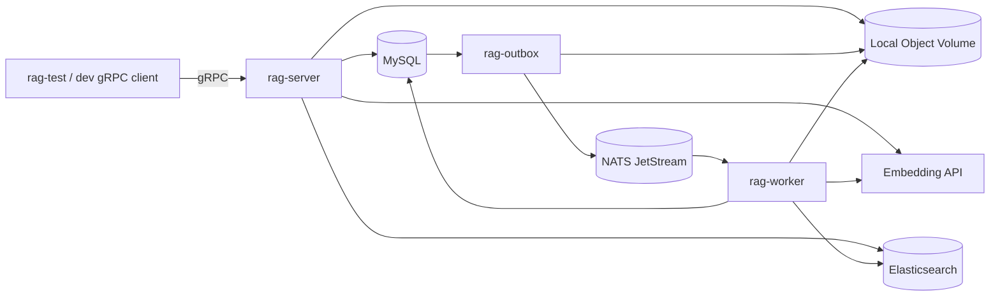

# 真实基础设施 Docker RAG 设计

> 状态：已批准，待实施
> 日期：2026-08-24
> 权威上位规格：`docs/SPEC.md`
> 路线图：`docs/PLAN.md`
> 实施范围：补齐 Milestone A～D 延期的真实基础设施与发布验收，不进入 Go 产品控制面

## 1. 目标

将当前通过 Fake ports 运行的 Mock Functional / Mock Reliability 闭环替换为可在 Docker Compose 中真实运行的 Python RAG 服务：

1. MySQL 8/InnoDB 保存 Dataset、Document、Job、Task、Fingerprint、IndexBuild、Chunk manifest、OutboxEvent 和幂等记录；
2. NATS JetStream 持久化投递 `task_id`，Worker 使用 durable consumer、显式 ACK/NAK 和 redelivery；
3. Elasticsearch 使用 `dense_vector` cosine KNN 与 BM25 保存、检索和清理版本化 Chunk；
4. gRPC Server 与 Worker 从 Docker 容器内调用 `.env` 配置的真实 OpenAI-compatible Embedding API；
5. Docker E2E 从 gRPC 上传真实文件，经过 Finalizer、Relay、NATS、Worker、模型和 ES，最终返回可追溯 Evidence；
6. 真实 integration、E2E、resilience、模型质量和 Docker `KILL` 测试成为发布门禁，Fake 测试继续承担快速、确定性的回归定位职责。

本设计不新增 HTTP/FastAPI 业务接口，不实现回答生成、Agent、MCP、SSE、OCR、MinIO、Kubernetes 或 Go 后端。

## 2. 已确认方案

采用“按真实纵向链路分阶段替换”的方案：

```text
P0 跨平台 protobuf 生成检查
  ↓
R1 MySQL Repository 与 migration
  ↓
R2 OpenAI-compatible ModelGateway
  ↓
R3 Elasticsearch SearchEngine
  ↓
R4 NATS JetStream TaskQueue
  ↓
R5 bootstrap/进程/Compose 真实装配
  ↓
R6 Docker Integration/E2E/Resilience/Eval
```

每个阶段必须先建立失败测试，再实现最小生产代码；每个工作包通过相称门禁后按 `AGENTS.md` 独立提交。任何 `git push` 仍需用户明确授权。

## 3. 运行拓扑



Compose 最终包含以下服务：

| 服务 | 职责 | 是否持有模型密钥 |
|---|---|---:|
| `mysql` | 元数据、事务状态、Outbox、版本与幂等 | 否 |
| `elasticsearch` | Dense/BM25 Chunk 索引 | 否 |
| `nats` | JetStream stream、durable consumer 与消息重投 | 否 |
| `rag-migrate` | 启动前执行幂等 Alembic migration，然后退出 | 否 |
| `rag-server` | 私网 gRPC；Document/Job/Retrieve application 入口 | 是，Retrieve 需要 query embedding |
| `rag-outbox` | Object Finalizer、staging sweeper、Outbox Relay | 否 |
| `rag-worker` | 唯一 Task consumer；解析、切块、Embedding、索引、终态 | 是 |
| `rag-test` | Compose `test` profile 内运行真实 integration/E2E/resilience | 是 |

`.env` 仅由 Compose `env_file` 注入需要模型的容器，不复制到镜像，不挂载为可下载文件。日志和异常只能记录提供商状态码、稳定错误码、请求耗时和批次数，禁止记录 Authorization header、API Key、完整请求体或完整向量。

## 4. P0：跨平台 protobuf 检查修复

### 根因

Git 索引中的 generated 文件使用 LF；Windows `core.autocrlf` 将工作区变成 CRLF；`scripts/check_generated.py` 使用 `read_bytes()` 与临时目录中的 LF 生成物逐字节比较，导致内容一致时仍误报四个文件过期。

### 修复

1. 新增 `.gitattributes`，固定 `.proto`、生成脚本和 `src/rag_mvp/rpc/generated/*` 为 LF；
2. 将生成物检查提取为文本规范化比较，统一 `CRLF/CR/LF` 后再判定内容；
3. 增加回归测试，证明只有换行符不同的 generated 文件视为同步，真实内容变化仍失败；
4. 运行生成检查、contract test 和全量快速门禁，且不手工编辑生成文件。

该修复只消除跨平台假失败，不放宽 proto 内容同步要求。

## 5. R1：MySQL MetadataRepository

### 5.1 技术与边界

- 使用 SQLAlchemy 2.x Async Engine、`asyncmy` 和 Alembic；
- ORM/SQLAlchemy model 只存在于 `adapters/metadata/`，不得进入 `domain/`；
- Repository 方法负责事务、行锁、条件更新和数据库实体到 domain dataclass 的转换；
- application、Worker、Outbox 不得直接持有 SQLAlchemy Session；
- isolation 使用 MySQL InnoDB `READ COMMITTED`，关键聚合显式 `SELECT ... FOR UPDATE`；
- Outbox 扫描使用短事务和 `FOR UPDATE SKIP LOCKED`，不得在持锁事务内调用 NATS、ES、对象存储或模型。

### 5.2 Schema

首个 migration 一次建立最终核心表：

| 表 | 关键约束 |
|---|---|
| `tenants` | 固定 `default_tenant` 主键；MVP 由服务端注入 |
| `datasets` | `tenant_id` 外键；保存 model、dimension、schema version |
| `documents` | Dataset 外键；active/next version、generation、逻辑删除状态 |
| `ingestion_fingerprints` | 唯一 `(dataset_id,file_sha256,config_digest)` |
| `jobs` | retry parent、retry count、generation、index version、错误 JSON |
| `tasks` | Job 外键；attempt、last delivery sequence、checkpoint、错误 JSON |
| `outbox_events` | Task 唯一关联；WAITING/READY/PUBLISHED/CANCELLED 与 staging key |
| `index_builds` | 唯一 `(document_id,index_version)`；BUILDING/ACTIVE/ABANDONED |
| `chunk_manifests` | 唯一 `(document_id,index_version,chunk_id)`；只保存 manifest/血缘，不保存向量 |
| `idempotency_records` | 唯一 `(operation_type,idempotency_key)`；保存首次命令结果引用 |

`Task` 与 `OutboxEvent` 必须由同一 transaction/session 创建。Repository 不在事务提交后直接发布 NATS。

### 5.3 并发语义

- 新上传先锁 fingerprint；相同内容/config 只保留 canonical Document/Job；
- 重建先锁 Document，再递增 `next_index_version`；
- Retry 先锁原 FAILED Job，并由活跃子 Job 唯一约束兜底；
- Delete 先锁 Document，写 DELETED 与 generation+1，再取消未终态摄取和未发布 Outbox；
- Worker 认领必须同时验证 Task=PENDING、Job 未取消、Document 未删除、generation 匹配；
- Worker 完成必须重复验证相同 fence，原子写 manifest、IndexBuild ACTIVE、Document active version 与 Job/Task 成功；
- 任何失配都不得重新激活 Document，只能取消并创建版本清理任务。

## 6. R2：OpenAI-compatible ModelGateway

### 6.1 配置

生产容器要求以下显式配置：

```text
EMBEDDING_MODEL_URL
EMBEDDING_MODEL_NAME
EMBEDDING_MODEL_API_KEY
EMBEDDING_MODEL_DIMENSION
RAG_EMBEDDING_BATCH_SIZE=32
RAG_EMBEDDING_TIMEOUT_SECONDS
RAG_EMBEDDING_MAX_RETRIES
```

`EMBEDDING_MODEL_DIMENSION` 是生产 mapping 与模型漂移保护所需的声明值；真实 API 返回的每个向量都必须与其一致。当前已验证的配置返回 1024 维，但代码不得把 1024 写死。

MVP 单个运行环境只配置一个 Embedding model/schema。`CreateDataset` 的 `embedding_model` 与 `embedding_dimension` 必须和当前 ModelGateway 配置一致，否则返回稳定 `EMBEDDING_CONFIG_MISMATCH`，不得创建 Dataset。不同模型或维度使用不同的服务部署/ES index；同一运行实例不混写多个维度。

### 6.2 HTTP 行为

- 使用 `httpx.AsyncClient` 调用 OpenAI-compatible `POST /embeddings`；URL 已指向 `/embeddings` 时不得重复拼接；
- Bearer API Key 只放请求头；
- 按 `batch_size` 保序分批，并按响应 `index` 重建原输入顺序；
- 校验响应 object/data、条数、index 唯一性、向量维度、有限浮点数；
- 网络错误、HTTP 429 和 5xx 使用有上限的指数退避；
- 401/403、其他确定性 4xx、响应 schema 错误不盲目重试；
- 所有外部异常映射为稳定 `DomainFailure`，不把 provider 原始 body 或密钥暴露给 gRPC；
- client 生命周期由 `bootstrap/container.py` 创建并在 Container close 时关闭。

Rerank 配置保持可选。未配置真实 Rerank endpoint 时，`rerank()` 返回可降级的 `RERANK_UNAVAILABLE`，由现有 `RetrievalService` 回退到 RRF，不伪造分数。

## 7. R3：Elasticsearch SearchEngine

### 7.1 索引与 mapping

MVP 使用单个版本化 index，例如 `rag-chunks-v1`，其 mapping 在 migration/bootstrap 阶段以声明的 `EMBEDDING_MODEL_DIMENSION` 创建并验证：

| 字段 | ES 类型/用途 |
|---|---|
| `_id` | `{document_id}:{index_version}:{chunk_id}` |
| `dataset_id` | `keyword`，所有检索必选过滤 |
| `document_id` / `chunk_id` | `keyword` |
| `index_version` / `ordinal` | integer |
| `content_with_weight` | `text`，BM25 |
| `vector` | `dense_vector`，cosine KNN，固定 dims |
| `source_name` | `keyword` + 可选 text 子字段 |
| `locator.*` | page/line 为 integer，symbol/language 为 keyword |
| `metadata` | `flattened`，只允许受限 exact-match filter |

启动时若 index 已存在但 vector dims 与配置不同，服务必须 fail fast，禁止动态修改 mapping 或写入错误维度。

### 7.2 行为

- `upsert_chunks` 使用 Bulk API 和版本化 `_id`，重复执行覆盖同一记录；
- Dense 与 Sparse 分别查询，不在 adapter 内做 RRF；
- Dense 使用 KNN cosine，Sparse 使用 BM25 `match`；两者都先过滤 `dataset_id` 和受限 metadata；
- 同分候选使用 `_id` 升序稳定排序；
- 返回完整 Chunk、locator、metadata 和原始 `_score`；
- 删除版本按 `document_id + index_version`，删除文档按 `document_id`，重复删除成功；
- application 继续使用 MySQL `visible_document_versions` 复核删除状态与 active version，ES 不是可见性事实源。

## 8. R4：NATS JetStream TaskQueue

### 8.1 Stream 与 consumer

- stream：配置的 `RAG_NATS_STREAM`；subject：`RAG_NATS_SUBJECT`；file storage；
- durable consumer：`RAG_NATS_CONSUMER`；显式 ACK；配置 ack wait、max deliver 和 backoff；
- 消息 body 只包含 UTF-8 `task_id`，不携带 Job/Document 快照；
- `publish()` 必须等待 JetStream publish acknowledgement；
- `consume()` 每次最多获取一条消息，返回 consumer sequence 作为 `delivery_sequence`，`num_delivered - 1` 作为 redelivery count；
- `ack()` 和 `nak(delay)` 只存在于 `ingestion/worker.py` 调用路径。

### 8.2 恢复语义

- Relay publish 成功、标记 Outbox 前强杀会产生重复 publish；Worker 依赖 MySQL Task 事实幂等收敛；
- 未 ACK 或 ack wait 超时必须被 durable consumer 重投；
- 最后一次 delivery 由 Worker 先写 MySQL FAILED 再 ACK；
- NATS 暂时不可用时 Outbox 保持 READY，下一轮 Relay 扫描补发；
- MAX_DELIVERIES advisory 补偿属于发布可靠性验收，不以消息系统状态替代 MySQL Job 状态。

## 9. R5：生产装配与进程生命周期

`bootstrap/container.py` 是唯一 concrete adapter 装配点，按进程角色构建最小依赖：

| 角色 | 依赖 |
|---|---|
| Server | MySQL Repository、Local Storage、ES、ModelGateway、application services、RagService |
| Worker | MySQL Repository、Local Storage、Parser Router、Chunker、ModelGateway、ES、NATS、Ingestion/Cleanup Service |
| Outbox | MySQL Repository、Local Storage、NATS、Finalizer、Relay、Sweeper |

Container close 按 client 的逆创建顺序幂等关闭 NATS、HTTP、ES 和数据库 engine。import 包或构造 Settings 不建立连接；连接只在显式 process startup/lifespan 发生。

Dockerfile 使用多阶段构建：

- runtime target 只包含生产依赖、源码、migration 和 proto 生成物；
- test target 增加 dev dependencies、tests 和测试 fixtures；
- `.env`、`.git`、`data/`、缓存和日志由 `.dockerignore` 排除；
- `rag-server`、`rag-worker`、`rag-outbox` 复用同一个 immutable image digest；
- `rag-test` 使用 test target，连接同一 Compose 网络中的真实服务。

## 10. R6：真实测试体系

### 10.1 测试分层

| 层 | 是否使用真实模型 | 是否使用真实中间件 | 目的 |
|---|---:|---:|---|
| Unit | 否 | 否 | 领域、算法、错误分类、响应解析边界 |
| Contract/Fake | 否 | 否 | Port 共同语义与快速回归 |
| Adapter Integration | 是（模型组） | 是（对应 adapter） | SDK、协议、mapping、事务和队列语义 |
| Docker E2E | 是 | 是 | 完整生产拓扑的 upload→retrieve |
| Docker Resilience | 是，仅需要重新摄取时调用 | 是 | KILL、重投、并发和最终一致性 |
| Real Eval | 是 | ES + MySQL | Recall@K、MRR、locator 与语义质量 |

### 10.2 真实模型测试

选中真实模型测试时，缺少任一模型配置必须失败，不允许 `skip` 或回退 Fake。测试至少覆盖：

1. 单条输入返回声明维度的有限数值向量；
2. 超过 batch size 的输入保持数量与顺序；
3. 相同文本重复请求的 cosine similarity 接近 1；
4. 中文语义相关文本的相似度高于无关文本；
5. 容器内 DNS、TLS、Bearer 鉴权与超时配置可用；
6. API Key 不出现在 adapter 异常、结构化日志、pytest capture 或 Docker logs；
7. Dataset 声明维度、ES mapping、文档向量和查询向量四者一致。

真实模型响应不做逐浮点 snapshot；断言结构、维度、有限性、顺序和相对语义关系。

### 10.3 Adapter Integration

- MySQL：migration 幂等、事务回滚、Task/Outbox 原子性、fingerprint/Retry/rebuild 并发、Delete generation fence；
- Elasticsearch：mapping、Bulk upsert 幂等、Dense、BM25、metadata、版本可见性输入和重复删除；
- NATS：publish ack、durable、ACK、NAK delay、ack timeout、redelivery、重复 publish；
- Model：真实 API 单条/批量/错误映射/维度与语义 smoke；
- gRPC：真实 Repository/Storage/ES/Model 装配下的 RPC transport。

### 10.4 Docker E2E

至少覆盖 `.txt`、`.md`、代码和文本 PDF：

```text
CreateDataset
  → SubmitDocument(client stream)
  → staging object
  → MySQL Task + WAITING Outbox
  → Finalizer promote + READY
  → Relay publish JetStream
  → Worker parse/chunk/real embed/ES bulk
  → MySQL active version + SUCCEEDED
  → Retrieve real query embed + Dense/BM25/RRF
  → Evidence locator/score/version assertions
```

测试不得直接调用 application service、不得手工执行 Worker、不得从测试代码写 MySQL/ES 来伪造成功；只允许通过 gRPC 提交/查询，并通过只读诊断查询验证跨存储结果。

### 10.5 Docker Resilience

通过独立测试 barrier/failpoint build 开关，在确定的持久化边界暂停 Worker，然后执行容器级强杀：

- index 写入后、MySQL complete 前 KILL Worker；
- MySQL SUCCEEDED 后、ACK 前 KILL Worker；
- Relay publish ack 后、Outbox PUBLISHED 前 KILL Relay；
- 暂停 NATS 后提交，恢复 NATS 后由 READY Outbox 补发；
- 并发相同内容上传、并发 Retry、并发 rebuild；
- Delete/Cancel 与已发布 delivery、Finalizer、Worker complete 竞态。

恢复测试只能重启目标容器，禁止 `docker compose down -v`。每个场景最终断言 MySQL 状态、ES 记录数/版本、对象文件和 NATS consumer 状态一致。

### 10.6 CI 与本地门禁

- pre-commit：保持无网络快速门禁，不消耗真实模型；
- PR quick job：unit、contract、functional、Fake resilience、coverage；
- PR Docker job：MySQL/ES/NATS integration、真实模型 integration、四格式 E2E；
- nightly/release：Docker KILL、并发压力、T1～T25 真实矩阵和 Real Eval；
- Docker/模型 job 没有 Secret 或基础设施启动失败时必须失败，不得报告为通过；
- 测试日志作为 artifact 保存时先执行密钥扫描与脱敏。

## 11. 错误处理

| 来源 | 稳定错误类别 | 重试策略 |
|---|---|---|
| Embedding timeout/网络/429/5xx | `EMBEDDING_UNAVAILABLE` | adapter 有限重试；耗尽后 Task NAK |
| Embedding 401/403 | `EMBEDDING_AUTH_FAILED` | 不重试，Task FAILED |
| Embedding schema/count/dimension | `EMBEDDING_RESPONSE_INVALID` / `EMBEDDING_DIMENSION_MISMATCH` | 不盲目重试；阻塞索引写入 |
| MySQL deadlock/连接短暂失败 | `METADATA_UNAVAILABLE` | 事务整体重试，禁止部分提交 |
| ES 429/5xx/连接失败 | `SEARCH_UNAVAILABLE` | Bulk/Task 有限重试与 NAK |
| ES mapping/dimension 冲突 | `SEARCH_SCHEMA_MISMATCH` | fail fast，不污染 index |
| NATS publish/consume 暂时失败 | `QUEUE_UNAVAILABLE` | READY Outbox/consumer 重试 |
| 非法 Task/终态/失配 fence | 现有领域错误 | ACK/取消/清理，不重复业务执行 |

外部 SDK 异常只在 adapter 映射；application 和 RPC 不依赖 SDK 异常类型。

## 12. 验收标准

只有同时满足以下条件，才能把当前状态从“Mock Reliability 完成”改为“单机真实可靠发布基线通过”：

1. protobuf 跨平台检查在 Windows/Linux 均通过；
2. runtime image 内不存在 tests/Fake ports/.env；
3. `docker compose up` 后 MySQL、ES、NATS、Server、Worker、Outbox 健康；
4. 容器内真实 Embedding 单条、批量、语义和密钥安全测试通过；
5. 四格式真实 gRPC E2E 通过；
6. MySQL、ES、NATS adapter integration 全部通过；
7. T1～T25 的真实基础设施复验状态全部完成；
8. Worker/Relay Docker `KILL` 窗口可恢复且无重复可见索引；
9. Recall@6、MRR@6、locator accuracy 达到 SPEC 门槛；
10. Unit、contract、functional、integration、E2E、resilience、eval 和覆盖率门禁全部成功；
11. 日志、镜像、Git history、测试 artifact 不包含 API Key；
12. `docs/SPEC.md`、`docs/PLAN.md`、`tests/TEST.md` 与实际实现一致。
